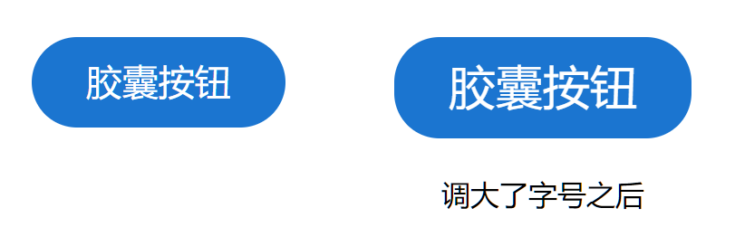
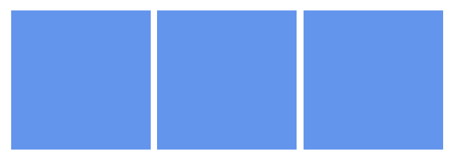
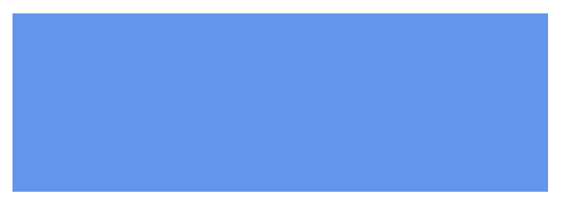
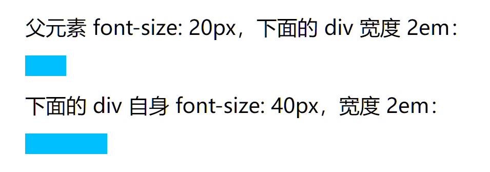

持续更新，记录 Web 开发中 CSS 相关的经验积累。
扩展阅读：

- [防御性 CSS](https://ishadeed.com/article/defensive-css/)，非常推荐，建议按照文中的内容养成习惯，看不惯英文可以看 [中文翻译](https://zhuanlan.zhihu.com/p/456571205) 或 [中文导读](https://linxz.github.io/blog/defensive-css)；
- [CSS 工作组认为设计上的错误](https://wiki.csswg.org/ideas/mistakes)，比较有意思，[卡颂的导读](https://www.zhihu.com/question/59920627/answer/3245236310)。


# 手机页面很难戳中的小按钮

移动设备上，用户用手指去点按控件，而手指的点击没有鼠标那么精确，如果按钮做的太小，那么可能很多次都难以点击命中，或者是容易点错。
这便需要我们养成一种良好的 CSS 习惯：扩大点击区域。

扩大点击区域最简单的实现方式，是利用 `padding` 属性，使得按钮的外径更大；
但是，增加 `padding` 会导致元素更大的空间，从而影响布局，实际开发中往往还要配合 `position: absolute;` 等样式来使用。

这里给出一种比较好的解决方法：
**使用伪元素来提供扩大点击区域的功能，伪元素设置为绝对定位，这样就不会影响布局了，甚至可以配合 Less 或 Sass 封装成函数。**

以下是示例，先来看难以戳中的小按钮：


如图所示，可以看到按钮非常小，难以点到。

采用伪元素的方法来扩大点击区域，代码如下：

```css
/* .close 元素本身必须是 absolute 或者 relative 的 */
.close::before {
  content: '';
  position: absolute;
  top: -15px;
  bottom: -15px;
  left: -15px;
  right: -15px;
}
```

这里我们通过负值的 `top`、`bottom` 等属性，使得伪元素在原元素的基础上向上下左右四个方向各扩展了 15px。

示例中的 `.close` 本身就是绝对定位的。如果你把这段代码用在自己的元素上面，记得把按钮元素改为 `position: relative;` 或 `position: absolute;`，不然伪元素的位置会错误。

达成的效果如图：


这个按钮的面积比原来大了数倍，更容易点按，而且，这种写法只需要我们添加一个伪元素的 CSS，不会影响原始布局。

-----

封装成 Sass：

```scss
// 扩大元素的点击区域
//   参数 $size：需要扩大半径（默认 15px）
@mixin expandClickArea($size: 15px) {
  &::before {
    content: '';
    position: absolute;
    top: -#{$size};
    bottom: -#{$size};
    left: -#{$size};
    right: -#{$size};
  }
}

// 扩大元素的点击区域，同时给当前元素添加 position: relative;
@mixin expandClickAreaRel($size: 15px) {
  position: relative;
  @include expandClickArea($size);
}

// 扩大元素的点击区域，同时给当前元素添加 position: absolute;
@mixin expandClickAreaAbs($size: 15px) {
  position: absolute;
  @include expandClickArea($size);
}
```

使用方式：

```scss
.close {
  // 给这个元素扩大点击区域，默认是 15px 半径
  @include expandClickArea();

  // 也可以指定半径
  @include expandClickArea(40px);

  // 如果当前元素是 static 定位，那么需要用这个 Rel 后缀的
  @include expandClickAreaRel();
}
```

-----

封装成 Less：

```less
// 扩大元素的点击区域
//   参数 @size：需要扩大半径（默认 15px）
.expandClickArea(@size: 15px) {
  &::before {
    content: '';
    position: absolute;
    top: -@size;
    bottom: -@size;
    left: -@size;
    right: -@size;
  }
}

// 扩大元素的点击区域，同时给当前元素添加 position: relative;
.expandClickAreaRel(@size: 15px) {
  position: relative;
  .expandClickArea(@size);
}

// 扩大元素的点击区域，同时给当前元素添加 position: absolute;
.expandClickAreaAbs(@size: 15px) {
  position: absolute;
  .expandClickArea(@size);
}
```

使用方式：

```less
.close {
  // 给这个元素扩大点击区域，默认是 15px 半径
  .expandClickArea();
}
```


# 胶囊形按钮的圆角怎么写

一个普通的方形按钮，假设高度为 50px，如图：


此时，我们想让它变成胶囊形或者叫跑道型按钮，于是想当然的就直接给它加上一个 `border-radius: 25px;`，这里的 `25px` 刚好等于高度值的一半，形成了下图一样的效果：


这样实现，看似需求已经达成了。
但是，假设某一天设计师突然要求更换字体，或者是全局更换了文字字号大小，可能就会出现这种情况：



可以看出，如果因为某些原因字号被调大，那么这种按钮的形状便会被破坏。

推荐的做法是，直接写成 `border-radius: 9999px;`，这样按钮两侧就一定是半圆形，不会因为内容被撑高而破坏：


-----

顺带一提，这里的圆角不能写成 `50%`，否则按钮会变成椭圆形，上下完全没有直边。


# CSS 属性 `pointer-events: none`

此属性表示哪些元素可以成为鼠标事件的目标，它的默认值是 `auto`；设为 `none` 后，会使得元素无法成为任何鼠标事件的目标。
实际上，这个 `none` 值的作用很大，它可以做到：

- 使元素无法触发鼠标点击、悬停、拖拽等事件，按钮、输入框等控件也无法使用；
- 类似于 `:hover` 这种 CSS 伪类选择器也不会被触发；
- 在这个元素上的点击操作等鼠标事件，都会穿透这个元素，在其 z 轴下层元素上触发；
- 甚至 F12 浏览器开发工具也不能选中这些元素。

不过，即使设置了这个属性，元素中的文本仍可以被选中，如果不想让文本被选中，可以配合 `user-select: none;` 属性一同使用。

这个属性的使用场合如下：

- **弹窗、抽屉的过渡动画期间，可以给元素放置这个属性，避免在动画播放期间被用户触发控件；**
- 画图类页面中，可用于实现 “网格辅助线”；编辑器类页面，可以用于实现 “输入预测”。


# 模态框原来应该这样写

模态框（Modal 或 Dialog）不同于其他元素，它是一种需要覆盖全屏的组件。实现它，需要考虑一些额外的因素：

**最好用 `ReactDOM.createPortal()` 把蒙层、模态框的元素全部放到 `<body>` 下：**

代码如下：

```tsx
function Modal() {
  return createPortal(<div>模态框或蒙层的 DOM...</div>, document.body)
}
```

因为你的 `Modal` 组件有可能被放置在某一个元素内部，然后此元素又被设置了 `overflow: hidden;` 等属性，这会导致模态框显示出现问题，把模态框的 DOM 放置在 `<body>` 下可以避免样式受到影响，也能更好的管理元素的 z 轴层叠关系。

-----

**管理焦点，避免模态框底下的元素被聚焦：**

用户有可能使用 Tab 键，从而聚焦模态框以外的原页面上的控件，这显然是不合理的。

使用 `focus-trap-react` 这个库，可以提供给我们一个 “焦点陷阱” 组件，此组件可以限定焦点只会在这个组件以内切换。
代码示例：

```tsx
import FocusTrap from 'focus-trap-react'

function Modal() {
  return (
    <FocusTrap>
      <div class="modal">
        模态框内容
        <button>确定</button>
      </div>
    </FocusTrap>
  )
}
```

-----

**管理滚动条，蒙层出现后，应该隐藏掉页面原始的滚动条而是采用蒙层自身的滚动条：**

此处可以参考 `antd` 的做法，模态框出现后，会给 `<body>` 元素附加这两个样式：

```css
body {
  overflow-y: hidden;
  /* 下面这条不是每次都会有 */
  width: calc(100% - 17px);
}
```

这里给 `<body>` 附加的两个样式：

- `overflow-y: hidden;` 会隐藏掉页面本身的滚动条；
- `width: calc(100% - 17px);` 并不是每次都会有，`antd` 的代码会进行判断，只在页面原来可滚动时加上这个样式，避免因为滚动条消失而导致页面发生移位，而且这里的 `17px` 也是代码计算出来的，刚好等于滚动条的宽度。

此外，模态框的如果内容特别长，也是可以滚动的，此时便需要用到模态框的滚动条了。
也正因如此，模态框一般都会出现在窗口的偏上部，方便用户从上往下滚动阅读，而且一般会提供一个 `centered` 参数用于设置是否要模态框居中显示。

-----

**利用浏览器的新增特性，实现更人性化的网页：**

可以使用 `<dialog>` 标签来作为模态框的容器，这个标签是浏览器原生提供的模态框标签，它具备了：

- 独有的 API 和特性，例如 `.showModal()`、不需要 JS 代码的情况下能和 `<form>` 互动；

- 更好的可访问性，不同的设备和浏览器可能也会为它特殊优化；
- 蒙层由浏览器实现，且提供 `::backdrop` 伪元素选择器，给蒙层定制样式。

这里给出 [MDN 文档](https://developer.mozilla.org/en-US/docs/Web/HTML/Element/dialog)，有兴趣的话可以展开阅读。

此外，还可以使用 `scrollbar-gutter` 为滚动条留出 “装订线”，避免滚动条的出现和消失引起页面发生跳动，[MDN 文档](https://developer.mozilla.org/en-US/docs/Web/CSS/scrollbar-gutter)。

还可以使用 `overscroll-behavior-y: contain;` 来避免模态框导致的滚动穿透，[MDN 文档](https://developer.mozilla.org/en-US/docs/Web/CSS/overscroll-behavior)。

-----

结合上一条技巧，我们可以在模态框出现和消失时的过渡动画添加 `pointer-events: none` 属性，避免在过渡动画期间被误操作。


# 怎么让 CSS 动画实现回弹效果

CSS 中 `transition` 属性一般会用到三个参数：过渡属性、持续时间、加速度曲线。
动画持续时间固定的情况下，可以通过修改第三个参数来调整动画流畅度。

例如：

```css
/* 第三个参数就是加速度曲线，默认是 ease */
transition: all 1000ms ease;

/* 也可以用这个属性，这个是拆分开的写法 */
transition-timing-function: ease;
```

这个 “加速度曲线” 的取值有好几种，例如 `linear` 表示 “线性”，会使得动画的进度完全和时间成正相关，但这种动画看起来就不是很流畅；默认的 `ease` 曲线是先快后慢，虽然和 `linear` 持续时间一样，但是 `ease` 看上去更流畅：


通过 [cubic-bezier](https://cubic-bezier.com/) 这个网站，可以看出，这些动画曲线其实指的是 “时间-动画进度” 的曲线，默认的 `ease` 就是先快后慢的方式，让动画看上去更加流畅：


CSS 支持我们使用自定义的动画曲线，但是曲线是不能自己随便画的，必须遵守 “三阶贝塞尔曲线” 的规则。
贝塞尔曲线是一种数学上使用方程来描述出的曲线，我们在使用计算机设计这个曲线时，可以在操作界面通过拖动两个控制点来调整曲线的形状。

这里有两个网站可以让我通过可视化界面来自定义动画的贝塞尔曲线：

- https://matthewlein.com/tools/ceaser
- https://cubic-bezier.com/

使用贝塞尔曲线的方式如下：

```css
/* 第三个参数 */
transition: all 1000ms cubic-bezier(0.25, 0.1, 0.25, 1);
```

上面的例子中，`cubic-bezier(0.25, 0.1, 0.25, 1)` 就是动画的加速度曲线，这个定义和 `ease` 是等效的。

我们可以让贝塞尔曲线的上部分超出上限，此时，表现在 CSS 的 `transition` 中的效果便是过渡 “越界”；
例如过渡最终要设置 `width: 500px;`，但是如果贝塞尔曲线超出上线，则过渡的过程中 `width` 会超出 `500px`，然后再降回来，形成类似 “回弹” 的效果。

这里给出一个示例，我们先在网页中调整出一个超出上界的贝塞尔曲线：


复制网页中的样式，放置到需要应用的元素上，得到的效果：


这样便实现了 “回弹” 的效果。


# 文本省略应该怎样做

文本省略的样式比较好写，这里可以随手给出一条：

```css
.ellipsis {
  overflow: hidden;
  text-overflow: ellipsis;
  white-space: nowrap;
}
```

但是，文本省略不是仅设置 CSS 就完了，实现了文本省略的效果后，我们还需要提供一个显示完整文本的途径。

最简单的方式是设置 `title` 属性值。设置属性值后，鼠标悬停后，便会显示 `title` 的内容。
示例 HTML 如下：

```html
<div class="container">
  标题：
  <span class="title" title="AMD、CommonJS 和 ES Module 模块化的区别">
    AMD、CommonJS 和 ES Module 模块化的区别
  </span>
</div>
```

此时，效果如下：


如果使用组件库，组件库可能会提供省略+悬停提示的组件（例如 `antd`）；如果组件库没有提供，此时便需要自行封装组件了。


# 为什么元素之间会有间隙

我们时常会忽略 HTML 标签之间的空格、换行符，实际上浏览器在渲染内容时，大部分情况空格都是对渲染结果没有任何影响的，换行符也并不会生效，而是根据视口和文档流来决定。

但是，考虑以下情况 HTML：

```html
<!DOCTYPE html>
<html lang="zh-CN">
  <head>
    <style>
      div {
        display: inline-block;
        width: 100px;
        height: 100px;
        background-color: cornflowerblue;
      }
    </style>
  </head>

  <body>
    <div></div>
    <div></div>
    <div></div>
  </body>
</html>
```

用浏览器打开这个网页，却发现显示效果有所不同：



可以看到，三个 `<div>` 之间出现了间隔。
实际上，这些间隔就是 HTML 文档中换行符和空格等元素导致的。

再次测试，修改 HTML 中三个 `<div>`，使它们连写在一起，没有空格和换行：

```html
<body>
  <div></div><div></div><div></div>
</body>
```

保存后，可以看到三个 `<div>` 之间的间隔没有了：



这是因为，对于 `inline-block` 或 `inline` 的元素而言，它们具备行级元素的特点，使得这些元素之间的间隔空格、换行符也会被保留，根据 HTML 的规范，`<div>` 标签之间的内容在渲染结果中产生一个 “空格”，导致几个 `<div>` 中间存在间隔。

如果想避免这种情况，有以下几种方式：

**设置 `font-size: 0` 属性：**字号为 0 时，渲染这些空格字符不占空间，因此最终渲染结果会像第二张图一样；但是，这种方式设置了字号，可能会对元素中的文字显示产生影响，导致需要对文本元素重设字号。

**给子元素添加 `float: left` 属性：**此时这些元素会脱离文档流并左对齐，它们之间的空格自然不会影响到这几个脱离文档流的元素了；此方法副作用太大，会严重影响布局，一般来说不推荐。

**改变布局方式，例如父容器改为 `display: flex` 属性：**因为 Flex 布局会管理每个子元素的位置，它们的 `inline-block` 设置也不起作用，元素之间的空格符号也会被忽略。

-----

还有一种情况是图片元素与文本放在一起时，图片似乎很难和文本对齐。

创建并填写以下 HTML 内容：

```html
<!DOCTYPE html>
<html lang="zh-CN">
  <head> </head>
  <body>
    你好
    
  </body>
</html>
```

通过浏览器 F12 选中元素可以看到，图片和文本底部无法对齐：


这种情况是因为，图片是 `inline` 行级元素，行级元素具备 “垂直对齐” 的选项，默认是 `vertical-align: baseline`，基于基线对齐；而图片元素没有 “基线”，浏览器会在其底部添加大约 4px 的空白用于对齐。
为什么要添加 4px 的空白，直接贴着底部对齐不行吗？**这是因为浏览器基于英语字母的基线，而不是中文，中文的基线实际上就是贴着文字底部。**

把文本换成英文便可以看出，图片和英文基线是对齐的了：


英文字母中，基线是以 “a”、“b” 等字母底部的水平线为准，而不是以字母 “p” 这种向下延伸的底部为准。此时，基线实际上比文本底部略高一点，也正因如此浏览器会给图片底部添加一点空白像素，让图片和文本基线保持对齐。

了解了原理，那么问题就好解决了，只需要修改图片的 `vertical-align` 属性不为 `baseline` 即可，想和中文文本底部对齐，可以设置属性 `vertical-align: bottom`。
例如：

```html
<!DOCTYPE html>
<html lang="zh-CN">
  <head> </head>
  <body>
    你好
    
    Paperplane
  </body>
</html>
```

此时图片便可以正常和中文底部对齐：


# 尝试 `currentColor` 值

在 CSS 中，存在 `currentColor` 这一个颜色变量，它表示**继承当前的文本颜色，即 `color` 的颜色。**
用好这个属性，可以减少定义 CSS 变量和传递 CSS 参数的情况，这在开发组件时尤为有效。

假设我们需要开发一个文本标签组件，使用以下代码：

```tsx
export function TextTag(props: { color: string, children: ReactNode }) {
  const { color = 'black', children } = props

  return (
    <span
      style={{
        color: color,
        border: `1px solid ${color}`,
        borderRadius: 3,
        padding: `3px 5px`,
      }}
    >
      {children}
    </span>
  )
}
```

可以看出，我们要通过传参来指定边框的颜色，这种方式存在弊端，因为此时还必须给 `color` 一个默认值，否则颜色为空边框属性不合法，显示不出边框线，代码中默认给出了 `'black'`。
使用此组件时，标签颜色也默认不能跟随当前文本颜色，假如这样使用组件：

```tsx
export default function App() {
  return (
    <div style={{ color: 'green' }}>
      Hello <TextTag>PaperPlane</TextTag>
    </div>
  )
}
```

显示效果如图，组件无法继承颜色：


此时，我们利用 `currentColor` 属性来对组件代码进行优化：

```tsx
export function TextTag(props: { color: string, children: ReactNode }) {
  const { color, children } = props

  return (
    <span
      style={{
        color: color,
        border: `1px solid currentColor`,
        borderRadius: 3,
        padding: `3px 5px`,
      }}
    >
      {children}
    </span>
  )
}
```

此时不需要指定 `color` 属性的默认值了，文字和颜色都会继承当前文字颜色：


而且，边框线通过 `currentColor` 值来继承标签内文本的颜色，无需传递多个变量，修改 `color` 后会使得文本和边框线同时生效。

-----

在使用 SVG 图片时，需要注意：

在 `` 这种用法中，SVG 图片中的 `currentColor` 无效，因为此时 SVG 图片是直接作为图片本身，图片的内容肯定不会依据字体颜色而改变。

如果想让 SVG 中的 `currentColor` 生效，需要直接在页面中放置 `<svg>` 标签。
如果 SVG 来自其他来源，无法放置标签，可以使用这种方式：`<object type="image/svg+xml" data="image.svg" />`。

你可能注意到了，`currentColor` 不符合 CSS 的命名方式，因为 CSS 中没有大写的关键字，所有驼峰写法（PascalCase）其实都应该改为横杠式（kebab-case），这是因为 `currentColor` 正是来自于 SVG 的。所以在 SVG 中这个关键词必须正确保持大小写，而在 CSS 中可以忽略大小写。


# 应用新式 CSS 特性

CSS 近些年飞速发展，很多我们没有了解过的特性，可能已经被支持好几年了。而且，现在浏览器自动更新非常方便，尤其是移动端，用户普遍使用的是非常新的浏览器版本，有着非常完整的特性支持。
因此，我们可以更放心大胆的使用新式 CSS 特性，极大的简化开发难度。

此处给出几个例子：

- 使用 `scroll-snap-type` 的 `mandatory` 模式来开发 “轮播图” 效果的控件，或者是使用其 `proximity` 模式来实现类似于苹果官网的 “滚动吸附” 效果，[MDN 文档](https://developer.mozilla.org/en-US/docs/Web/CSS/scroll-snap-type)；

- 使用 `position: sticky` 来开发 “滚动吸顶”、“吸顶标题书签” 效果，[MDN 文档](https://developer.mozilla.org/en-US/docs/Web/CSS/position)；
- 使用 `attr()` 来获取元素的属性值，可以用在伪元素的 `content` 中，实现类似于 “文本注释” 的效果，[MDN 文档](https://developer.mozilla.org/en-US/docs/Web/CSS/attr)。


# 避开 CSS 常见的误区

此处列出常见的 CSS 误区，便于我们改善开发体验、改进项目可维护性。


## 单位 `em` 根据的是什么

因为字号是可以继承的，所以很多人认为 `em` 是基于父元素的字号，这是不对的，甚至连 [MDN 文档](https://developer.mozilla.org/en-US/docs/Learn/CSS/Building_blocks/Values_and_units#lengths) 上面都写错了。
正确的结论是：`em` 依据**当前元素**的字号，而不是父元素的字号。

这里给出一段测试用 HTML：

```html
<!DOCTYPE html>
<html lang="zh-CN">
  <head>
    <style>
      div {
        margin: 15px 30px;
      }

      .bar {
        width: 2em;
        height: 20px;
        background-color: deepskyblue;
      }
    </style>
  </head>

  <body>
    <div style="font-size: 20px">
      <div>父元素 font-size: 20px，下面的 div 宽度 2em：</div>
      <div class="bar"></div>

      <div>下面的 div 自身 font-size: 40px，宽度 2em：</div>
      <div class="bar" style="font-size: 40px"></div>
    </div>
  </body>
</html>
```

在浏览器中查看样式：



可以看出，`em` 依据的是元素自身的 `font-size`，而不是父级元素的 `font-size`。


## 可以直接用 `rem` 来进行移动端开发

移动端开发时 CSS 怎么设置元素的尺寸？很多人会直接回答：使用 `rem` 单位即可。
这种没有任何前因后果的说法是不对的。必须了解 `rem` 这个单位的由来、用法、前置条件，才能理解为什么会有这么一个单位。

移动端不可能像 PC 网页开发一样，可以给整个页面中间加一个固定宽度的容器。移动端所有元素的宽度都是基于屏幕宽度的，我们虽然可以使用百分比宽度来进行开发，但是这样会导致字号、高度等属性无法设置，毕竟它们不能使用百分比。
因此，我们需要一个新的单位来处理元素尺寸，这便是 `rem` 存在的意义。

在移动端开发中，通常设计师会以  750 作为设计稿中的屏幕宽度，此时我们设置的宽度值最好基于屏幕宽度 750，而不用单独做百分比转换。
例如，一个元素在设计稿中宽度为 375，它的宽度为 50%；另一个元素在设计稿中宽度为 250，它的宽度为 33.33%。但这个百分比的计算，不需要由前端开发者自己去计算百分比，而是直接写 375 、250 即可。

基于这些问题，小程序给出了 `rpx` 这个样式单位，且小程序的屏幕宽度默认是 `750rpx`，这就使得我们直接给元素设置设计稿中的宽度，但单位改为 `rpx` 即可。
而 Web 开发中，并没有 `rpx` 这个单位，所以我们只好使用 `rem` 单位。

CSS 的 `rem` 单位，表示基于 `<html>` 元素的 `font-size`，默认的字号属性是 `font-size: 16px`，此时例如 `2rem` 即表示 `32px`。
可以看出， 直接使用这个属性是不可能的，必须加以处理。

最简单的实现，设置 CSS：

```css
html {
  /* 这里的 750 为设计稿中屏幕宽度 */
  font-size: calc(100vw / 750);
}
```

此时，根节点的 `font-size` 被指定为屏幕宽度的 750 分之一，也就是说此时 `1rem` 等于屏幕的 750 分之一，此时 `750rem` 等于 `100%` 宽度，而 `375rem` 也就等于 `50%` 宽度。我们可以使用 `rem` 来当做小程序的 `rpx` 来使用了。设计稿上是多少宽度和高度，就设置多少 `rem` 即可。

这个做法会导致字号变得很小，可以加一条 CSS 来重置字号：

```css
body {
  font-size: initial;
}
```

这样，我们就实现了一个最简单版本的 `rpx`。

**可以看出，移动端开发如果想使用 `rem`，必须进行一些预处理，绝不是开箱即用的。**实际上现在很多移动端开发脚手架，已经预先帮我们配置好了 `rem` 转换规则，甚至直接写 `px` 就行，预处理会自动进行尺寸转换。但无论如何，不能简单概括为 “移动端开发使用 `rem` 来写尺寸”。

> 实际上，上面这种写法仅仅用于演示，它并不适合在生产环境使用。
> 推荐使用例如 [postcss-plugin-px2rem](https://github.com/soda-x/postcss-plugin-px2rem) 这类插件对 CSS 进行处理，此时只需要写 `px` 单位即可，工具会自动把 `px` 处理成 `rem`，而且，工具还支持跳过特定属性，例如 `border-radius`、`border-width` 这些不需要跟随屏幕尺寸一起缩放的属性。


## 过度设置 `width` 属性

建议阅读张鑫旭的 [《CSS 世界》](https://search.jd.com/Search?keyword=CSS%20%E4%B8%96%E7%95%8C) 这本书，其中开头的章节便介绍了要以 “水流” 的思路看待文档流。

对于**块级**元素而言，例如 `<body>`、`<div>` 等大部分内容都是块级的，它们具备像 “水流” 一样的特性，会自动铺满父容器的宽度。除非必须，不要给块级元素设置任何 `width` 属性，尤其是设置 `width: 100%` 这种坏习惯，一定要改掉。因为给一个块级元素设置任何 `width` 属性，都会破坏它的 “流动性”，导致后续的尺寸设置变得很麻烦，可维护性严重下降。

例如，存在以下需求：页面容器宽度最大为 `1000px`，里面放置文章文本，但文章内容需要在四周留出 `30px` 的空白边距。
HTML 代码如下：

```html
<!DOCTYPE html>
<html lang="zh-CN">
  <head>
    <style>
      /* 此处 CSS 有省略 */

      .container {
        max-width: 1000px;
        margin: 0 auto;
        background-color: #ddd;
      }

      .content {
        /* 这里不要设置 width */
        padding: 30px;
      }
    </style>
  </head>

  <body>
    <div class="container">
      <div class="content">
        文章内容，文章内容，文章内容，文章内容，文章内容，文章内容，文章内容，文章内容。
      </div>
    </div>
  </body>
</html>
```

渲染结果如下：


可以看到，此处内容元素只需要设置 `padding`，而无需设置任何宽度。如果通过计算给其设置宽度 `940px`，那么后续修改 `padding` 时，还需要一并计算新的 `width`。

这便是利用了块级元素的 “流动性”，即自动铺满当前容器的特性，使得系统自动为我们 “计算” 了内容宽度。

-----

除此之外，块级元素的 “流动性” 也取决于其 `box-sizing` 的设置。
`box-sizing` 这个属性表示元素的尺寸计算依据于哪一个盒子，它默认等于 `content-box` 表示元素的宽高依据于内容盒子，也就是不包含 `padding` 区域；可以将它设置为 `border-box`，此时，元素的尺寸计算依据含边框的尺寸，也就是不包含 `margin` 区域。

如下图所示（来自 《CSS 世界》）：


可以看出，在默认的 `box-sizing: content-box` 设置下，只要给一个块级元素设置了 `width`，那么元素的尺寸便处于 “完全定死” 的状态，它的尺寸被固定，内边距、边框宽度也是固定的，元素完全失去了 “流动性”。
而在 `box-sizing: border-box` 设置下，只要设置了 `width`，元素内部的内容区域还是会自动适配 `width` 减去 `padding` 的宽度。

而且，`box-sizing: border-box` 更符合我们的直觉：元素的宽度一经设定，便是其 “最终宽度”。事实上，这个设置也会使得我们的 CSS 配置更加具备可维护性。
常见的一种做法是给所有元素设置这个属性：

```css
* {
  box-sizing: border-box;
}
```

《CSS 世界》作者张鑫旭不推荐这个做法，但对于一般项目而言，此配置简单、有用，其实可以接受。这个做法在很多 CSS 重置中也都能见到
