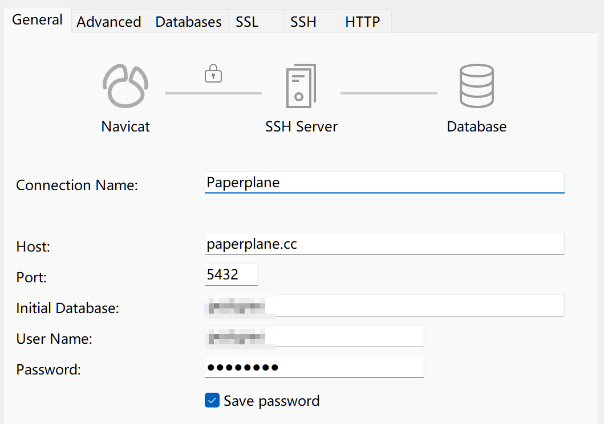

持续更新，记录 Docker 以及部署 DevOps 工具时常见的问题。

注意，以下各项内容均在 Linux 系统中实践过，但不保证能正确应用于 Windows 和 macOS。


# 常用链接

Docker Hub：https://hub.docker.com/
Docker Compose 文档：https://docs.docker.com/compose/compose-file/
Dockerfile 文档：https://docs.docker.com/reference/dockerfile/
Docker 配置文件 daemon.json 文档：https://docs.docker.com/reference/cli/dockerd/
将 Docker run 转化为 Docker Compose：https://www.composerize.com/ （建议外网访问）


# Docker 引擎 `daemon.json` 配置

官网文档：https://docs.docker.com/reference/cli/dockerd/#daemon-configuration-file
可以看到在不同操作系统下，可以使用的字段有所不同。

Linux 编辑配置文件：

```bash
sudo vim /etc/docker/daemon.json
```

macOS 编辑配置文件：

```bash
sudo vim ~/.docker/daemon.json
```

Windows 配置文件：
使用 WSL 时优先在 `%userprofile%\.docker\daemon.json`；
未使用 WSL 时优先在 `%programdata%\docker\config\daemon.json`。

（Windows 和 macOS 如果安装了 Docker Desktop，可以直接在设置界面找到 “Docker Engine” 配置项修改，这个入口其实就是在编辑 `daemon.json`）

修改配置文件后，需要重启 Docker 来使配置生效（Docker Desktop 选择 “Restart”）：

```bash
sudo systemctl daemon-reload
sudo systemctl restart docker.service
```

-----

**使用 Docker 源镜像：**

用于国内拉取镜像加速。网上的版本太旧，很多都不能用了，Github Gist 上有人持续更新一个列表，[点击前往](https://gist.github.com/y0ngb1n/7e8f16af3242c7815e7ca2f0833d3ea6)。
本文此部分最后一次更新于 2024 年 3 月。

```json
{
  "registry-mirrors": [
    "https://docker.mirrors.sjtug.sjtu.edu.cn",
    "https://docker.nju.edu.cn",
    "https://dockerproxy.com",
    "https://mirror.baidubce.com",
    "https://hub.c.163.com"
  ]
}
```

上面的镜像源分别来自：
[上海交通大学镜像服务](https://mirror.sjtu.edu.cn/)，他们也有 k8s 的镜像加速；
[南京大学镜像服务](https://mirror.nju.edu.cn/)，他们有 k8s、ghcr（Github 的镜像仓库）、gcr（Google 的镜像仓库）等镜像加速，很赞；
[Dockerproxy](https://dockerproxy.com) 免费镜像，他们也提供上面各种国外镜像仓库加速，具体可以看文档；
百度云；
网易数帆。

阿里云需要去注册一个 [镜像加速器](https://cr.console.aliyun.com/cn-hangzhou/instances/mirrors)，会提供一个带用户 ID 的域名；
腾讯云的服务器可以使用 `https://mirror.ccs.tencentyun.com`，注意非腾讯云的服务器可能无法使用的。

-----

**配置 Docker 的日志存储方式和体积上限：**

推荐参考 [Docker 官方文档](https://docs.docker.com/config/containers/logging/configure/) 来进行进一步了解。
简单地限制 Docker 日志的体积：

```json
{
  "log-driver": "json-file",
  "log-opts": {
    "max-size": "1024m",
    "max-file": "3"
  }
}
```

上述配置将 Docker 日志限制为 1024MB 大小，至多 3 个文件。注意不要把 `"max-file": "3"` 中值 `"3"` 的双引号去掉。

也可以针对某个容器单独设置 Compose：

```yaml
logging:
  driver: "json-file"
  options:
    max-size: "1024m"
    max-file: "3"
```

-----

**k8s 配置 cgroups：**

```json
{
  "exec-opts": ["native.cgroupdriver=systemd"]
}
```


# 容器中服务的时区不正确

遇到此问题，可以尝试给服务的 Docker Compose 配置时区环境变量，或者把宿主机的时区和时间文件以只读方式映射到容器：

```yaml
environment:
  - TZ=Asia/Shanghai # 只配这一条，就能解决大多数问题
volumes:
  - /etc/timezone:/etc/timezone:ro
  - /etc/localtime:/etc/localtime:ro
```


# 必须 `sudo` 才能执行 `docker` 指令

需要将当前用户添加到 `docker` 组中。此处以 Ubuntu 举例：

```bash
# 创建名为 docker 的用户组，如果已有则跳过此步骤
sudo groupadd docker

# 将当前用户加入 docker 组（重新登录后生效）
sudo gpasswd -a $USER docker
```


# 提示 Docker Compose 文件存在错误

注意你的所有端口映射写法，参考：

```yaml
ports:
  - 80:80   # 一切正常
  - 443:443 # 一切正常
  - 2222:22 # 这行会导致出问题！
```

这是因为一个很隐晦的 yaml 规则：**数值如果带有冒号，可能会被当做时间来解析。**
通常较大的数字带冒号，不会被当做时间，比如上面的 `80:80` 和 `443:443`；但如果数字较小，即使很多位，也可能被当做时间来解析，导致报错。

推荐的做法是，任何情况都给 `ports` 里面的项加上引号，养成这个习惯：

```yaml
ports:
  - '80:80'
  - '443:443'
  - '2222:22'
```


# Docker 日志太占空间

此日志清理命令为转载，原文链接：https://blog.csdn.net/qq165285727/article/details/132557787 ，应该是网上最好的方法了。
指令如下：

```bash
sudo docker ps -aq | xargs docker inspect --format='{{.LogPath}}' | xargs truncate -s 0
```

此指令会执行的操作：

- `docker ps -aq`：列出所有容器的ID；
- `docker inspect --format='{{.LogPath}}'`：获取每个容器的日志路径；
- `xargs truncate -s 0`：使用 `truncate -s 0` 命令清空每个日志文件。

同时建议参考下文中全局配置日志文件上限的方式，这样可以避免日志经常占满磁盘空间。


# 服务监听不到流量

有可能是因为服务绑定的地址不对，如果监听 `127.0.0.1` 无法成功，可以试试 `0.0.0.0`，反之亦然；
区别是：

- `127.0.0.1` 绑定来自本地计算机的连接；
- `0.0.0.0` 表示所有可用的 IPv4 地址，服务绑定后可以监听来自主机、局域网、互联网上所有的连接。

通常而言，Docker 会创建网关并为每个容器管理流量，此时，容器收到的流量都是被 Docker 网络引擎转发过来的，对于容器来说这些流量是来自 `127.0.0.1` 的；所以这种情况下，如果你将容器移出 Docker 运行，可能就需要改为监听 `0.0.0.0`。

更常见的情况是使用 Nginx，来自服务器外部的流量，经过 Nginx 后，对于服务而言也是来自 `127.0.0.1` 的了；所以你将服务运行在没有 Nginx 的环境下，可能也需要改为监听 `0.0.0.0`。

端口映射时，也可以指定 IP 地址，例如：

```yaml
ports:
  - '127.0.0.1:8080:8080'
  - '9090:9090'
```

这两种方式是不同的，`8080` 端口映射仅允许来自本地网络的连接进入容器；而 `9090` 端口映射没有指定 IP，它默认就是 `0.0.0.0`，即表示允许所有连接进入容器。
如果你的服务直接对外暴露，允许宿主机的端口直通容器，那么需要按照 `9090` 的写法，前面不能加上 `127.0.0.1`。


# 容器内如何访问宿主机

Docker 默认使用桥接模式管理容器的网络：为每个容器建立一个虚拟网络，容器之间互相不通，由 Docker 引擎管理通讯。
因此，容器中的 `localhost` 或者 `127.0.0.1` 实际上是容器在自己所在的虚拟网络中的回环地址，它并不指向宿主机。

但是，容器有可能需要访问宿主机自身暴露的端口，总会有这种需求。所以需要一个表示宿主机的主机名或者 IP 地址。
方法有很多：

-----

**直接获取容器中网关的地址，此地址即指向宿主机：**

执行指令：

```bash
# 此指令列出了容器所有底层信息，也包括网络设置
docker inspect <容器名>
```

注意结果中的 `NetworkSettings.Gateway` 字段，如果有值，则它就是容器中用于访问宿主机的 IP 地址；
如果你使用 Docker Compose，上述值可能为空，改为寻找 `NetworkSettings.Networks`，它是一个对象，表示当前容器加入的所有 Docker 网络，你可以通过任一网络的 `Gateway` 字段来得到用于访问宿主机的 IP 地址。如果当前容器加入多个网络，选择其中任一个即可访问宿主机。

Docker 建立的网络，其网关地址不会自行发生改变，但是此方法不够通用，在不同机器上有可能网关地址不同，还需要想办法把这个 IP 传给容器里的服务，实际应用较少。

-----

**【推荐】将网关添加到 hosts 当做一个域名：**

Docker 允许我们将网关地址添加到容器的 hosts 中，当做一个域名。编辑 Docker Compose 配置：

```yaml
extra_hosts:
  - '<自定义域名>:host-gateway'
```

经过这样配置后，在此容器中便可以使用自定义的域名来访问宿主机。这里的 `host-gateway` 是关键字，不要动它。
你可以使用 `docker exec` 进入容器中，找到 `/etc/hosts` 文件，便可以看到 Docker 自动添加了 hosts 记录。

这种方法实际上是上一种方法的升级版，它让 Docker 自动把不固定的网关地址映射为了一个固定的域名，所以是最稳定和最推荐的做法。

-----

**使用魔法域名（仅 Docker Desktop 可用）：**

使用在 Windows 和 macOS 上安装的 Docker Desktop 时，容器中可以直接使用以下域名来访问宿主机：

```
host.docker.internal
```

注意，Linux 是不支持的，所以这个方法也不推荐。

-----

**使用宿主机的网络模式（仅 Linux 系统可用）：**

编辑 Docker Compose 配置（再说一遍，仅 Linux 可以用）：

```yaml
network_mode: host
```

这会使得容器共享宿主机的网络，此时便可以通过 `localhost`、`127.0.0.1` 直接访问宿主机。
此模式通讯效率也是最高的，但是会存在安全性问题，也没有做到网络隔离。实际上这种方法牺牲了 Docker 的很多特性，仅用于特定场景，不是广泛的解决方法。


# 部署 Nginx 时如何初始化

Nginx 镜像在启动容器后，如果没有给它的配置目录 `/etc/nginx/` 做目录映射，那么它会使用内部的一套默认配置来启动；
一旦将这个配置目录映射到宿主机的某个目录，那么 Nginx 镜像便不会创建任何默认配置了，这个目录就是空着的，导致第一次启动报错。

按照以下步骤来初始化：

```bash
# 提前新建目录，如果让 Docker 来创建的话，目录的拥有者会变成 root
sudo mkdir -p <配置文件目录>

# 临时启动一个 Nginx 容器
sudo docker run --name tmp-nginx-container -d nginx

# 复制出默认配置
sudo docker cp tmp-nginx-container:/etc/nginx/ <配置文件目录>

# 删除临时的 Nginx 容器
sudo docker rm -f tmp-nginx-container
```

这样便得到了一份默认的 Nginx 配置文件，正常启动 Nginx 时就可以把这个配置文件目录映射过去了。


# 部署 Gitea 并与宿主机的 22 端口直通

因为 Git 使用 SSH 通讯，默认走 22 端口，所以如果想让 Gitea（或者 Gitlab、Gogs 等）的容器也绑定到 22 端口，会与操作系统的 sshd 服务抢占 22 端口，导致无法成功。

SSH 的 Git 克隆地址通常是这样的：`git@paperplane.cc:jia-niang/paperplane-blog.git`，其中指定了用户名 `git`，因此我们可以实现一个程序，判断连接到主机的用户名，如果叫 `git`，便将它转发给 Git 服务。

如果直接将 Gitea 安装到宿主机，安装程序会自动帮我们部署转发程序；但在 Docker 中部署 Gitea 时，这个转发程序便需要由用户自行来完成了。这里有两份官方文档：[gitea.com 的中文文档](https://docs.gitea.com/zh-cn/installation/install-with-docker#ssh-%E5%AE%B9%E5%99%A8%E7%9B%B4%E9%80%9A)、[gitea.cn 的中文文档](https://docs.gitea.cn/installation/install-with-docker#ssh-%E5%AE%B9%E5%99%A8%E7%9B%B4%E9%80%9A)，可以提供第一手的支持，本文旨在写出自己的实践以避坑。

依次执行这些指令，这里以 Ubuntu 系统为例：

```bash
# 新建 git 用户，如果已有则跳过此步
sudo adduser git

# 为 git 用户创建一个 SSH 密钥对
sudo -u git ssh-keygen -t rsa -b 4096 -C "Gitea Host Key"

# 创建一个可执行文件
sudo vim /usr/local/bin/gitea
```

在这个文件中写入以下内容：

```bash
ssh -p 2222 -o StrictHostKeyChecking=no git@127.0.0.1 "SSH_ORIGINAL_COMMAND=\"$SSH_ORIGINAL_COMMAND\" $0 $@"
```

这段内容用于把原始的命令转发给本机的 `127.0.0.1:2222`，并使用 `git` 用户名。这里的 `2222` 端口你可以更换成别的。
完成写入后保存退出，继续执行：

```bash
# （重要）给刚才那个文件赋予可执行权限
sudo chmod a+x /usr/local/bin/gitea

# （重要）把刚才给 git 用户生成的公钥添加到 git 用户的已认证公钥列表中，允许自己连自己
sudo echo "$(cat /home/git/.ssh/id_rsa.pub)" >> /home/git/.ssh/authorized_keys

# 查看并记住 git 用户的用户 ID （左）、用户组 ID（右）
sudo vim /etc/passwd
```

完成以上步骤后，便可以准备启动 Gitea 容器。
编辑 Docker Compose 配置：

```yaml
environment:
  - USER_UID=1002 # 填写刚才看到的 git 用户的 ID（左）
  - USER_GID=1002 # 填写刚才看到的 git 用户的用户组 ID（右）
volumes:
  - /home/git/.ssh/:/data/git/.ssh   # 必须
  - /etc/timezone:/etc/timezone:ro   # 推荐
  - /etc/localtime:/etc/localtime:ro # 推荐
  - <持久化存储目录>:/data
ports:
  - '127.0.0.1:2222:22' # 必须，左侧的端口号不一定是 2222，只要和上面的匹配即可
```

至此便完成了设置。

> 原理也很简单，未登录的用户只能使用 https 克隆，想使用 SSH 则必须在 Gitea 中登记自己的公钥。
>
> 而 Gitea 在登记公钥时，向 `/home/git/.ssh/authorized_keys` 中写入的不只是公钥本身，而是在开头加了一段 `command="/usr/local/bin/gitea ...` 的指令，这会使得使用这些公钥的用户连接时，自动执行上面所写的可执行文件，从而使指令被转发到 2222 （或者是你自己指定的）端口。
>
> 而我们在 Docker 中配置了，本机的 2222 （或者是你自己指定的）端口映射到 Gitea 容器的 22 端口，这样便实现了把用户从宿主机 22 端口传来的 SSH 直通给了 Gitea 容器的 22 端口。


# 数据库使用 Navicat 但不暴露端口

数据库如果对外暴露端口，可能遭到加密勒索等黑客攻击，因此大部分场合我们都不会把数据库的端口对外开放，通常 Docker 容器直接不做端口映射，或者是通过防火墙禁用掉数据库的端口。

但是，不开放数据库端口，会使我们导致难以调试，无法使用 Navicat 之类的工具。
虽然可以通过一些数据库连接工具来对外暴露一个 Web 界面，通过 Web 界面调试，例如 [adminer](https://hub.docker.com/_/adminer)、[mongo-express](https://hub.docker.com/_/mongo-express) 等工具，但是便利性还是比不上 Navicat 的，所以还是希望能用一种方法来支持工具调试。

此时，有一种方案就比较适合我们的需求：
Navicat 允许我们使用 SSH 隧道来连接数据库，会先 SSH 连接到主机，然后再尝试连接数据库，这便相当于做了一次 “中转”。
下面就以 PostgreSQL 举例，演示这种配置方式：

首先，为了避免数据库端口意外对外暴露，可以先在云服务供应商的防火墙处配置，禁用数据库端口的连通，一般来说禁用 TCP 即可，当然也可以把 UDP 也一起禁用了；也可以使用 Linux 的防火墙 `iptables` 或 `firewalld`，关闭掉这些端口的连接。

> MySQL 端口为 `3306`，PostgreSQL 端口为 `5432`，MongoDB 端口为 `27017`。

然后，修改数据库的 Docker Compose 文件：

```yaml
services:
	postgres:
    ports:
      - '127.0.0.1:5432:5432'
      # 注意这里的 127.0.0.1 不能省略
```

这里虽然做了 `5432` 端口映射，但指定了 `127.0.0.1` 这个 IP，只允许来自宿主机本地的连接。
这样做，即使 `5432` 端口对外放开，外部的连接也无法传入 PostgreSQL。

然后这一步是可选的，如果你使用域名来连接，建议做这一步；如果用 IP 直连，这一步可省略。
修改 hosts，把本机的域名指向本地。
执行指令：

```bash
sudo vim /etc/hosts
```

添加：

```ini
127.0.0.1 example.com
```

把这里的 `example.com` 换成你自己的域名。
更换后，可能要重启服务器或重启网络服务，这个新的 hosts 才能生效。

然后，打开 Navicat 配置连接：
先配置 SSH：


此处配置和 SSH 连接用的配置一样，端口是 22；认证方式我是用 SSH 密钥，如果是密码的方式，可以在下拉框处修改。
服务器地址我这里填写了域名，如果你使用 IP 直连，改成 IP 即可。

然后配置数据库连接：


这里需要注意的是，如果你通过 SSH 连接到服务器，那么此时这里的 “Host” 地址是相对于服务器而言的了。
**如果数据库就在这台服务器上，你可以把 “Host” 直接配置成 `localhost`；也可以像我这样填写本机的域名，那么上一步配置 hosts 便是必须的步骤，不然服务器走外网 DNS 到自身的地址，却发现 `5432` 端口被防火墙挡了。**

这样便配置完成了，点击左下角的 “Test Connection” 测试连通。
完成时：


-----

如果连接失败了，也可以通过图示化界面查看是哪一步出错。

例如，如果 SSH 连接没配对，会显示成这样：


如果 SSH 连接配置正确，但是访问数据库的步骤出错，会显示成这样：


这样调试起来也会更容易。
