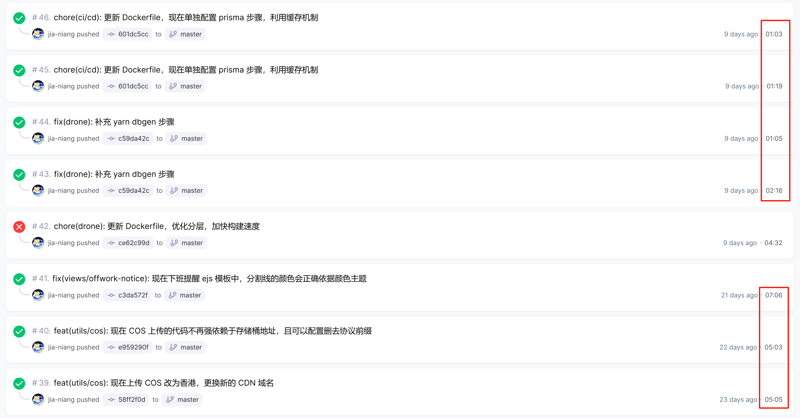
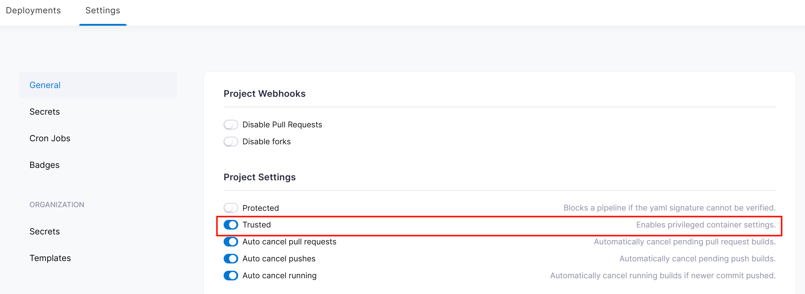
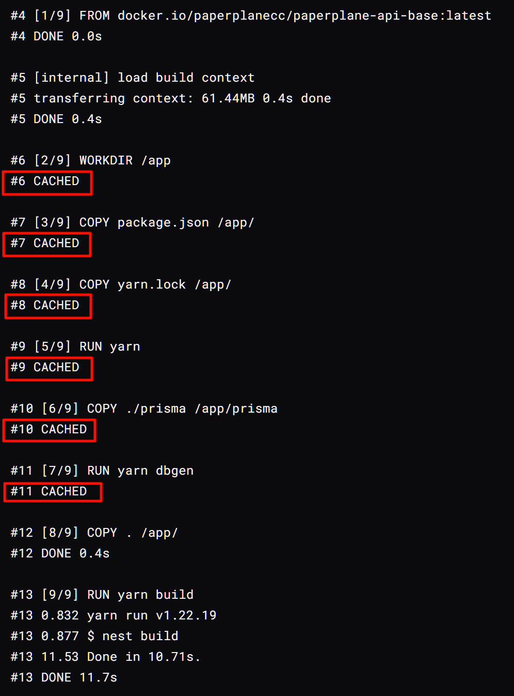

现在很多代码托管平台都提供基于 Docker 镜像的构建流水线，例如 GitHub、腾讯云等。不同于 Jenkins 等传统的 CI/CD 工具，这种构建流水线对环境的要求和构建过程产生的副作用都非常小，在多次构建之间的差异也更小。因此，我推荐学习和使用此类构建工具。

[Drone CI](https://www.drone.io/) 就是这样的基于 Docker 镜像的构建流水线工具，本博客也是使用 Drone CI 构建而来，[查看构建状态](https://drone.paperplane.cc/jia-niang/paperplane-blog)。


目前在 https://drone.paperplane.cc/ 上大约运行了 20 多个 CI/CD 流水线。


# 背景

Drone 采用的是类似 k8s 的架构，其自身负责提供网站 UI 界面、提供 API 以及触发发起或停止构建操作，类似于 k8s 的 Master 节点；而具体运行构建任务的则是交给各种 Drone Runner 来负责，类似于 k8s 的 Worker 节点。

Runner 有很多种类：在 Docker 中构建、通过 SSH 执行命令、直接在本机执行命令等。各个 Runner 通过 RPC 连接到 Drone，负责执行 Drone 分配的构建任务。通常来说 99% 的使用场景都是 Docker Runner，本文也以此为基础。

-----

对于前端项目而言，CI/CD 步骤一般是这样（克隆代码的步骤省略）：

- 安装依赖，例如 `yarn`；
- 运行测试，例如 `yarn jest`；
- 编译打包，例如 `yarn build`；
- 部署，可以直接把文件 `scp` 或者 `rsync` 到服务器指定目录；或者用 `nginx` 等镜像为基础打包成一个 Docker 镜像，推送到镜像仓库，然后令部署机器拉取镜像并运行。

可以看出前端项目相对而言构建和部署都比较简单。但是，这种简单的构建部署往往也会花费较长的时间，例如：`yarn` 安装依赖时可能会花费很多时间，而且如果部署机器和构建机器不在一起，那么之间的数据传输也会耗费时间。这些 CI/CD 流程中存在着优化空间。


# 纯前端项目的部署方式

之前说过，前端项目可以通过 `scp` 或 `rsync` 的方式拷贝静态资源来部署。
还有一种方式就是打包成 Docker 镜像，一般会这样做：

提供一个 Dockerfile 文件：

```dockerfile
FROM nginx
RUN rm /etc/nginx/conf.d/default.conf
ADD deploy/default.conf /etc/nginx/conf.d/
COPY dist/ /usr/share/nginx/html/
```

然后在项目中创建 `/deploy/default.conf` 写入：

```nginx
server {
  listen 80;
  server_name  _;
  index index.html index.htm;
  root /usr/share/nginx/html;

	location / {
		try_files $uri $uri/ /index.html =404;
	}
}
```

这样配置就提供好了，执行 `docker build` 即可打包成 Docker 镜像。
启动这个镜像无需任何额外参数或配置，启动后可以通过这个镜像的 `80` 端口来访问网站。

-----

对于纯前端项目而言，我个人更倾向于使用 `scp` 或者 `rsync` 等方式把文件拷贝到服务器指定目录，这样做有几个好处：

- 旧版本的 JS/CSS 等文件可以保留，如果用户停留在旧版本页面上，未及时刷新，此时懒加载到旧模块不会白屏报错（推荐试试我开发的 [`use-upgrade`](https://www.npmjs.com/package/use-upgrade)）；
- 外层的 Nginx 统一控制访问行为，不需要多走一次容器内层的 Nginx，管理起来更方便。
- 如果使用镜像的方式，则还需要在部署机上调度容器，增加了一系列的操作。


# 基于 Docker 的几种部署方式

实际开发中，构建和部署往往都不在同一台机器上，所以采取 Docker 镜像的方式来部署，则会涉及到一个镜像的 “传递” 问题。
如何把镜像从构建的服务器传递到部署的服务器，并执行后续的部署指令；以及构建和部署是同一台服务器时，怎样做最为方便，这便是本文的核心主旨。

本文只考虑基于 Docker 镜像构建和部署的场景。使用 Docker 镜像，可以保证运行环境的一致性，且这样还能做到服务器上多个不同 Node.js 版本的项目共存，甚至衍生出滚动更新（不停机升级）等很多玩法。
如果使用服务供应商的云原生服务，或者使用 k8s，打包 Docker 镜像就是必须的选择。


## 推送镜像到镜像仓库

在负责构建的服务器完成构建任务后，通过 `docker build` 指令把项目打包成 Docker 镜像，然后使用 `docker push` 推送到镜像仓库；
此后，使用 `ssh` 等方式连接到部署服务器，执行 `docker pull` 指令拉取镜像；而且即使在本机部署，也能这样操作。

这便是最简单直观的部署方式，也是最 “正确” 的方式。

需要注意的是，Docker Hub 官方只对免费用户提供一个私有镜像的额度，这肯定是不够用的；而云服务供应商例如阿里云、腾讯云，都会提供镜像仓库服务，付费使用云服务供应商的镜像仓库服务也是可以的。
如果不想付费，也可以自行搭建 Docker 镜像仓库，例如使用 [`registry`](https://hub.docker.com/_/registry)、[`harbo`](https://goharbor.io/) 等工具。

我之前也是一直这样做的，但是近期出现了一些小插曲：

> 近期我把网站服务器从腾讯云迁移到了 [“雨云”](https://www.rainyun.com/Mjg1OTU0_)，它的价格优惠较大、硬盘可弹性扩容、公网 IP 可以随便买，且其香港服务器的线路非常好。
> 但是，迁移后小厂的问题暴露了出来，例如小厂没有 Docker 的内网加速域名，也没有制品库服务，服务器上拉取和上传镜像必须走固定带宽小水管。 而我的一些项目需求的 Docker 镜像体积较大，例如 [`paperplane-api`](https://git.paperplane.cc/jia-niang/paperplane-api) 这个项目的基础镜像就有 1.5 GB（压缩后也有近 900MB），打包依赖和代码后未压缩的体积竟然高达 2.5GB。上传镜像到制品库的耗时是不可接受的。 虽然我有自搭的制品库，但小厂也不支持自建网络，Drone 运行的构建容器也没法配置 hosts，所以即使想推送到自搭制品库，流量也要经过外网绕一圈再回来。

我没有多余的服务器，构建和部署都在同一台机器上，因此可以寻找一种直接在本机上构建并部署，无需访问外部网络的部署方式。


## 使用 Exec Runner 构建成功后直接运行

这种方式类似 Jenkins。在本机执行命令，牺牲了 Drone 作为 Docker 容器运行时的特性，无法做到环境和文件的隔离。

并且，这个场景仅适用于构建机和部署机是同一台的情况。如果是分别两台服务器，则这个步骤无法实现 “传递” 镜像，可能还是得通过  Docker 镜像仓库来上传和下载镜像，并使用命令来部署。


## 导出镜像为文件并在部署机上导入

Docker 提供了 [`docker image save`](https://docs.docker.com/reference/cli/docker/image/save/) 命令，用于将某个镜像保存为文件；
随后，可以使用 [`docker image load`](https://docs.docker.com/reference/cli/docker/image/load/) 命令，指定一个文件把它加载还原为镜像。

这便给我们提供了在两台服务器之间传递 Docker 镜像的方式。构建机把镜像导出为文件后，通过 `scp` 等方式发送给部署机，然后通过 SSH 连接到部署机执行部署命令，加载文件，取得镜像，然后运行新的镜像。

但是，这种方式的效率不高，原因如下：

- 导出、导入都需要额外的时间，这个过程也会占用硬件资源；
- 传输效率不高：使用 Docker 镜像仓库时可以利用镜像的 “分层” 机制，跳过已存在哈希值的 “层” 来大幅降低传输数据量；但是这种方式把镜像整个打包为一个压缩包传输，没法利用 “分层” 的特性；
- 部署动作只能由构建机发起：使用 Docker 镜像仓库时，部署操作实际上可以看做是部署机在 “发起需求”，请求获取最新的镜像；而这种传输镜像文件的部署方式，需要构建机主动向每个部署机传输文件，主动方的角色变成了构建机，如果部署机较多，维护起来会很麻烦。

我比较倾向于把这种方式看做是类似于使用镜像仓库来管理镜像，而且不需要付费购买镜像仓库服务，也不需要自搭镜像仓库。


## 构建部署同一台机器时推荐使用 DinD

如果你使用 Drone 以及 Docker Runner，且构建机和部署机是同一台服务器，那么我强烈推荐使用 DinD 模式。
“DinD” 全名 “Docker in Docker”，即运行在 Docker 中的 Docker。

这里先解释一下 Drone Docker Runner 的运行方式：
Drone Docker Runner 的 Docker Compose 配置文件通常是这样：

```yaml
services:
  drone-runner-docker:
  image: drone/drone-runner-docker
  container_name: drone-runner-docker
  volumes: # ↓ 注意这一行
    - /var/run/docker.sock:/var/run/docker.sock
```

我们需要把宿主机的 Docker UNIX Socket 暴露给 Runner，因为构建流程中的每一步都是跑在 Docker 容器中的，这些容器需要 Runner 自行去拉取，**此时 Runner 就会使用宿主机的 Docker 来进行拉取镜像操作**；
而且 Drone 的配置文件中支持将宿主机的目录映射到构建过程中，而 Runner 本身也是一个容器，它不可能越过 Docker 直接把宿主机的文件直接挂在到另一个容器。

因此，Runner 必须能访问宿主机的 Docker，通过它来完成镜像拉取、目录挂载等操作。

注意上面加粗的一句话，Drone Docker Runner 运行时，每一步所使用的镜像，都是由宿主机的 Docker 来拉取的。这些镜像会被存储在宿主机上，可以直接通过 `docker images` 看到。也正因如此，后续构建操作便不再需要重新拉取一遍镜像了。

Drone Docker Runner 本身运行在容器中，和宿主机是隔离的，但是它可以让宿主机为自己拉取镜像。
这便给了我们启发：**虽然构建的容器和宿主机是隔离的，但是可以通过上面这种方式，把构建镜像的 Docker 守护进程换成宿主机的 Docker，这样镜像构建好后，对于宿主机而言直接就是可用状态了，运行它即完成了部署。**

而 `docker:dind` 这个 Drone 镜像就可以帮我们实现这一点，它提供另一个能运行在 Docker 容器里的 Docker 环境，我们可以使用 `docker build` 等命令，但只要我们把 `/var/run/docker.sock` 这个文件替换成宿主机的，那么 Docker 相关的操作就都会由宿主机来完成。
给出一个实例 `.drone.yml`：

```yaml
steps:
  - name: build-image
    image: docker:dind
    volumes:
      - name: dockersock
        path: /var/run/docker.sock
    commands:
      - docker build --progress plain -t example/example:example .

volumes:
  - name: dockersock
    host:
      path: /var/run/docker.sock
```

这里可以看到，我们通过 `volumes` 机制来把宿主机的 `/var/run/docker.sock` 挂载到 DinD 容器中同样的位置，这样在 DinD 容器中执行的 Docker 命令，都会发生在宿主机的 Docker 守护进程上面。
这个构建步骤完成后，宿主机的镜像列表中便会出现构建好的 `example/example:example` 镜像，此时直接运行它即可。

这种方式速度快，具备隔离性，如果构建机和部署机是同一台，那么推荐这种方式。


# 优化 CI/CD 的速度

这里给出项目 [`paperplane-api`](https://git.paperplane.cc/jia-niang/paperplane-api) 的 [构建流水线](https://drone.paperplane.cc/jia-niang/paperplane-api) 记录：



可以看到在优化操作之前，每次构建所花费的时间很长，而优化后只需要一分钟左右。

实际上，这一分钟时间也有很大一部分浪费在 clone 操作上，真正 CI/CD 执行的时间加起来也就不到 30 秒钟：


这个项目是一个最终打包为 Docker 镜像并在本机部署的 Node.js 后端项目，还使用到了 Prisma 做 ORM。

为什么 Docker 容器构建速度可以有这么大的优化？
除去 clone 操作的耗时，原先超过四分钟的步骤，可以优化到只花费 30 秒钟，速度可以优化到 8 倍。这便是本文接下来讲到的 CI/CD 速度优化的内容。


## 通过依赖项的缓存加快构建流程

前端项目每次 CI/CD 都需要安装依赖项，也就是 `yarn` 或 `npm i`。在这一步骤中，部署机需要从 npm 下载大量代码包，一般来说 `node_modules` 这个文件夹会很大，很容易就超出 GB 级别了，这些依赖项都需要在 CI/CD 流程中从网络上下载，非常耗时。

如果是本机直接执行 CI/CD 安装依赖，这些包会在本机硬盘上缓存。但是，Drone CI 每一个步骤都是基于 Docker，在完成步骤后，容器即被销毁，无法持久化缓存。
因此，我们需要想办法为 Drone 流水线持久化 npm 或 yarn 的缓存。下文以 yarn 为例。

Drone 的 Docker 流水线支持配置 `volumes` 来挂载宿主机的目录，我们需要将 yarn 的缓存目录对外挂载。
参考如下 `.drone.yml` 配置：

```yaml
steps:
  - name: install-deps
    image: node:20
    volumes:
      - name: yarn-cache
        path: /home/node/.cache/yarn
    commands:
      - yarn

volumes:
  - name: yarn-cache
    host:
      path: /path/to/host/dict
```

这段配置使用 `node:20` 镜像进行 `yarn` 安装依赖，但配置了 `volumes`，将目录 `/home/node/.cache/yarn` 挂载到宿主机的目录。
每次安装依赖后，包的缓存会持久化保存在宿主机的磁盘上，下次构建也能用到这些缓存，速度就可以很快。

不过，Drone 默认不允许构建流程访问宿主机的磁盘，因为这存在风险。
我们需要在 Drone 中项目的 “Setting” 页面找到 “Trusted” 选项并开启，这样才允许使用 `volumes` 配置：



-----

对于 yarn 而言，可以通过 `yarn cache dir` 来获取当前缓存存储的目录。

对于不同的用户身份，缓存目录也不一样，存在这样的规则：

- 如果使用的是非 `root` 用户，例如 `node` 镜像默认的是 `node` 用户，那么缓存目录位于：`/home/<用户名>/.cache/yarn`；
- 如果使用的是 `root` 用户，那么缓存目录位于：`/usr/local/share/.cache/yarn`。

如果使用 npm，可以通过 `npm config get cache` 来获取当前缓存存储的目录。
npm 通常缓存目录位于：`~/.npm`。


## 通过 Layer 加快 Docker 镜像制作流程

本段内容受腾讯 AlloyTeam 的一篇 [博文](https://mp.weixin.qq.com/s/QfHHJnzD4vhenjFcFSNMhQ) 的启发，强烈建议阅读。

Docker 镜像的产生需要通过 [Dockerfile](https://docs.docker.com/reference/dockerfile/) 来声明制作镜像的步骤，Dockerfile 是一个记录镜像制作过程中运行命令的文件，我们在 `docker build` 的时候会依次执行其中的命令，大部分步骤可以产生 “Layer”，或者叫 “层”。例如，执行 `RUN` 会产生 Layer，执行 `COPY` 把源码拷贝到镜像中，也会产生 Layer。

只有层机制还不够，Docker 会记录每次操作的哈希；构建镜像时，如果本地已有某个哈希值的 Layer，直接复用这一 Layer 即可，构建步骤就可以瞬间完成；推送镜像到仓库时，如果镜像仓库已有相同哈希值的 Layer，那么便可以跳过上传步骤，节约大量的网络传输流量。

我们发现，只要保证 Layer 可以被复用，构建速度和上传速度都可以极大程度的加速。
这里还是以 `paperplane-api` 的流水线举例，可以看到大部分步骤都被缓存了，构建步骤瞬间完成：



但是，想复用 Layer 的机制，需要满足这样的条件：

- 对于任何 Dockerfile 指令而言，**必须它之前的所有 Layer 都已使用缓存，它才能应用缓存**；
- 通过 `ADD` 或 `COPY` 向镜像中添加文件时，文件的内容和没有任何变化时，才能应用缓存。

这两点机制是 Docker 用于在多次构建镜像时保证镜像的一致性的。但这些机制也给我们利用缓存机制提出了考验。

通过上面的规则，可以得出一些结论：

- **如果某一步完全没办法缓存，为了防止它影响后面步骤的缓存，我们需要尽量把这个步骤移至最尾部执行；例如把项目源码 `COPY` 进镜像，每次构建时项目源码肯定是发生过改动的，这一步肯定无法缓存，所以 `yarn build` 类似的指令在最后执行；**
- **安装依赖时 `yarn` 指令必须要有 `package.json` 和 `yarn.lock`，而这两个文件一般来说不会特别频繁的修改，我们可以先只把这两个文件 `COPY` 到镜像，然后执行 `RUN yarn` 安装；这样一来，如果依赖项没有发生过任何变动，`COPY` 操作和 `RUN yarn` 的哈希值都没有变化，这两个 Layer 可以应用缓存，从而使得安装依赖的步骤瞬间完成。**

基于上面这两点结论，这里给出一个 Dockerfile 示例：

```dockerfile
FROM node:20

# 指定工作区
WORKDIR /app

# 添加依赖配置到工作区，安装依赖
COPY package.json /app/
COPY yarn.lock /app/
RUN yarn

# 拷贝源码到工作区，打包编译
COPY . /app/
RUN yarn build

CMD [ "yarn", "start:prod" ]
```

可以看到在 `COPY . /app/` 这一步之前的步骤，都是可以应用缓存。

-----

既然层存在缓存机制，如果某一步操作和之前所有操作的哈希都已存在，那么这些操作便可以复用缓存，这虽然可以加快我们的构建速度，但也存在一些问题：
如果 Dockerfile 中需要执行一些带有副作用的命令，例如如果要 `curl` 发送一个请求，Docker 并不知道这一步有副作用，只要命令不被修改，这一步骤就会被缓存，后续就被跳过执行了，请求也就不再会被发出。

同样，使用 [Prisma](https://www.prisma.io/) 等工具也会存在这种问题：
在 CI/CD 流程中，因为要在部署之前把数据库结构同步成最新代码的版本，我们需要为 Prisma 的 `migrate deploy` 操作单独准备一个步骤，通常把即将生产部署的镜像修改 `command` 启动命令并运行一次即可，因为生产部署的镜像中包含了最终的数据库结构、数据库连接配置，以及 npm 依赖项；
**但 Prisma 会通过 `postinstall` 这个钩子来生成类型，也就是说在 `yarn` 这一步时，类型定义就已被生成好了；而我们只拷贝了 `package.json` 和 `yarn.lock`，并没有拷贝任何 Prisma 的 Scheme 文件，这会导致 Prisma 生成的类型为全空，而且会被缓存下来，后续无法执行 `migrate deploy` 操作，运行也会报错。**

因此，在对 Prisma 这种 `yarn` 操作即存在副作用的工具进行 CI/CD 时，需要额外注意，副作用的步骤需要额外处理，不可使这类步骤被缓存。
此处给出一个 Dockerfile 示例：

```dockerfile
FROM node:20

WORKDIR /app

COPY package.json /app/
COPY yarn.lock /app/
RUN yarn

# 注意下面两行是新增的
COPY ./prisma /app/prisma
RUN yarn prisma generate

COPY . /app/
RUN yarn build

CMD [ "yarn", "start:prod" ]
```

这里我们额外增加了一个步骤，把 Prisma 的 Scheme 文件拷贝到镜像中，并专门执行一次 `prisma generate` 操作生成类型。如果 Scheme 文件没有任何改动，且 Prisma 没有任何需要应用的数据库结构迁移 SQL，这两步还是可以正常缓存的。