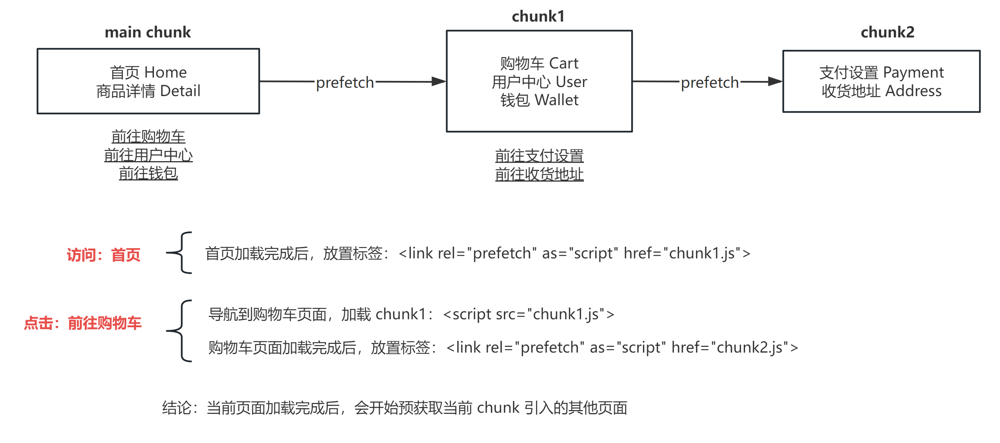
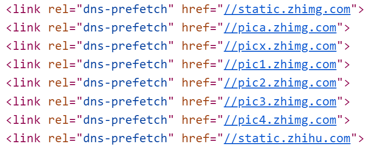

**请注意区分 dns-prefetch 和 prefetch 的区别。这两种本文都会有讲到。**

先说结论：这几种方式都可以提高网站的浏览体验，减少用户等待资源加载的时间。
具体来说：

- preload、prefetch 都是为了提前加载资源，以减少用户后续浏览时的资源下载时间，两者选用一个即可；前者会令浏览器尽快加载资源（但主 chunk 中不起效），后者则是尝试在闲时自动后台下载；
- dns-prefetch、preconnect 都是只在资源和主域名不同的场景下用于加速浏览器连接的，两者选用一个即可；前者预解析其他域名的 DNS，后者则更激进，还会对其他域名预先建立 TCP、TLS 握手等。

如果你读过 [《特殊的代码注释》](https://paperplane.cc/p/f5ed8e85faac/) 这一篇博文，你可能对 preload 和 prefetch 比较熟悉。


# preload 和 prefetch

preload 表示 “预加载”，prefetch 表示 “预获取”。

**先来说说背景：**

SPA 站点的特点就是会代码打包，这样才能提供更好的体验。但如果把全站的 JS、CSS 打包在一起，首屏加载会很久，所以我们会进行 “代码分割” 的做法，按照一定的模块划分来对代码进行拆分成多个 chunk（代码块），部分页面是只有用户访问到时才会尝试加载，这样就可以大大减少首屏的加载时间。

例如，商店页面可以只把首页单独做成一个 chunk，而用户、订单、购物车页都分割出去，用户访问时再去加载。

Webpack 本身支持代码分割，此时会注入代码，在用户浏览时会根据用户的访问情况自动加载用到的 chunk。具体语法是这样：

```typescript
// 以下以商店页面的 “关于” 页举例

// 不使用代码分割，直接把关于页和首页打包在一起
import AboutPage from '@/pages/about'

// 使用代码分割，把关于页分出去。这里的 loadable 来自 @loadable/component
const AboutPageAsync = loadable(() => import('@/pages/about'))
```

可以看出，实现代码分割只需我们使用 `import()` 这种模块引入方式，且一般这个操作都是在路由注册的时候，所以也被称为 “懒路由”。

-----

**目的和原理：**

继续上面的例子：商店页面可以只把首页单独做成一个 chunk，而用户、订单、购物车页都分割出去，用户访问时再去加载。
而如果用户浏览首页时，点击了购物车链接，那么浏览器加载购物车页面的资源，这也需要加载时间，会造成短暂的延时从而影响用户体验。

我们想要在用户浏览过程中，浏览器在后台把某些页面的资源加载完毕，用户后续点击链接便可以瞬间跳转过去，无需等待资源加载。
这便是 “预加载” 或者说 “预获取” 资源。

Webpack 给我们提供了简便的配置 preload 和 prefetch 的方式，我们只需要在 `import()` 中添加特定的注释即可：

```typescript
// 这个关于页会被预加载
const AboutPage1 = loadable(() => import(/* webpackPreload: true */ '@/pages/about'))

// 这个关于页会被预获取
const AboutPage2 = loadable(() => import(/* webpackPrefetch: true */ '@/pages/about'))
```

放置 `/* webpackPreload: true */` 注释开启某个模块的预加载；
放置 `/* webpackPrefetch: true */` 注释开启某个模块的预获取。

只要使用了这些功能，Webpack 便会在打包的产物中注入对应的代码，使得我们在浏览网站的过程中自动预加载或预获取一些资源代码。

-----

先来讲 **prefetch**，因为它的逻辑比较简单：

假设任意页面 A 通过 `import(/* webpackPrefetch: true */ '...')` 这种方式引入了页面 B，**那么在页面 A 的代码装载完成之后**，Webpack 注入的代码会自动往网页的 `<head>` 内加入以下内容：

```html
<head>
  <link rel="prefetch" as="script" href="模块文件名.js">
</head>
```

这个标签的作用是提示浏览器：用户将来可能需要某些资源，所以浏览器可以在网络空闲时在后台默默加载好这些资源。[MDN 文档说明](https://developer.mozilla.org/en-US/docs/Web/HTML/Attributes/rel/prefetch)。
浏览器会以较低的优先级尝试后台加载这些资源，并短时间缓存。

以商店网站来举例，具体流程是这样的：



-----

然后就是 **preload**，它的逻辑和 prefetch 相似，但有不同之处：

假设任意页面 A 通过 `import(/* webpackPreload: true */ '...')` 这种方式引入了页面 B，**那么在页面 A 刚开始被装载时**，Webpack 注入的代码便会自动往网页的 `<head>` 内加入以下内容：

```html
<head>
  <link rel="preload" as="script" href="模块文件名.js">
</head>
```

preload 标签的作用是提示浏览器：用户很快就要用到某些资源，浏览器会以较高的优先级去加载这些资源。[MDN 文档说明](https://developer.mozilla.org/en-US/docs/Web/HTML/Attributes/rel/preload)。
以商店网站来举例，流程是这样的：


preload 和 prefetch 有一个巨大的区别：**在主 chunk 中，任何 preload 都是无法生效的**，它只能在其它异步加载的 chunk 中才能正常生效。
例如主 chunk 页面 A 异步加载 B，B 异步加载 C，且都使用 preload 来加载，此时 B 是无法被 preload 的，但是 C 可以。Github 上有很多人对此有疑问：[链接1](https://github.com/webpack/webpack/issues/8342#issuecomment-437659472)、[链接2](https://github.com/webpack/webpack/issues/7920)。

这里解释一下原因：preload 的代码会在页面 A 刚开始被装载时便会插入 `<link>` 标签，所以实际上页面 B 的资源下载是和页面 A 同步进行的。**这意味着在页面 A 的前一个页面，便已被注入了 Webpack 的预加载代码逻辑了**。
而如果页面 A 本身就被打包在主 chunk 里，因为主 chunk 必定首先加载，没有比它更前的页面了，**那么实际上并没有一个时机来为 B 放置 preload 的标签，所以此时 preload 是无法生效的**。

如果真想实现主 chunk 引入其它模块的 preload，则需要 Webpack 分析所有主 chunk 用到的 preload 加载的资源，并提前注入到 HTML 文件的 `<head>` 里，这也需要 [html-webpack-plugin](https://github.com/jantimon/html-webpack-plugin) 插件来与之配合，通过 [插件作者的回复](https://github.com/jantimon/html-webpack-plugin/issues/1150) 来看，目前看来这个功能并没有任何计划提供支持。

-----

**关于 `<link rel="preload/prefetch">` 这个标签：**

浏览器对不同域名的缓存往往不能共通，所以给 prefetch 和 preload 提供了跨域的资源可能无法达成效果。

此外，被预加载或预获取的资源如果响应头的 Cache-Control 被设为 `no-store` 或 `no-cache`，那么也是没有效果的。 

此外，这个标签的 `as` 属性是必须的。它的值一般为 `"script"`，但也支持 `"style"`、`"font"`、`"image"` 等值。使用这个属性，会为浏览器的预加载或预获取请求添加 `Accept` 头。
值得一提的是，因为 CSS 自身有能力引入其它资源（使用 `@import()` 语法），可能会导致加载一大堆文件，所以 Webpack 没有计划为 CSS 文件提供预加载或预获取的功能。


# dns-prefetch（DNS 预解析）

**注意 dns-prefetch 和 prefetch 有巨大的区别，不可混为一谈。**

dns-prefetch 我们称为 “DNS 预解析”，**它只适用于存在 CDN 且 CDN 域名与主域名不同的情况**。
它的作用是让浏览器提前为其它的域名做 DNS 解析，提高后续访问的速度。

以知乎为例：



这里知乎为自己的几个 CDN 域名都做了 dns-prefetch，这样后续浏览时便可以优化连接速度。
如果需要对 dns-prefetch 的优化进行指标化的度量，[这篇文章](https://www.cythilya.tw/2016/06/25/dns-prefetching/) 有提到各个浏览器查看 DNS 解析性能指标的方式。

可以看出，DNS 预解析是通过在 `<head>` 中放置标签的方式来实现的：

```html
<head>
  <link rel="dns-prefetch" href="域名">
</head>
```

因为网站打开后马上就会加载资源，所以 DNS 预解析生效的越早越好，一般是希望把标签直接放置在 HTML 中，而不是通过 JS 来放置。

-----

**实现方式：**

因为 DNS 预解析通常是直接放在 HTML 的，所以我们需要使用 Webpack 插件来实现。

使用 `html-webpack-tags-plugin` 插件：

```javascript
const HtmlWebpackTagsPlugin = require('html-webpack-tags-plugin')

// 放入 webpack 的 plugins 中：
new HtmlWebpackTagsPlugin({
  usePublicPath: false, // ← 如果不加这一行，href 前面会多出一个 "/"
  links: [
    { path: 'https://example.com', attributes: { rel: 'dns-prefetch' } },
  ],
})
```


# preconnect（预连接）

preconnect 我们称为 “预连接”，它同样适用于某些资源和主域名不同的场景，它会使浏览器提前发起 DNS 解析、TCP 握手，如果是 https 的网站还会提前进行 TLS 握手。

**推荐的做法是，只将最关键的域名进行 “预连接”。因为预连接的域名太多会导致占用很多网络带宽，可能会导致适得其反。**
以 bilibili 视频播放页为例：


可以看到只有两个域名开启了预连接。

-----

**实现方式：**

预连接也是推荐直接放在 HTML 的，方法和 DNS 预解析类似：

```javascript
const HtmlWebpackTagsPlugin = require('html-webpack-tags-plugin')

// 放入 webpack 的 plugins 中：
new HtmlWebpackTagsPlugin({
  usePublicPath: false, // ← 如果不加这一行，href 前面会多出一个 "/"
  links: [
    { path: 'https://example.com', attributes: { rel: 'preconnect' } },
  ],
})
```

-----

通常来说，preconnect 覆盖了 dns-prefetch 的功能。
但是考虑到可能有的浏览器不支持 preconnect，所以常见的做法是只要使用了 preconnect 就也一同使用 dns-prefetch。

知乎上有一篇 [文章](https://zhuanlan.zhihu.com/p/358836730) 对 preconnect 和 dns-prefetch 做了测试，可以看出这两者都能明显提升性能，且 preconnect 更加明显。而且 preconnect 和 dns-prefetch 同时开启时，和只开启 preconnect 是没有区别的（2ms 区别应该是误差）。


# modulepreload

自 Chrome 66 开始，新增了 `<link rel="modulepreload">` 的支持，可以称之为 “模块预加载”。

它和 preload 类似，但是相比之下它除了下载和缓存资源之外，还对资源代码提供了原生 ES Module 的支持，会解析和编译它并把结果放入 module map 中，为后续的执行代码做好准备。
可以理解为：这是为 ES Module 提供的专用的 preload。

在本地开发时，Vite 利用了这个功能，使得本地开发调试 JS 的速度得到进一步加快。
