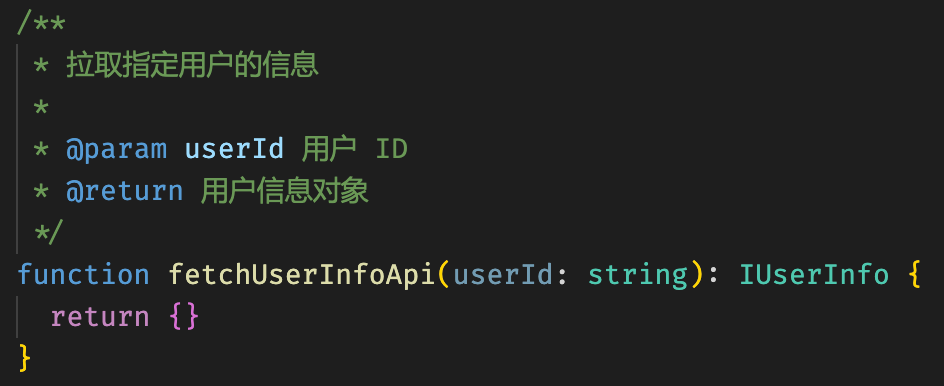
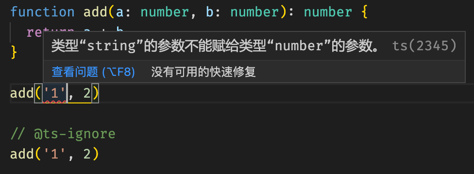
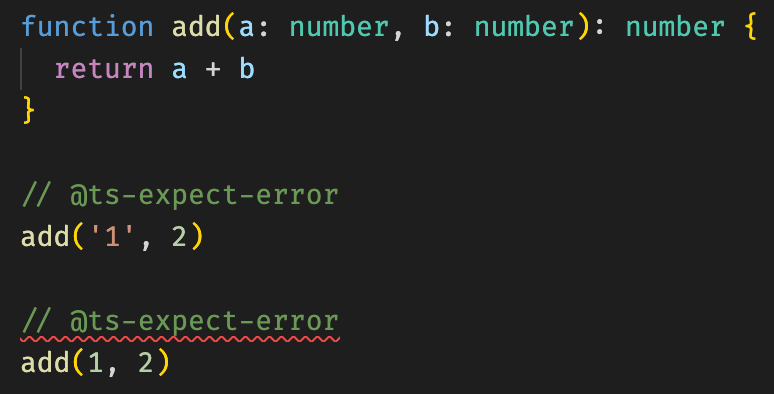
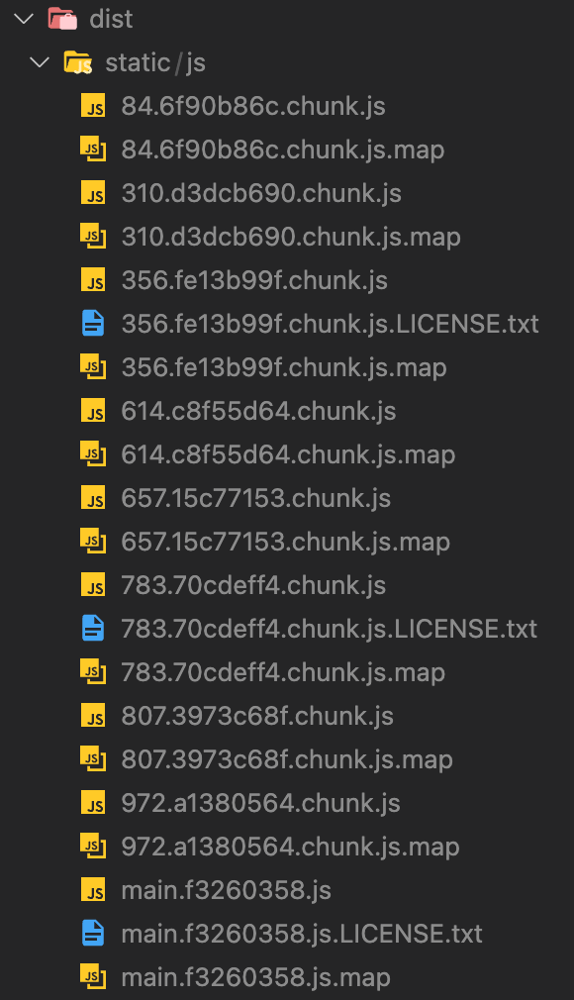
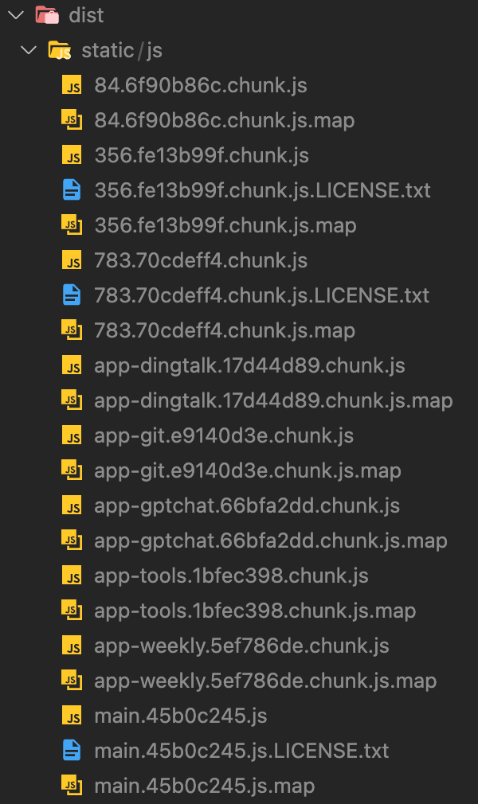
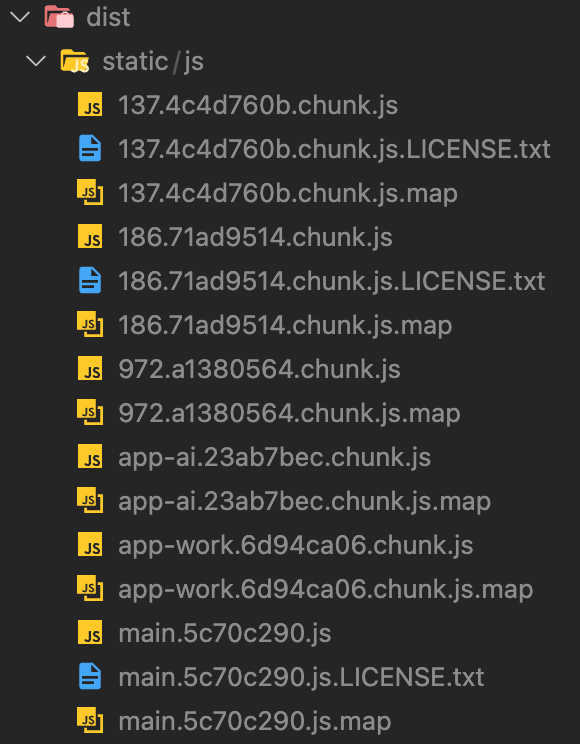

在项目开发过程中，我们经常能看到各种特殊格式的代码注释，例如可能会以 `@` 开头，或者是格式很复杂，甚至编辑器还会给这些注释加上代码高亮。
如果删掉这些注释，代码可能会出现报错，甚至项目运行也会收到影响。

这些就是被称为 “Magic comment”（魔法注释）的特殊注释。这些注释不会对代码的运行产生影响，但是，编译工具（例如 Webpack、Typescript）或 IDE 则会读取它们，并产生一些效果。


# 常见的 JSDoc 注释

经常能见到的注释格式，这里以 Typescript 举例：

```typescript
/**
 * 拉取指定用户的信息
 *
 * @param userId 用户 ID
 * @return 用户信息对象
 */
function fetchUserInfoApi(userId: string): IUserInfo {
  return {}
}
```

我们经常能在项目中看到这类注释。它通常写在方法上方，标注了方法的参数、返回值等信息，还会有一些文本介绍。通常来说，库的作者都会提供尽可能详细的注释，便于使用者理解。

想要用键盘输入这种注释，只需要输入 `/**` 开头，并按下回车键，编辑器就会自动帮我们生成注释。

我们还可以注意到，这种注释也有文本高亮，所以是一种支持格式的注释：




打出这种注释后，我们在其他地方想要使用这个方法，在输入的时候，编辑器也会自动给我们提示：


这种注释的名称叫 [JSDoc](https://jsdoc.app/)。
在以前没有 Typescript 的年代，Javascript 开发者们约定使用这种特殊格式的注释，用于标记一个方法的参数、返回值等信息，而编辑器、IDE 也会集成解析 JSDoc 的功能，在我们调用方法时展示出相关的提示。

这里有两点需要特别注意：只有 `/**` 开头的注释会被识别为 JSDoc 注释，JSDoc 注释即使只有一行也是可以的，以 `//` 和 `/*` 开头的都不行；**此外，JSDoc 的语法支持 markdown 格式，VSCode 可以正确解析和显示。**

JSDoc 的结构看上去很直观，开头一段是介绍文本，然后是很多行由 `@params` 这种开头格式的标识符，用于标识一个方法的参数、返回类型等。JSDoc 不仅可以给方法用，也可以给对象、类、变量使用，它也支持很多种标识符，具体可以前往 [官方文档](https://jsdoc.app/) 查看和参考。

-----

上面的例子是 Typescript 的注释。
如果你的项目没有使用 Typescript，那么可以写成这种格式：

```javascript
/**
 * 拉取指定用户的信息
 *
 * @param {string} userId 用户 ID
 * @return {Object} 用户信息对象
 */
function fetchUserInfoApi(userId) {
  return {}
}
```

注意这里每一个 `@` 开头的标识符，后面都有一个花括号格式的类型标记。

-----

这里给出几段 JSDoc 用法示例，以下均不使用 Typescript：

下面是一个构造函数的 JSDoc 用法，其中用到了构造函数的标识 `@constructor`，这个方法的 `country` 参数是可选的，JSDoc 中表示为方括号包裹起来 `[country]` 这种形式：

```javascript
/**
 * 构造一个 Person 对象
 *
 * @constructor
 * @param {string} name 名字
 * @param {number} age 年龄
 * @param {string} [country] 国家（可选）
 */
function Person(name, age, country) {
    this.name = name;
    this.age = age;
    this.country = country || 'Unknown';
}
```


下面是一个带有使用示例的 JSDoc，使用 `@example` 作为标识符：

```javascript
/**
 * 计算两个数的和
 *
 * @param {number} a 加数
 * @param {number} b 被加数
 * @returns {number} 计算出的结果
 *
 * @example
 *
 * // 得到结果： 7
 * sum(3, 4)
 */
function sum(a, b) {
  return a + b;
}
```


下面是一个使用对象作为参数的 JSDoc 示例：

```javascript
/**
 * 提交用户信息
 *
 * @param {Object} userInfo 提交的用户对象
 * @param {string} userInfo.name 用户的姓名
 * @param {number} userInfo.age 用户的年龄
 * @param {Date} userInfo.createAt 用户的创建日期
 */
function submitUserApi(userInfo) {}
```

使用这种格式，在调用方法时候，编辑器也能正确的给出格式提示：


下面是一个使用复杂类型参数的 JSDoc 示例：

```javascript
/**
 * 我是复杂参数的方法
 *
 * @param {string[]} arrayParam 我是字符串数组
 * @param {(string|number)} mixedParam 我可以是数字或字符串
 * @param {*} anyParam 我可以是任何类型
 */
function test(arrayParam, mixedParam, anyParam) {}
```

在调用这个方法时，编辑器可以从 JSDoc 中推导出参数的类型，从而给我们提供提示：


-----

可以看出，JSDoc 主要是在没有 Typescript 的年代大放光彩。如果你还在使用 Javascript，那么可以参考 Typescript 提供的一份 [文档](https://www.typescriptlang.org/docs/handbook/intro-to-js-ts.html)，它提供了 JSDoc 来模拟 Typescript 功能的方式。

如果你的项目使用了 Typescript，那么 JSDoc 的作用就会减弱很多，因为 Typescript 本身具备类型标注的功能。

但是，我们还是可以利用 JSDoc 的编辑器提示功能，在复杂的方法上方加上以 `/**` 开头的说明注释，这样别人才调用你的方法时，就可以看到你写的说明注释。之前的 `//` 双斜杠注释是不会显示编辑器的提示的，要改掉这个习惯。

-----

还有一种升级版的 JSDoc，叫 [TSDoc](https://tsdoc.org/)，目前 VSCode 已经原生支持。
在用户已经使用了 Typescript 时，便可以减少 JSDoc 中啰嗦的类型标注，格式有所变化。

这里给出一个 TSDoc 的片段示例：

```typescript
/**
 * 用 `<div>` 包裹元素
 * 
 * @param {import("react").ReactNode} input 提供的节点
 * @returns {import("react").ReactNode} 返回被包裹的节点
 */
function wrapperDiv(input) {
  return <div>{input}</div>
}
```

可以看到，这里可以使用 `import()` 这种方式来导入类型。此外，TSDoc 还支持如 `@typedef`、`@template` 等多种标注。


# Typescript 的 `@ts-` 注释

常见的 Typescript 注释一共有四种：

`// @ts-ignore` 取消下一行代码的 Typescript 类型检查错误提示。
这个是最常用的，如果下一行代码出于某些原因类型问题暂时无法解决，可以使用此方式来取消类型检查提示。




`// @ts-expect-error` 预期下一行代码存在至少一个错误，因此先在此标记一下，暂时不要提示。
这个功能和上面的 `// @ts-ignore` 类似，但是相比来说，这个显然更好一点，因为语义更加明确，并且如果未来代码更新了，下一行语句的错误不存在了，编辑器会把这个注释标红，便于我们及时获知代码的变动。



可以看到，因为不存在错误了，所以 `// @ts-expect-error` 出现了红色波浪线提示，因此它其实是 `// @ts-ignore` 的更好的替代。


 `// @ts-nocheck` 只能放在文件首行，表示不对此文件进行类型检查。
一般来说，在 Typescript 项目中引入 JS 的文件（最常见的场景是引入 JS 的 SDK），通常这会导致整个文件有一大堆报错，使用这个注释，便可以让此文件的错误不再显示。

`// @ts-check` 只能放在文件首行，一般用于 .js 文件，表示为此文件开启类型检查。


这些 Typescript 注释，支持 `//` 或 `/* */` 格式，也支持在 JSX 中使用：`{/* @ts-ignore */}`。


# Webpack 的 `/*#__PURE__*/` 注释

首先明确一下，`/*#__PURE__*/` 注释是由 Webpack 在编译构建过程中添加的，用于给其它工具提供代码标注，便于其他工具更好的处理代码。实际上最终的打包构建产物代码中，这个注释我们是看不到的。

在 Webpack 4 以及之前，[Uglify.js](https://github.com/mishoo/UglifyJS) 会读取并使用这些注释；而在 Webpack 5 以及后续版本，则是由 [Terser](https://terser.org/) 读取并使用这些注释。

Webpack 有一个名叫 [“TreeShaking”](https://webpack.docschina.org/guides/tree-shaking/) 的功能，它可以分析并在打包时删除没有使用到的代码，这个过程就是由 Terser 来进行的，因此此注释实际上是给 Terser 使用的。
简单介绍一下 TreeShaking：

例如一个模块里导出了 3 个方法，但是只被使用了 1 个，那么 TreeShaking 可以使打包产物不包含其他 2 个方法的代码，以此来减小打包后的代码体积。因此工具要分析代码中方法、变量的使用情况，确保只有未被使用的方法、变量才被 TreeShaking 删除，否则会引起代码的功能异常。

通常来说，变量的使用情况分析起来较为容易；而方法的使用情况则涉及到一个 “副作用” 的概念：
如果一个方法只是单纯的接受一个输入并返回一个结果输出，它并不修改输入的变量，更不会去修改外部变量，那么这个方法可以被看做是 “纯净的”、“无副作用的”。

请看以下示例：

文件 `convertUserInfo.ts`：

```typescript
// 假设此方法只是单纯的做对象字段转换
// 它不会修改传入的变量，也不会引起任何外部改动
export function convertUserInfo(userInfo: IUserInfo): INewUserInfo {
  return { ...userInfo, name: userInfo.username }
}
```

页面文件：

```jsx
import { convertUserInfo } from './convertUserInfo'

export default function UserInfoPage() {
  const userInfo = useUserInfo()
  
  // 注意下面这一行，newUserInfo 并没有被使用
  const newUserInfo = convertUserInfo(userInfo)

  return <div>{userInfo.name}</div>
}
```

以上代码中，`convertUserInfo` 是一个完全没有副作用的方法，它接收一个变量，并返回一个新变量，并不会对原来的变量进行修改，也不会对方法外部做任何改动。

可以看到，`const newUserInfo = convertUserInfo(userInfo)` 这一句代码，方法返回的变量并没有被使用，我们可以认为：这一行语句可以被 TreeShaking 删除掉；甚至如果 `convertUserInfo` 方法仅有这一处调用，那么 `convertUserInfo.ts` 这整个文件都可以丢弃掉不必打包。

而以上代码在打包之后（**注意请以打包构建后的产物为准**），产物中还是会包含 `convertUserInfo` 相关的代码，因为工具认为 `convertUserInfo` 方法被引入且使用了，这个方法有可能有副作用，所以不能删掉它。

修改文件页面文件的代码为：

```jsx
import { convertUserInfo } from './convertUserInfo'

export default function UserInfoPage() {
  const userInfo = useUserInfo()
  
  // 注意下面这一行，添加了注释
  const newUserInfo = /*#__PURE__*/ convertUserInfo(userInfo)

  return <div>{userInfo.name}</div>
}
```

上述代码中，添加了 `/*#__PURE__*/` 注释之后再打包代码，构建产物中这一行代码就不存在了；如果 `convertUserInfo` 方法全局仅这里使用了一次，那么 `convertUserInfo.ts` 整个文件都不会被打包。

由此可见，`/*#__PURE__*/` 注释可以标注方法调用是 “纯净的”、“无副作用” 的。
被此注释标注的方法调用，如果它的返回值没有被使用，那么这些语句便可以被 TreeShaking 删除。

其实，`/*#__PURE__*/` 也可以写成 `/*@__PURE__*/` 的格式，Terser 的注释支持符号 `#` 和 `@` 开头。

-----

此外，Terser 还支持以下几种注释（开头的 `#` 也都可以换成 `@`），可在 [官方文档](https://github.com/terser/terser#annotations) 处查看：

注释 `/*#__INLINE__*/` 或 `/*#__NOINLINE__*/`：标注一个方法调用，分别表示会确保此方法被内联、确保此方法不被内联。
Terser 中具备变量和方法的 “内联” 的功能，配置项 `compress.inline` 便是控制此行为的（[查看文档](https://terser.org/docs/api-reference#compress-options)），此配置项有三个级别：`false` 或 `0` 表示关闭内联；`1` 表示只内联简单的方法；`2` 表示内联方法和参数（这也是 `create-react-app` 的默认配置）；`3` 或 `true` 表示内联方法和参数以及变量（这也是 Terser 的默认值）。

以 `create-react-app` 创建的默认项目为例，页面文件：

```jsx
function addOne(input: number) {
  return input + 1
}

function addTwo(input: number) {
  return input + 2
}

function App() {
  console.log(addOne(111))
  
  console.log(addTwo(222))
  console.log(addTwo(333))

  return null
}

export default App
```

打包后的产物中搜索 `111`、`222`，可以看到如下代码：

```javascript
function r(e) {
  return e + 2
}
var l = function () {
  return console.log(111 + 1), console.log(r(222)), console.log(r(333))
}
```

可以看到，在构建产物中，如果方法只被用过一次，那么方法代码将被直接 “内联” 到调用方，也就是第一段 `console.log(111 + 1)`，这里直接把 `addOne` 的源代码复制到此处了；而 `addTwo` 方法被多次使用，它没有被 “内联”。

如果将上述代码修改为：

```typescript
function addOne(input: number) {
  return input + 1
}

function addTwo(input: number) {
  return input + 2
}

function App() {
  console.log(/*#__NOINLINE__*/ addOne(111))
  
  console.log(/*#__INLINE__*/ addTwo(222))
  console.log(/*#__INLINE__*/ addTwo(333))

  return null
}

export default App
```

打包后的产物中，可以找到这一段代码：

```javascript
function r(e) {
  return e + 1
}
var l = function () {
  return (
    console.log(r(111)),
    console.log(222 + 2),
    console.log(
      (function (e) {
        return e + 2
      })(333)
    ),
    null
  )
}
```

可以看到，原来的 `addOne` 被 `/*#__NOINLINE__*/` 给强制禁用内联了，虽然它只被调用了一次；
而原来的 `addTwo` 被 `/*#__INLINE__*/` 给强制开启内联了，注意多次调用时 Terser 只会内联第一次方法的代码，因为变量有可能重名。


注释 `/*#__KEY__*/`：一般用于标注字符串，此字符串将被视为某个对象的 “属性名”，当对象的属性名被压缩时，此字符串也会一同改为对应的值，使用示例：

```typescript
import _ from 'lodash'

_.get({ propA: 123 }, /*#__KEY__*/ 'propA')
```


# Webpack 的 `webpack*:` 注释

Webpack 支持使用代码中的 “魔法注释（Magic Comments）” 来定义编译构建时的行为，可以参考 [官方文档](https://webpack.docschina.org/api/module-methods/#magic-comments) 上的说明。其实日常开发中，我们最常见最常用的还是 `/* webpackChunkName: "chunk名" */`，其他的并不常见。

**注意：这些注释都是用于 “导入解析” 的场合，也就是我们常说的 “动态导入”，也就是 `import()` 这种写法。如果你用不到这种导入方式，那么可以直接跳过这个章节。此章节中所有注释都需要放置在 `import()` 的括号中。**

-----

下面来介绍 Webpack 支持的注释：

`/* webpackChunkName: "chunk名" */`：在 Webpack 进行代码分割时，使用你提供的 chunkName 作为文件名，并且使相同的 chunkName 的代码合并打包到同一个文件里。
这个是最常见最常用的注释，它用于在 Web 项目中，在使用 `import()` 来实现代码分割的同时来指定分割后的代码文件的名称。

先来介绍一下什么是代码分割：

现在 Web 项目通常都包含数十个甚至上百个页面，其中还会使用大量的图片、CSS、JS 等资源。而 SPA 单页站点会把资源打包整合成一个文件，一次性加载所有资源，此时网络带宽将直接影响到网页的加载速度，有可能导致长时间的白屏，最终影响到用户体验。

解决方案就是使用 Webpack 提供的 “代码分割” 功能，把项目代码分为几块，例如作为一个电商网站，可以把首页、商品详情页两个最频繁访问的页面放在一起首屏就加载，而其他页面单独放在其他的文件里，用户访问到时再去加载；甚至可以再极端一点，除了首页，其他所有页面都做成访问时再加载。

Webpack 提供的代码分割功能需要我们使用 ES Module 规定的 `import()` 方法来导入模块，打包时遇到这种代码，Webpack 便会将导入的模块拆分开，放在另一个 JS 文件中。一般来说，我们会在路由配置文件中来做这一步。

我们这里直接用 Paperplane App 应用站的 [部分源码](https://git.paperplane.cc/jia-niang/paperplane-app/src/commit/b3919ee6abf3a7321ab42e666e609cd58fa2020e/src/router/index.tsx) 来举例，这里使用的是 `react-router@6`，以这篇博文编写的时间点来看，这是一个非常新的版本：

```typescript
import loadable from '@loadable/component'
import { createBrowserRouter, RouteObject, RouterProvider } from 'react-router-dom'

// 注意下面这两个页面/组件，它们是直接导入的
import MainLayout from '@/components/layout/main'
import HomePage from '@/pages'

// 下面这些页面，都是通过 import() 来导入的
const ToolsPage = loadable(() => import('@/pages/tools'))
const DingtalkPage = loadable(() => import('@/pages/tools/dingtalk'))
const WeeklyPage = loadable(() => import('@/pages/tools/weekly'))
const GPTChatPage = loadable(() => import('@/pages/tools/gptchat'))
const GitPage = loadable(() => import('@/pages/tools/git'))

const routerConfig: RouteObject[] = [
  {
    element: <MainLayout />,
    children: [
      { path: '/', element: <HomePage /> },

      { path: '/tools', element: <ToolsPage /> },
      { path: '/tools/dingtalk', element: <DingtalkPage /> },
      { path: '/tools/weekly', element: <WeeklyPage /> },
      { path: '/tools/gptchat', element: <GPTChatPage /> },
      { path: '/tools/git', element: <GitPage /> },
    ],
  },
]

const router = createBrowserRouter(routerConfig, { basename: process.env.PUBLIC_URL })

export default function RouterEntry() {
  return <RouterProvider router={router} />
}
```

从上面的路由配置可以看出，除了首页之外，其他页面都是使用 `import()` 导入的，这样我们的项目便实现了代码分割。如果用户访问我们的站点首页，那么只会加载布局组件 `MainLayout` 和首页 `HomePage` 两部分的代码，其他页面的代码不会立刻加载，而是等到用户访问对应页面的时候再去加载。

我们可以运行编译构建，查看一下构建产物：



可以看到代码被拆分成了很多块。

如果不使用 `import()` 组织代码，我们把其中的 `import()` 部分改为：

```typescript
import ToolsPage from '@/pages/tools'
import DingtalkPage from '@/pages/tools/dingtalk'
import GitPage from '@/pages/tools/git'
import GPTChatPage from '@/pages/tools/gptchat'
import WeeklyPage from '@/pages/tools/weekly'
```

此时再运行编译构建，查看构建产物：


此时就只有一个代码文件，它的体积非常大，如果用户的网速不理想，加载这么大一个文件一定会引起长时间的白屏。

介绍完了代码分割，接下来介绍这个 `/* webpackChunkName: "chunk名" */` 注释的作用。
它需要配合 `import()` 方法来使用。最常见的用法是这样：

```typescript
const ToolsPage = loadable(() => import(/* webpackChunkName: "app-tools" */ '@/pages/tools'))
const DingtalkPage = loadable(() => import(/* webpackChunkName: "app-dingtalk" */ '@/pages/tools/dingtalk'))
const WeeklyPage = loadable(() => import(/* webpackChunkName: "app-weekly" */ '@/pages/tools/weekly'))
const GPTChatPage = loadable(() => import(/* webpackChunkName: "app-gptchat" */ '@/pages/tools/gptchat'))
const GitPage = loadable(() => import(/* webpackChunkName: "app-git" */ '@/pages/tools/git'))
```

如上面代码示例所示，这个注释写在 `import()` 里面，冒号后面的字符串可以自己定。
我们把代码改成上面的格式，然后编译构建，看看产物：



可以看出，打包产物中的 JS 文件，都会使用我们前面注释中所写的名称来作为文件名。项目的入口文件名，固定是 `main`。当然这里还会多出几个文件，它们是被多个文件公用的部分，被 Webpack 抽出来放到单独的 JS 文件中了。

看到这里，难道说这个注释的作用只是为了给打包后的文件重新命名吗？其实并不是，它真正的作用是令我们可以给多个导入的模块指定相同的文件名，这样这些文件便可以被打包到同一个文件中去，加载时也是同时加载。

以上面的项目代码来举例，作为用户，我们在上班时有可能会同时使用钉钉功能和周报功能，因此我想让 `DingtalkPage` 和 `WeeklyPage` 两个页面放在一个代码包里，这样它们之间页面跳转就是秒跳，不需要白屏等待；同样我想让 `GPTChatPage` 和 `GitPage` 两个页面放在同一个代码包里。
这样修改代码：

```typescript
// 下面这两行，chunk 名都叫：app-work
const DingtalkPage = loadable(() => import(/* webpackChunkName: "app-work" */ '@/pages/tools/dingtalk'))
const WeeklyPage = loadable(() => import(/* webpackChunkName: "app-work" */ '@/pages/tools/weekly'))

// 下面这两个，chunk 名都叫：app-ai
const GPTChatPage = loadable(() => import(/* webpackChunkName: "app-ai" */ '@/pages/tools/gptchat'))
const GitPage = loadable(() => import(/* webpackChunkName: "app-ai" */ '@/pages/tools/git'))
```

此时编译构建项目，查看产物：



此时 Webpack 便会自动组织和打包代码，让我们所需的几个模块按照相同的 chunkName 组合在一起放到一个文件里面。
我们一开始说的需求：“例如作为一个电商网站，可以把首页、商品详情页两个最频繁访问的页面放在一起首屏就加载，而其他页面单独放在其他的文件里，用户访问到时再去加载”，便可以使用这种方式来实现。

对了，如果你的 `import()` 使用了字符串拼接的方式，也就是动态导入，Webpack 提供了两个占位符 `[request]` 和 `[index]` 供我们在 chunkName 中使用，它们分别表示 “文件实际的名称” 和 “自增的数字”。示例：

```typescript
const animalName = 'cat'
import(/* webpackChunkName: "[request]" */ `./animals/${animalName}`)
```

在 Webpack 打包时，这里的 `[request]` 会被替换成目录 `./animals/` 下的每个文件的实际名称。

-----

`/* webpackInclude: /^正则$/ */` 和 `/* webpackExclude: /^正则$/ */`：分别用于指定哪些文件需要被包含、哪些文件需要被排除，需要提供一个正则表达式，用来匹配文件路径和文件名。
注意这个正则表达式是匹配被导入文件的完整路径的，你可以理解成从 `/src` 开始的完整路径。

举一个简单的例子即可说明：

```typescript
const animalName = userInput

// 导入 ./animals/ 目录下的文件，但是，以 dog 开头的除外
import(/* webpackExclude: /\/dog/ */ `./animals/${animalName}.png`)
```

以上示例中，Webpack 会把 `./animals/` 目录下所有 `.png` 结尾的文件都作为资源文件，但排除了任何以 `dog` 开头的文件。
用户输入一个名称，便会寻找对应名字的图片加载，找不到时会报错。

注意：如果资源是一个数组格式，并且通过 `forEach`、`map` 等方式全部加载，使用这个注释会导致被排除的资源加载失败并报错，因此需要也在代码里控制，跳过被这个注释排除掉的资源文件的使用。举例：

```jsx
import { useEffect, useState } from 'react'

const imageNameList = ['aaa', 'bbb', 'ccc']

function App() {
  const [images, setImages] = useState<string[]>([])

  useEffect(() => {
    Promise.all(
      // 注意，下面排除了 aaa 文件，所以代码一定会报错
      imageNameList.map(imageName =>
        import(/* webpackExclude: /aaa/ */ `./images/${imageName}.jpg`)
          .then(fileInfo => fileInfo.default)
      )
    ).then(setImages)
  }, [])

  return (
    <div>
      {images.map(image => (
        
      ))}
    </div>
  )
}

export default App
```

如果代码中需要引入的某些文件被 `/* webpackExclude: /^正则$/ */` 注释排除了，代码是一定会报加载资源失败的报错的，需要妥善处理。

-----

`/* webpackMode: "模式" */`：指定 Webpack 在加载模块时的模式。它支持以下值：

- `"lazy"`（默认值）：为模块单独分割出一个 chunk 文件，可以延迟加载；
- `"lazy-once"`：一般用于动态引入的场合，生成一份可以 “一次性满足所有导入” 的 chunk，可以延迟加载，你可以理解为组合所有导出仅生成一份文件，举个例子：做国际化多语言支持，每个国家的语言都是一份 JS 或者 JSON 配置，通过动态 `import()` 来导入语言文件，如果这些语言文件使用 `"lazy-once"` 来导入的话，那么切换语言时候可以秒切不需要等加载；
- `"eager"`：避免被导入的模块生成额外的 chunk，也就是说代码分割是无效的，注意 `import()` 依然是一个 `Promise`；
- `"weak"`：使用 “弱依赖” 模式，一般用于 SSR + 代码分割的场景。此 `import()` 方法仍然返回一个 `Promise`，但只会在当前已加载了此模块时，才会 `resolve` 此模块，否则此 `Promise` 直接 `reject` 而并不去加载 JS 文件。一般来说，这个注释可以避免代码在 SSR 场景下，代码在服务端和客户端各运行一次而引发问题。

-----

`/* webpackPrefetch: true */` 和 ` /* webpackPreload: true */`：这两个注释分别表示导入的模块需要被 “预获取（prefetch）” 和 “预加载（preload）”。用好它们，可以优化网站的用户体验。

如果网站进行了代码分割，把代码分为了不同的 chunk，那么用户浏览网站时加载其他 chunk 代码便需要下载资源，影响体验。开发者可以令浏览器默默地提前加载好资源，这样后续就不需要等待资源的下载了。

它们的原理是：

- `/* webpackPrefetch: true */`：当前模块如果引入了某个带有此注释的模块，那么 Webpack 注入的代码会放置一个 `` 标签在 `<head>` 里，浏览器会去尝试在空闲时间发送请求预获取这些资源（一定是在当前模块加载完毕后），并在短时间内缓存；
- ` /* webpackPreload: true */`：当前模块如果引入了某个带有此注释的模块，那么 Webpack 注入的代码会放置一个 `<link rel="preload" as="script" href="模块文件名.js">` 标签在 `<head>` 里，浏览器会去尝试尽快请求这些资源，优先级比 prefetch 更高；**需要注意的是，Webpack 会试图在父模块开始加载时便放置 `<link>` 标签（也就是时机比父模块的加载还要早），如果父模块一开始就是同步加载的，那么 preload 不会生效**。

一般来说，使用 prefetch 时负担会更小一点，preload 用不好可能会导致性能优化无效。

-----

`/* webpackIgnore: true */`：导入时禁用导入解析，注意此时也不会运作代码分割，一般用于引入静态部署的 JS 文件。
禁用导入解析意味着被导入的文件不会被一起打包，也不会被工具压缩代码和重命名文件。举例：

```typescript
import(/* webpackIgnore: true */ './lib/mylib')
```

这样运行，浏览器会直接尝试加载 `http://localhost:3000/static/js/lib/mylib` 这个文件，既不会给 url 添加 `.js` 后缀，也不会加上哈希值，这个文件同样也没有被打包。

-----

`/* webpackExports: ["需要导入的变量或方法名"] */`：这个需要 `webpack@5` 版本才能用，注意只有在打包构建时才能产生效果，如果一个模块导出了很多个方法和变量，而我们只需要用到其中几个，那么可以用这个来指定打包时只保留哪些方法和变量。

-----

以上注释都可以组合使用，使用逗号 `,` 分隔即可，例如 `/* webpackMode: "lazy-once", webpackChunkName: "app-utils" */`。


# ESLint 注释

ESLint 的注释也是比较常见的，它们主要用于令 ESLint 跳过某一行代码的检查。可以参考 [官方文档](https://zh-hans.eslint.org/docs/latest/use/configure/rules)。
例如预期某一行代码不符合 ESLint 规则，但是只能这么写，或者是这么写不会引起问题，那么我们可以写一行：

```typescript
// eslint-disable-next-line 要忽略的规则名
```

这样下面一行代码即使不符合这个规则，也不会标红。

这里列出常用的 ESLint 注释格式：

**注意：ESLint 的注释都必须以 `eslint` 字符串开头，否则会识别不到；有的注释不支持双斜杠 `//` 形式；在 ESLint 注释后面接上空格和两个连续的横杠 `--`，便可以写自己的注释了，两个横杠后面的内容会被 ESLint 忽略。**

`/* eslint-disable */`：在当前文件中，从下一行开始，跳过规则检查，注意这个注释不支持写成 `//` 双斜杠格式；
`/* eslint-enable */`：在当前文件中，从下一行开始，开启规则检查，注意这个注释不支持写成 `//` 双斜杠格式。
上面这两个注释，还支持指定特定的规则，例如：`/* eslint-disable no-console */` 表示在当前文件中，从下一行开始，跳过 `no-console` 这条规则检查，也可以指定多个规则，用逗号分隔，注意这个也不支持写成 `//` 双斜杠格式。

`// eslint-disable-line`、`// eslint-disable-next-line`：跳过当前行、下一行的规则检查，支持 `/* */` 格式。
这个注释支持指定特定的规则，例如：`// eslint-disable-next-line no-console` 表示在下一行跳过 `no-console` 这条规则检查，也可以指定多个规则，用逗号分隔。

`/* eslint eqeqeq: 0 */`：在当前文件中覆写特定的 ESLint 规则，注意这个注释不支持写成 `//` 双斜杠格式，规则可以使用数字、`"off"` 甚至数组等格式，也可以一次覆写多个规则，用逗号分隔。
