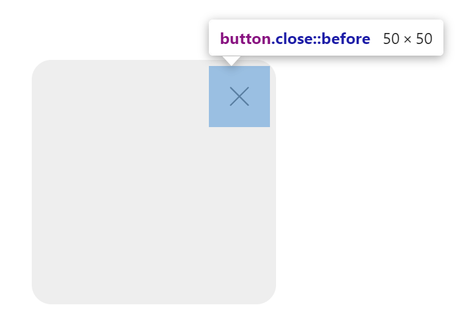
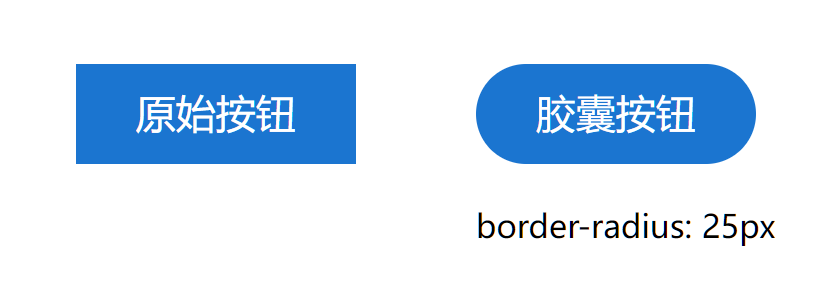
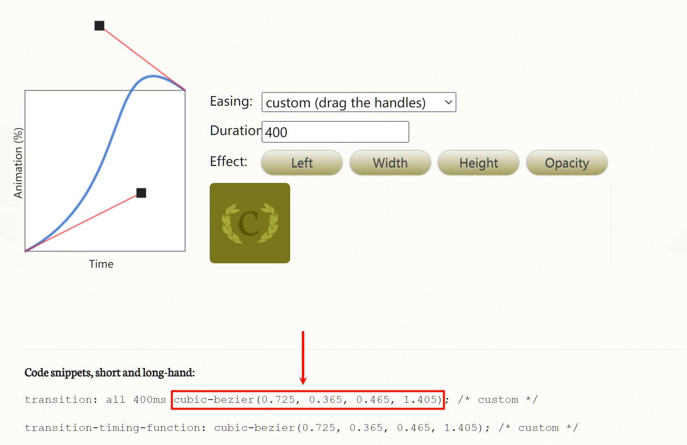

持续更新，记录 Web 开发中可以更精细的打磨优化用户体验的 CSS 技巧。
扩展阅读：

- [防御性 CSS](https://ishadeed.com/article/defensive-css/)，非常推荐，建议按照文中的内容养成习惯，看不惯英文可以看 [中文翻译](https://zhuanlan.zhihu.com/p/456571205) 或 [中文导读](https://linxz.github.io/blog/defensive-css)；
- [CSS 工作组认为设计上的错误](https://wiki.csswg.org/ideas/mistakes)，比较有意思，[卡颂的导读](https://www.zhihu.com/question/59920627/answer/3245236310)。


# 手机页面很难戳中的小按钮

移动设备上，用户用手指去点按控件，而手指的点击没有鼠标那么精确，如果按钮做的太小，那么可能很多次都难以点击命中，或者是容易点错。
这便需要我们养成一种良好的 CSS 习惯：扩大点击区域。

扩大点击区域最简单的实现方式，是利用 `padding` 属性，使得按钮的外径更大；
但是，增加 `padding` 会导致元素更大的空间，从而影响布局，实际开发中往往还要配合 `position: absolute;` 等样式来使用。

这里给出一种比较好的解决方法：
**使用伪元素来提供扩大点击区域的功能，伪元素设置为绝对定位，这样就不会影响布局了，甚至可以配合 Less 或 Sass 封装成函数。**

以下是示例，先来看难以戳中的小按钮：


如图所示，可以看到按钮非常小，难以点到。

采用伪元素的方法来扩大点击区域，代码如下：

```css
/* .close 元素本身必须是 absolute 或者 relative 的 */
.close::before {
  content: '';
  position: absolute;
  top: -15px;
  bottom: -15px;
  left: -15px;
  right: -15px;
}
```

这里我们通过负值的 `top`、`bottom` 等属性，使得伪元素在原元素的基础上向上下左右四个方向各扩展了 15px。

示例中的 `.close` 本身就是绝对定位的。如果你把这段代码用在自己的元素上面，记得把按钮元素改为 `position: relative;` 或 `position: absolute;`，不然伪元素的位置会错误。

达成的效果如图：



这个按钮的面积比原来大了数倍，更容易点按，而且，这种写法只需要我们添加一个伪元素的 CSS，不会影响原始布局。

-----

封装成 Sass：

```scss
// 扩大元素的点击区域
//   参数 $size：需要扩大半径（默认 15px）
@mixin expandClickArea($size: 15px) {
  &::before {
    content: '';
    position: absolute;
    top: -#{$size};
    bottom: -#{$size};
    left: -#{$size};
    right: -#{$size};
  }
}

// 扩大元素的点击区域，同时给当前元素添加 position: relative;
@mixin expandClickAreaRel($size: 15px) {
  position: relative;
  @include expandClickArea($size);
}

// 扩大元素的点击区域，同时给当前元素添加 position: absolute;
@mixin expandClickAreaAbs($size: 15px) {
  position: absolute;
  @include expandClickArea($size);
}
```

使用方式：

```scss
.close {
  // 给这个元素扩大点击区域，默认是 15px 半径
  @include expandClickArea();

  // 也可以指定半径
  @include expandClickArea(40px);

  // 如果当前元素是 static 定位，那么需要用这个 Rel 后缀的
  @include expandClickAreaRel();
}
```

-----

封装成 Less：

```less
// 扩大元素的点击区域
//   参数 @size：需要扩大半径（默认 15px）
.expandClickArea(@size: 15px) {
  &::before {
    content: '';
    position: absolute;
    top: -@size;
    bottom: -@size;
    left: -@size;
    right: -@size;
  }
}

// 扩大元素的点击区域，同时给当前元素添加 position: relative;
.expandClickAreaRel(@size: 15px) {
  position: relative;
  .expandClickArea(@size);
}

// 扩大元素的点击区域，同时给当前元素添加 position: absolute;
.expandClickAreaAbs(@size: 15px) {
  position: absolute;
  .expandClickArea(@size);
}
```

使用方式：

```less
.close {
  // 给这个元素扩大点击区域，默认是 15px 半径
  .expandClickArea();
}
```


# 胶囊形按钮的圆角怎么写

一个普通的方形按钮，假设高度为 50px，如图：


此时，我们想让它变成胶囊形或者叫跑道型按钮，于是想当然的就直接给它加上一个 `border-radius: 25px;`，这里的 `25px` 刚好等于高度值的一半，形成了下图一样的效果：



这样实现，看似需求已经达成了。
但是，假设某一天设计师突然要求更换字体，或者是全局更换了文字字号大小，可能就会出现这种情况：


可以看出，如果因为某些原因字号被调大，那么这种按钮的形状便会被破坏。

推荐的做法是，直接写成 `border-radius: 9999px;`，这样按钮两侧就一定是半圆形，不会因为内容被撑高而破坏：


-----

顺带一提，这里的圆角不能写成 `50%`，否则按钮会变成椭圆形，上下完全没有直边。


# CSS 属性 `pointer-events: none`

此属性表示哪些元素可以成为鼠标事件的目标，它的默认值是 `auto`；设为 `none` 后，会使得元素无法成为任何鼠标事件的目标。
实际上，这个 `none` 值的作用很大，它可以做到：

- 使元素无法触发鼠标点击、悬停、拖拽等事件，按钮、输入框等控件也无法使用；
- 类似于 `:hover` 这种 CSS 伪类选择器也不会被触发；
- 在这个元素上的点击操作等鼠标事件，都会穿透这个元素，在其 z 轴下层元素上触发；
- 甚至 F12 浏览器开发工具也不能选中这些元素。

不过，即使设置了这个属性，元素中的文本仍可以被选中，如果不想让文本被选中，可以配合 `user-select: none;` 属性一同使用。

这个属性的使用场合如下：

- **弹窗、抽屉的过渡动画期间，可以给元素放置这个属性，避免在动画播放期间被用户触发控件；**
- 画图类页面中，可用于实现 “网格辅助线”；编辑器类页面，可以用于实现 “输入预测”。


# 模态框原来应该这样写

模态框（Modal 或 Dialog）不同于其他元素，它是一种需要覆盖全屏的组件。实现它，需要考虑一些额外的因素：

**最好用 `ReactDOM.createPortal()` 把蒙层、模态框的元素全部放到 `<body>` 下：**

代码如下：

```tsx
function Modal() {
  return createPortal(<div>模态框或蒙层的 DOM...</div>, document.body)
}

```

因为你的 `Modal` 组件有可能被放置在某一个元素内部，然后此元素又被设置了 `overflow: hidden;` 等属性，这会导致模态框显示出现问题，把模态框的 DOM 放置在 `<body>` 下可以避免样式受到影响，也能更好的管理元素的 z 轴层叠关系。

-----

**管理焦点，避免模态框底下的元素被聚焦：**

用户有可能使用 Tab 键，从而聚焦模态框以外的原页面上的控件，这显然是不合理的。

使用 `focus-trap-react` 这个库，可以提供给我们一个 “焦点陷阱” 组件，此组件可以限定焦点只会在这个组件以内切换。
代码示例：

```tsx
import FocusTrap from 'focus-trap-react'

function Modal() {
  return (
    <FocusTrap>
      <div class="modal">
        模态框内容
        <button>确定</button>
      </div>
    </FocusTrap>
  )
}
```

-----

**管理滚动条，蒙层出现后，应该隐藏掉页面原始的滚动条而是采用蒙层自身的滚动条：**

此处可以参考 `antd` 的做法，模态框出现后，会给 `<body>` 元素附加这两个样式：

```css
body {
  overflow-y: hidden;
  /* 下面这条不是每次都会有 */
  width: calc(100% - 17px);
}
```

这里给 `<body>` 附加的两个样式：

- `overflow-y: hidden;` 会隐藏掉页面本身的滚动条；
- `width: calc(100% - 17px);` 并不是每次都会有，`antd` 的代码会进行判断，只在页面原来可滚动时加上这个样式，避免因为滚动条消失而导致页面发生移位，而且这里的 `17px` 也是代码计算出来的，刚好等于滚动条的宽度。

此外，模态框的如果内容特别长，也是可以滚动的，此时便需要用到模态框的滚动条了。
也正因如此，模态框一般都会出现在窗口的偏上部，方便用户从上往下滚动阅读，而且一般会提供一个 `centered` 参数用于设置是否要模态框居中显示。

-----

**利用浏览器的新增特性，实现更人性化的网页：**

可以使用 `<dialog>` 标签来作为模态框的容器，这个标签是浏览器原生提供的模态框标签，它具备了：

- 独有的 API 和特性，例如 `.showModal()`、不需要 JS 代码的情况下能和 `<form>` 互动；

- 更好的可访问性，不同的设备和浏览器可能也会为它特殊优化；
- 蒙层由浏览器实现，且提供 `::backdrop` 伪元素选择器，给蒙层定制样式。

这里给出 [MDN 文档](https://developer.mozilla.org/en-US/docs/Web/HTML/Element/dialog)，有兴趣的话可以展开阅读。

此外，还可以使用 `scrollbar-gutter` 为滚动条留出 “装订线”，避免滚动条的出现和消失引起页面发生跳动，[MDN 文档](https://developer.mozilla.org/en-US/docs/Web/CSS/scrollbar-gutter)。

还可以使用 `overscroll-behavior-y: contain;` 来避免模态框导致的滚动穿透，[MDN 文档](https://developer.mozilla.org/zh-CN/docs/Web/CSS/overscroll-behavior)。

-----

结合上一条技巧，我们可以在模态框出现和消失时的过渡动画添加 `pointer-events: none` 属性，避免在过渡动画期间被误操作。


# 怎么让 CSS 动画实现回弹效果

CSS 中 `transition` 属性一般会用到三个参数：过渡属性、持续时间、加速度曲线。
动画持续时间固定的情况下，可以通过修改第三个参数来调整动画流畅度。

例如：

```css
/* 第三个参数就是加速度曲线，默认是 ease */
transition: all 1000ms ease;

/* 也可以用这个属性，这个是拆分开的写法 */
transition-timing-function: ease;
```

这个 “加速度曲线” 的取值有好几种，例如 `linear` 表示 “线性”，会使得动画的进度完全和时间成正相关，但这种动画看起来就不是很流畅；默认的 `ease` 曲线是先快后慢，虽然和 `linear` 持续时间一样，但是 `ease` 看上去更流畅：


通过 [cubic-bezier](https://cubic-bezier.com/) 这个网站，可以看出，这些动画曲线其实指的是 “时间-动画进度” 的曲线，默认的 `ease` 就是先快后慢的方式，让动画看上去更加流畅：


CSS 支持我们使用自定义的动画曲线，但是曲线是不能自己随便画的，必须遵守 “三阶贝塞尔曲线” 的规则。
贝塞尔曲线是一种数学上使用方程来描述出的曲线，我们在使用计算机设计这个曲线时，可以在操作界面通过拖动两个控制点来调整曲线的形状。

这里有两个网站可以让我通过可视化界面来自定义动画的贝塞尔曲线：

- https://matthewlein.com/tools/ceaser
- https://cubic-bezier.com/

使用贝塞尔曲线的方式如下：

```css
/* 第三个参数 */
transition: all 1000ms cubic-bezier(0.25, 0.1, 0.25, 1);
```

上面的例子中，`cubic-bezier(0.25, 0.1, 0.25, 1)` 就是动画的加速度曲线，这个定义和 `ease` 是等效的。

我们可以让贝塞尔曲线的上部分超出上限，此时，表现在 CSS 的 `transition` 中的效果便是过渡 “越界”；
例如过渡最终要设置 `width: 500px;`，但是如果贝塞尔曲线超出上线，则过渡的过程中 `width` 会超出 `500px`，然后再降回来，形成类似 “回弹” 的效果。

这里给出一个示例，我们先在网页中调整出一个超出上界的贝塞尔曲线：



复制网页中的样式，放置到需要应用的元素上，得到的效果：


这样便实现了 “回弹” 的效果。
