持续更新，记录移动端 Web 开发的优良习惯、技巧与避坑。


# `rem` 单位怎么用

移动端开发时 CSS 怎么设置元素的尺寸？很多人会直接回答：使用 `rem` 单位即可。
这种没有任何前因后果的说法是不对的。必须了解 `rem` 这个单位的由来、用法、前置条件，才能理解为什么会有这么一个单位。

移动端不可能像 PC 网页开发一样，可以给整个页面中间加一个固定宽度的容器。移动端所有元素的宽度都是基于屏幕宽度的，我们虽然可以使用百分比宽度来进行开发，但是这样会导致字号、高度等属性无法设置，毕竟它们不能使用百分比。
因此，我们需要一个新的单位来处理元素尺寸，这便是 `rem` 存在的意义。

在移动端开发中，通常设计师会以  750 作为设计稿中的屏幕宽度，此时我们设置的宽度值最好基于屏幕宽度 750，而不用单独做百分比转换。
例如，一个元素在设计稿中宽度为 375，它的宽度为 50%；另一个元素在设计稿中宽度为 250，它的宽度为 33.33%。但这个百分比的计算，不需要由前端开发者自己去计算百分比，而是直接写 375 、250 即可。

基于这些问题，小程序给出了 [`rpx`](https://developers.weixin.qq.com/miniprogram/dev/framework/view/wxss.html#%E5%B0%BA%E5%AF%B8%E5%8D%95%E4%BD%8D) 这个样式单位，且小程序的屏幕宽度默认是 `750rpx`，这就使得我们直接给元素设置设计稿中的宽度，但单位改为 `rpx` 即可。
而 Web 开发中，并没有 `rpx` 这个单位，所以我们只好使用 `rem` 单位。

CSS 的 `rem` 单位，表示基于 `<html>` 元素的 `font-size`，默认的字号属性是 `font-size: 16px`，此时例如 `2rem` 即表示 `32px`。
可以看出， 直接使用这个属性是不可能的，必须加以处理。

最简单的实现，设置 CSS：

```css
html {
  /* 这里的 750 为设计稿中屏幕宽度 */
  font-size: calc(100vw / 750);
}
```

**此时，根节点的 `font-size` 被指定为屏幕宽度的 750 分之一，也就是说此时 `1rem` 等于屏幕的 750 分之一，此时 `750rem` 等于 `100%` 宽度，而 `375rem` 也就等于 `50%` 宽度。我们可以使用 `rem` 来当做小程序的 `rpx` 来使用了。设计稿上是多少宽度和高度，就设置多少 `rem` 即可。**

这个做法会导致字号变得很小，可以加一条 CSS 来重置字号：

```css
body {
  font-size: initial;
}
```

这样，我们就实现了一个最简单版本的 `rpx`。

编写一个 HTML 并填写以下内容：

```html
<!DOCTYPE html>
<html lang="zh-CN">
  <head>
    <meta name="viewport" content="width=device-width, initial-scale=1.0" />
    <style>
      html { font-size: calc(100vw / 750); }
      body { font-size: initial; margin: 0; }
    </style>
  </head>
  <body>
    <div style="background-color: deepskyblue; width: 375rem">宽度 375</div>
    <div style="background-color: deepskyblue; width: 250rem">宽度 250</div>
  </body>
</html>
```

在浏览器中查看：

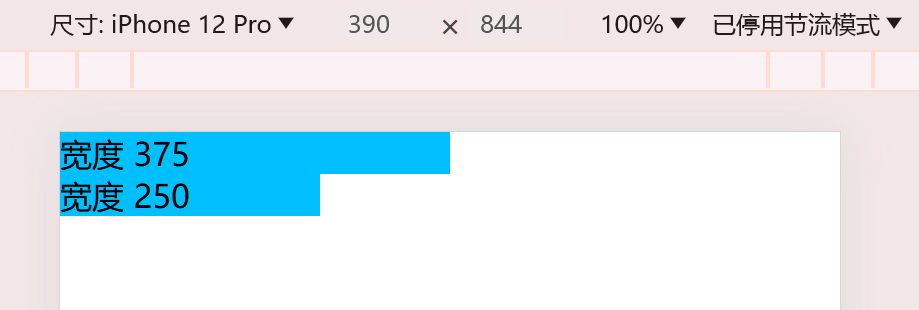

可以看出，此时 375 正是设计宽度 750 的一半，而 250 是设计宽度 750 的三分之一。

**由此可见，移动端开发如果想使用 `rem`，必须进行一些预处理，绝不是开箱即用的。**实际上现在很多移动端开发脚手架，已经预先帮我们配置好了 `rem` 转换规则，甚至直接写 `px` 就行，预处理会自动进行尺寸转换。但无论如何，不能简单概括为 “移动端开发使用 `rem` 来写尺寸”。

> 实际上，上面这种写法仅仅用于演示，它并不适合在生产环境使用。
> 推荐使用例如 [postcss-plugin-px2rem](https://github.com/soda-x/postcss-plugin-px2rem)、[postcss-pxtorem](https://www.npmjs.com/package/postcss-pxtorem) 这类插件对 CSS 进行处理，此时只需要写 `px` 单位即可，工具会自动把 `px` 处理成 `rem`，而且，工具还支持跳过特定属性，例如 `border-radius`、`border-width` 这些不需要跟随屏幕尺寸一起缩放的属性。


# 为什么点击屏幕会有 300ms 延迟

此问题现在已几乎不存在，主要出现在早期的网站上。

直接说结论：
早期很多网站没有适配移动端设备，所以用移动设备打开网站时，可能需要放大网页才能看清内容，所以移动端浏览器双击操作会用于放大网页；
**而移动浏览器为了判断用户是点击操作还是双击缩放，会在用户第一次点击屏幕后，等待 300ms 并检测这期间是否存在第二次点击，以此来判断是点击还是双击，**这就导致了点按操作（具体来说，是 `click` 事件）会有 300ms 延迟。

测试代码：

```html
<!DOCTYPE html>
<html lang="zh-CN">
  <head>
    <script>
      function test() {
        document.getElementById('display').innerText = '已点击'
        setTimeout(() => {
          document.getElementById('display').innerText = ''
        }, 1000)
      }
    </script>
  </head>
  <body>
    <button onclick="test()">测试</button>
    <span id="display"></span>
  </body>
</html>
```

**测试时，必须将浏览器切换到手机设备调试，否则是看不出区别的。**
可以感受到，点击按钮后，要经过大约 300ms，文字才会出现。

直接说最佳解决方案：
在网页的 `<head>` 内加入这么一个标签：

```html
<meta name="viewport" content="width=device-width, initial-scale=1.0" />
```

你可以把这段代码贴入 HTML，然后再次测试，会发现这样就没有延迟了。

实际上，这个 `viewport` 的 `<meta>` 标签是专为移动端适配而设计出来的，它指定了浏览器视口的宽度、缩放倍率等。
示例中的是最常见的设置，它指定了视口宽度为屏幕宽度（`100vw`），初始缩放倍率为 `1.0`，此时，因为我们明确告诉了浏览器视口相关的配置，浏览器就会认为 “已经适配了，不需要进一步缩放了”，此时所有点按操作就都不再需要延迟 300ms 了。

这个标签还可以设置虚拟键盘的行为，或设置是否允许用户缩放网页等，具体可以参考 [MDN 文档](https://developer.mozilla.org/zh-CN/docs/Web/HTML/Viewport_meta_tag)。
对于 “视口” 的解释，可以查看 [这篇博文](https://juejin.cn/post/6959047144065990663#heading-12)，或是 [阮一峰的博文（2012）](https://www.ruanyifeng.com/blog/2012/05/responsive_web_design.html)。

对于小程序开发者而言，你可以直接使用 `bindtap` 事件，小程序的页面是移动端专用适配的，不会存在缩放，也不会有点按延迟。

-----

接下来讲一下，在早期还没有 `viewport` 元数据标记时，常用的解决方案。

**CSS 的 `touch-action` 属性：**

将以下内容贴入 `<head>` 中并测试：

```html
<style>
  body {
    touch-action: manipulation;
  }
</style>
```

这个属性 `touch-action` 用于指定在移动端打开网页时，用户的点按操作应被如何处理；
此属性值 `manipulation` 表明只允许滑动滚动和双指缩放操作，不允许双击缩放；此时，因为开发者禁用了双击操作，所以用户的点按无需等待 300ms，可以立即生效。

这个属性被 Chrome 浏览器支持于约 2015 年，Firefox 浏览器则支持于约 2017 年。

-----

**利用 `touchstart` 事件：**

点按屏幕时，如果浏览器认为用户有可能是双击缩放屏幕，那么就会等待 300ms 左右再触发 `click` 事件，这我们知道；
**但 `touchstart` 事件是立即触发的，它不会有任何延迟；因此，我们可以全局监听 `touchstart` 事件，在触发时如果判断不是滚动操作，就立即派发一个相同坐标的 `click` 事件到相同的元素上，这样点击操作就可以无延迟触发了。**

也可以使用 `pointerenter`，它诞生更晚，主要用于兼容触控笔、鼠标等设备，它的事件类型、参数也有所不同。

以下给出简略实现的代码，请插入到 `<head>` 中：

```html
<script>
  window.addEventListener('load', () => {
    document.querySelector('html').addEventListener('touchstart', e => {
      console.log('触发了 touchstart 事件：', e)

      var clickEvent = new MouseEvent('click', {
        bubbles: true,
        cancelable: true,
        view: window,
      })
      e.target.dispatchEvent(clickEvent)
    })
  })
</script>
```

这样以来，点击操作又可以做到瞬时触发，不再会有延迟了。

不过，这个示例代码很不完善，不能用于生产环境；
如果你需要兼容很早期的移动端浏览器，建议使用这些较为成熟的包：

- [`fastclick`](https://www.npmjs.com/package/fastclick) ，一个专门解决移动端点击延迟的库；
- [`zepto`](https://zeptojs.com/)，它提供了 `$().tap()` 这个事件监听器，用于监听移动端的点按，可以无延迟触发；
- [`jQuery Mobile`](https://jquerymobile.com/)，专为移动端优化，提供了 `$().on('tap')` 兼容移动端的点按操作。


# 为什么划动页面有延迟

以前存在过这种问题：页面较长时，划屏滚动页面，但感觉页面的滚动 “不跟手”，总有迟滞感。

贴一个演示 GIF 图：


可以看到，左侧的网页对划屏操作的响应，存在着明显的延迟。

我们知道，浏览器监听事件时，可以阻止事件的默认行为（`.preventDefault()`），或者停止传播事件（`.stopPropagation()`）；
**而触摸（`touchstart`）、滚动（`wheel`）等事件的默认行为也是可以被阻止的，所以浏览器为了判断开发者是否会阻止滚动行为，会等待滚动事件监听器执行完成，再去决定页面是否会滚动，因此导致了延迟。**

很多框架会在根元素上监听触摸事件，例如实现全局事件统一监听，或实现消除 300ms 点击延迟等需求，这就会导致滚动延迟。

**解决方法：**
使用 JS 进行事件监听时，添加第三个参数：

```js
document.body.addEventListener('touchstart', handler, { passive: true })
```

上面这个 `{ passive: true }` 即表示，这个事件监听器是 “被动” 的，不可被阻止；此时，事件处理函数中调用 `.preventDefault()` 就失效了，无法阻止事件的默认行为。查看 [MDN 文档](https://developer.mozilla.org/zh-CN/docs/Web/API/EventTarget/addEventListener#passive)。

元素的触摸事件被定义为 “被动” 的，不可阻止，那么浏览器就直接执行默认行为滚动页面就行了，也不用等到监听函数运行完毕，所以延迟自然就不存在了。
注意，元素上所有的触摸事件必须全部是 “被动” 的，如果有任一时间监听没有这么做，那么滚动延迟仍然会有。

> 曾经，Firefox 浏览器也会对这个行为进行优化，浏览器只会等待事件监听函数很短的事件，如果没有立刻阻止默认行为，那么 Firefox 就会直接开始滚动动作，此时也无法阻止默认行为了。

Chrome 和 Firefox 已经上线了一项优化：对于根级别的元素，包括了 `window`、`<html>` 和 `<body>`，它们与触摸、滚动相关的事件监听器默认是 `{ passive: true }`；浏览器开发团队表示，未来有意向让所有类似的事件都默认是 “被动” 的。

-----

对于小程序开发者而言，可在全局配置或页面配置中，使用 `enablePassiveEvent` 配置项来进行优化，可以设置特定事件或所有事件为 “被动” 的，具体配置方式请参考 [官方文档](https://developers.weixin.qq.com/miniprogram/dev/reference/configuration/app.html#enablePassiveEvent)。

使用 [`<scroll-view>`](https://developers.weixin.qq.com/miniprogram/dev/component/scroll-view.html) 滚动区组件时，可开启 `enable-passive` 属性，此时组件的触摸事件无法被阻止，滚动行为可以得到优化。


# 什么是 “像素比例”

以前，我们在代码中写的一像素 `1px` 就指代屏幕上的一个像素点；但现在高分辨率的屏幕已经普及，尤其是移动端，普遍采用了视网膜屏幕（Retina）或者高分辨率屏幕（HiDPI），此时，为了显示的更清晰，`1px` 可能会在屏幕上渲染为多个像素点。

例如我使用的 4K 分辨率（3840 × 2160）屏幕，尺寸是 27 寸，和以前的 1080p 屏幕大小相差并不多，这是因为高分屏的像素更为密集；此时如果页面还按照 1:1 比例显示像素，那么文字就会小的看不清楚了。

此时，操作系统会允许我们进行 “UI 缩放”，设置如下：


一般来说，2K 屏幕建议 150% 倍率缩放，4K 屏幕建议 200% 倍率缩放，此时显示效果就和 1080p 屏幕差不多了，但文字、UI 等渲染更为精细。

对于软件而言，它也可以选择是否适配系统的缩放倍率，对显示内容进行缩放。软件适配系统缩放倍率时，可以使得显示内容更清晰，不适配则可获得较大的窗口面积。
浏览器因为要渲染大量文本，我们肯定是为了让文字更清晰才选配高分辨率屏幕，所以肯定会适配系统 UI 缩放。

软件适配 UI 缩放后，会将原本尺寸定义按照系统 UI 缩放比例进行乘积计算，例如，在 4K 屏幕上 UI 缩放倍率是 200%，此时 `1px` 长度，在屏幕上渲染占用 `2px` 的实际像素；而 `1 × 1` 的像素点，实际上渲染为 `2 × 2` 一共四个像素点。
我们认为，此时的 “像素比率” 为 `2`。

你可以通过 `window.devicePixelRatio` 来获取当前设备的 “像素比率”，它也被简称为 “dpr”。查看 [MDN 文档](https://developer.mozilla.org/zh-CN/docs/Web/API/Window/devicePixelRatio)。
对于小程序而言，可以使用 [`wx.getWindowInfo().pixelRatio`](https://developers.weixin.qq.com/miniprogram/dev/api/base/system/wx.getWindowInfo.html) 来获取像素比率。

测试代码：

```html
<!DOCTYPE html>
<html lang="zh-CN">
  <head>
    <meta name="viewport" content="width=device-width, initial-scale=1.0" />
    <script>
      window.addEventListener('resize', () => {
        document.body.innerText = 'devicePixelRatio = ' + window.devicePixelRatio
      })
    </script>
  </head>
  <body></body>
</html>
```

将浏览器调整为手机模式，然后从菜单中选取不同手机，进行查看。

一般来说，屏幕大小近似的设备，分辨率越高，像素比率也越大；
反之亦然，分辨率相同，屏幕越小，像素比率也越大。
例如：


甚至还有非整数倍率的设备，例如：


通常来说，我们开发的网站在各种分辨率屏幕上，都能正确渲染，高分屏更精细，低分屏也不会有什么问题，这是因为浏览器会按照缩放比率自动处理像素的转换。

但是，有些场合必须开发者手动处理：

**需手动对 `<canvas>` 里面的尺寸进行适配：**
`<canvas>` 不会自动适配设备像素比率，因此，画板操作中所有像素数值相关的操作，都需要把像素乘以 `window.devicePixelRatio` 后再使用。

代码示例：

```html
<!DOCTYPE html>
<html lang="zh-CN">
  <head>
    <meta name="viewport" content="width=device-width, initial-scale=1.0" />
  </head>
  <body style="margin: 0">
    <div>像素比例：<span id="ratio"></span></div>
    <script>
      document.getElementById('ratio').innerText = window.devicePixelRatio
    </script>

    <canvas id="canvas" height="50" width="200"></canvas>
    <script>
      const canvas = document.getElementById('canvas')
      const ctx = canvas.getContext('2d')
      ctx.fillStyle = 'lightskyblue'
      ctx.fillRect(0, 0, canvas.width, canvas.height)
      ctx.font = '16px sans-serif'
      ctx.fillStyle = 'black'
      ctx.fillText('我是绘制内容', 0, 16)
    </script>
  </body>
</html>
```

代码中，我们绘制了一个 `<canvas>` 并写入一些文字。
将浏览器调整为手机模式，然后从菜单中选取不同像素比例的手机，进行查看：


可以看出，`<canvas>` 中文本渲染非常模糊，这是因为，`<canvas>` 内容的渲染并不会适配 UI 缩放，所以它以 1 倍像素比率渲染，然后显示到画布上，画布却要适配 UI 缩放，所以画布内容放大为原始大小的 2 倍，因此文字变模糊了。

一种解决方式是，把画布尺寸、画布中所有绘制操作的尺寸，全部按照 UI 缩放倍率放大，然后使用 CSS 将画布还原回原始尺寸；
修改代码为：

```html
<script>
  const canvas = document.getElementById('canvas')
  const ctx = canvas.getContext('2d')

  // 用 CSS 缩放到原始的画布尺寸
  canvas.style.width = canvas.width + 'px'
  canvas.style.height = canvas.height + 'px'

  // 调整绘制尺寸使其适应 UI 缩放，以下所有尺寸都需要乘以 dpr
  const dpr = window.devicePixelRatio
  canvas.width = canvas.width * dpr
  canvas.height = canvas.height * dpr

  ctx.fillStyle = 'lightskyblue'
  ctx.fillRect(0 * dpr, 0 * dpr, canvas.width * dpr, canvas.height * dpr)

  ctx.font = `${16 * dpr}px sans-serif`
  ctx.fillStyle = 'black'
  ctx.fillText('我是绘制内容', 0 * dpr, 16 * dpr)
</script>
```

然后刷新页面，可以发现文字的渲染不再模糊了：


这里只给出简单的处理方式，实际开发中，请根据需求选用合适的库。

<br />

**需提供更高品质的背景图：**
对于纹理、背景图、图标等，建议使用更高品质的图片，例如 2 倍图、3 倍图。一个比较好的做法是，此类资源使用矢量图，例如 `.svg` 格式的图片。

对于图片资源而言，浏览器原生支持这种用法：

```html

```

这个 `srcset` 属性为图片元素指定了 “二倍图” 的 URL；对于老式不支持此属性的浏览器，原始图片也能正确展示。

或者，使用这种方式：

```html
<picture>
  <source media="(min-width: 800px)" srcset="image-lg.png" />
  <source media="(min-width: 400px)" srcset="image-sm.png" />
  
</picture>
```


这种方式通常用于不同尺寸、不同分辨率比例的组合，适配性能最强，但写法较为复杂。可以参考 [阮一峰的博文](https://www.ruanyifeng.com/blog/2019/06/responsive-images.html)，了解这些用法。

对于背景图，可以使用 CSS 媒体查询：

```css
/* 默认情况，一倍图 */ 
.div {
  background-image: url(image.png);
}

/* 像素比率大于 1.5，使用两倍图  */
@media (min-resolution: 1.5dppx) {
  .div {
    background-image: url(image@2x.png);
  }
}

/* 等同于上面两倍图的写法，这个写法不推荐 */
@media (-webkit-min-device-pixel-ratio: 1.5) {
  .div {
    background-image: url(image@2x.png);
  }
}
```

其中单位 `dppx` 可以改用 `x`。


# 手机刘海屏和虚拟 Home 键适配

京东 Aotu 凹凸实验室有一篇博文：[网页适配 iPhoneX，就是这么简单](https://jelly.jd.com/article/6006b1055b6c6a01506c87fd)，建议阅读，本文对其有部分转载；
原文中部分图片已丢失，这里有一篇 [转载的博文](https://www.cnblogs.com/cangqinglang/p/13173893.html)，图片还能看。

现在很多手机顶部有挖孔屏、刘海屏，底部有虚拟 Home 键小横条。
一般来说，手机浏览器的标题栏或者系统 UI 的状态栏，会帮我对顶部的刘海 or 挖孔进行一个 “封顶”，所以我们不用担心顶部刘海的问题（小程序还是需要处理的，因为小程序有全屏视图）；
此时底部的虚拟 Home 键则是需要处理的一个问题了，因为很多情况下，页面的确认按钮、商品页的下单按钮，都是在屏幕底部，如果虚拟 Home 键挡住了这些内容，会影响用户体验。

如图：


这就需要我们对页面进行适配。
这里给出一张京东凹凸实验室博文中的原图，展现适配后的样式：


可以看出，此时页面底部会为虚拟 Home 键留出空白。

如何实现，我们都知道：给元素加一个 `padding-bottom` 就可以了。
但是，这个值什么时候加，留白应该留出多少以适配不同机型，这就成为了一个问题。

面对现在手机屏幕形状越来越奇怪的局面，浏览器提出了 “安全区” 的概念，如图：

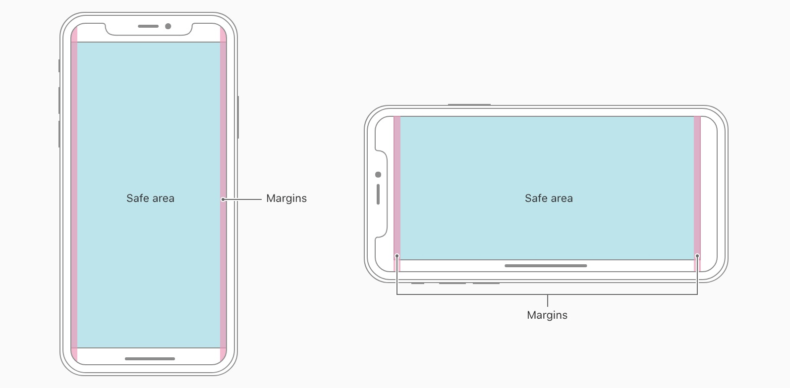

如图所示，蓝色区域是安全区，这个区域显示内容可以保证完整，不会被屏幕四角的圆角裁切掉，也不会被虚拟 Home 键或者刘海挡住。

浏览器提供访问四边边距的方式：

```css
/* 以最常见的屏幕底边距为例： */
div {
  padding-bottom: constant(safe-area-inset-bottom);
  padding-bottom: env(safe-area-inset-bottom);
}
```

使用 `safe-area-inset-bottom` 这个值用于获取底部安全区边距，把 `bottom` 改为 `top`、`left`、`right`，可以用于获取顶部、左侧、右侧的安全区边距，不过一般底部用的最多；
使用 `env()` 来提取这个变量的值，注意，旧版本的浏览器可能只支持 `constant()`，而部分新版浏览器可能只支持 `env()`，所以建议像示例中那样写两遍，顺序不要调换。

还有一点，网站必须放置了这个标签，才能使用 `env()`：

```html
<meta name="viewport" content="width=device-width, viewport-fit=cover">
```

关键点在于 `viewport-fit=cover`，必须设置了这个值；
这个属性有两个取值 `contain`（默认）、`cover`，用于指定设备的屏幕边缘如果不是规则矩形，应采用 “外切” 还是 “内接” 显示内容，如图：

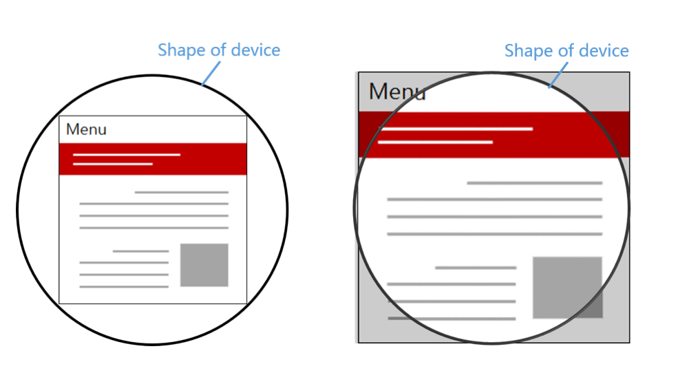

对于 iPhone 需要适配刘海屏和虚拟 Home 键的场景，显然是后者 `cover`；
对于这两种模式，还可以使用 CSS 媒体查询来区分：

```css
@viewport (viewport-fit: contain) {
  /* ... */
}   
```

-----

如果使用 Sass 预处理器，可以把这个值定义为一个变量：

```scss
$safeAreaBottom: env(safe-area-inset-bottom);

.bar1 {
  /* 使用方式 */
  padding-bottom: $safeAreaBottom;
}
```

但涉及到 `calc()` 计算操作时，必须把变量转义为其 “原始形式”，使用 `#{}` 包裹变量名，如下：

```scss
.bar2 {
  /* 涉及到 calc 计算，必须用 #{} 包裹住变量名 */
  padding-bottom: calc(20px + #{$safeAreaBottom});
}
```

-----

小程序中，还需要考虑页面顶部安全区的适配：
如果页面配置中设置了 `{ navigationStyle: 'custom' }`，即自定义导航栏，此时页面为全屏页面，不再有导航栏为我们 “封顶” 了，还需要额外适配页面顶部导航栏和系统状态栏。

除了使用上述 CSS 值之外，也可以使用小程序给我们提供的 API：

- 通过 [`wx.getWindowInfo().safeArea`](https://developers.weixin.qq.com/miniprogram/dev/api/base/system/wx.getWindowInfo.html) 来获取屏幕安全区对象，它有 `top`、`bottom`、`right`、`left` 四个属性表示页面四边安全区的坐标，还有 `width`、`height` 来获取屏幕安全区的尺寸；
- 通过 `wx.getWindowInfo().statusBarHeight` 获取状态栏的高度。


# 手机页面很难戳中的小按钮

移动设备上，用户用手指去点按控件，而手指的点击没有鼠标那么精确，如果按钮做的太小，那么可能很多次都难以点击命中，或者是容易点错。
这便需要我们养成一种良好的开发习惯：扩大点击区域。

扩大点击区域最简单的实现方式，是利用 `padding` 属性，使得按钮的外径更大；
但是，增加 `padding` 会导致元素更大的空间，从而影响布局，实际开发中往往还要配合 `position: absolute;` 等样式来使用。

这里给出一种比较好的解决方法：
**使用伪元素来提供扩大点击区域的功能，伪元素设置为绝对定位，这样就不会影响布局了，甚至可以配合 Less 或 Sass 封装成函数。**

以下是示例，先来看难以戳中的小按钮：


如图所示，可以看到按钮非常小，难以点到。

采用伪元素的方法来扩大点击区域，代码如下：

```css
/* .close 元素本身必须是 absolute 或者 relative 的 */

.close::before {
  content: '';
  position: absolute;
  top: -15px;
  bottom: -15px;
  left: -15px;
  right: -15px;
}
```

这里我们通过负值的 `top`、`bottom` 等属性，使得伪元素在原元素的基础上向上下左右四个方向各扩展了 15px。

示例中的 `.close` 本身就是绝对定位的。如果你把这段代码用在自己的元素上面，记得把按钮元素改为 `position: relative;` 或 `position: absolute;`，不然伪元素的位置会错误。

达成的效果如图：


这个按钮的面积比原来大了数倍，更容易点按，而且，这种写法只需要我们添加一个伪元素的 CSS，不会影响原始布局。

-----

封装成 Sass：

```scss
// 扩大元素的点击区域
//   参数 $size：需要扩大半径（默认 15px）
@mixin expandClickArea($size: 15px) {
  &::before {
    content: '';
    position: absolute;
    top: -#{$size};
    bottom: -#{$size};
    left: -#{$size};
    right: -#{$size};
  }
}

// 扩大元素的点击区域，同时给当前元素添加 position: relative;
@mixin expandClickAreaRel($size: 15px) {
  position: relative;
  @include expandClickArea($size);
}

// 扩大元素的点击区域，同时给当前元素添加 position: absolute;
@mixin expandClickAreaAbs($size: 15px) {
  position: absolute;
  @include expandClickArea($size);
}
```

使用方式：

```scss
.close {
  // 给这个元素扩大点击区域，默认是 15px 半径
  @include expandClickArea();

  // 也可以指定半径
  @include expandClickArea(40px);

  // 如果当前元素是默认的 static 定位，那么需要用这个 Rel 后缀的
  @include expandClickAreaRel();
}
```

-----

封装成 Less：

```less
// 扩大元素的点击区域
//   参数 @size：需要扩大半径（默认 15px）
.expandClickArea(@size: 15px) {
  &::before {
    content: '';
    position: absolute;
    top: -@size;
    bottom: -@size;
    left: -@size;
    right: -@size;
  }
}

// 扩大元素的点击区域，同时给当前元素添加 position: relative;
.expandClickAreaRel(@size: 15px) {
  position: relative;
  .expandClickArea(@size);
}

// 扩大元素的点击区域，同时给当前元素添加 position: absolute;
.expandClickAreaAbs(@size: 15px) {
  position: absolute;
  .expandClickArea(@size);
}
```

使用方式：

```less
.close {
  // 给这个元素扩大点击区域，默认是 15px 半径
  .expandClickArea();
}
```


# 移动端的 “专属” 的 WebAPI

以下列出几个比较常见和常用的。


## Geolocation API

地理位置 API，用户授权后可以获得用户位置的经纬度。查看 [MDN 文档](https://developer.mozilla.org/en-US/docs/Web/API/Geolocation_API)。

这里给出一段代码用例：

```js
async function getLocation() {
  return new Promise((resolve, reject) => {
    navigator.geolocation.getCurrentPosition(
      position => {
        const lat = position.coords.latitude
        const lon = position.coords.longitude

        console.log(`纬度:${lat},经度:${lon}`)

        resolve({ lat, lon })
      },
      err => {
        if (err.code === 1) {
          reject(new Error('位置服务被拒绝'))
        } else if (err.code === 2) {
          reject(new Error('暂时获取不到位置信息'))
        } else if (err.code === 3) {
          reject(new Error('获取位置信息超时'))
        } else {
          reject(new Error('未知错误'))
        }
      },
      {
        enableHighAccuracy: false, // 是否获取精确位置
        timeout: 3000,             // 超时时间
        maximumAge: 3600 * 1000,   // 更新位置间隔
      }
    )
  })
}
```

你可能会有疑问：这个 API 并不是移动端专属的，PC 端浏览器也能用啊？
实际上，这个 API 在 PC 浏览器上的效果非常差，在移动端才是它真正发挥作用的地方。

在 PC 端，浏览器利用 IP 地址来判断用户所在的位置，并得出经纬度。
对于 Chrome 浏览器而言，这个步骤会访问谷歌的 IP 到位置的解析服务，而在中国大陆，访问谷歌的网络不畅通，会出现错误码为 `3` 的超时错误；即使使用国产浏览器，不走谷歌的解析服务，在国内也会因为 NAT 的问题，导致 IP 地址的位置不精确。

而在移动端，位置服务可以通过设备上 GPS 获取精确的经纬度坐标，IP 地址仅仅起到辅助和后备的作用，所以在移动端上这个 API 才能真正发挥作用。

注意：这个 API 必须在 HTTPS 协议下才可使用，如果连接不是 HTTPS，会直接报错；即使是本地开发也是如此，所以本地开发时可能需要配置 Webpack 使用 HTTPS 并配置自签证书。

-----

对于小程序用户而言，可以使用微信官方提供的 [`wx.getLocation()`](https://developers.weixin.qq.com/miniprogram/dev/api/location/wx.getLocation.html) API 来尝试获取用户地点；
此接口需要小程序符合特定的类目，申请接口权限并通过官方审核，且必须按照官网文档进行配置。


## 页面的可见性和生命周期

Page Visibility API 是一系列监听页面可见性的 API，在移动端因为 App 界面是独占前台的，可以获得较为精准的可见性状态，不会像 PC 网页那样还要考虑页面被其他窗口挡住的情况。可以通过 [阮一峰的博文](https://www.ruanyifeng.com/blog/2018/10/page_visibility_api.html) 来了解这个 API，或是查看 [MDN 文档](https://developer.mozilla.org/en-US/docs/Web/API/Page_Visibility_API)。

Page Lifecycle API 是基于上面的 Page Visibility API，以此扩充了数个监听页面生命周期的 API，可以实现对页面生命周期的精确监控。在移动端，切换 App、冻结页面、唤醒等操作比较常见，页面的可见性状态也比较明确，可以更充分的利用这些 API。可以通过 [阮一峰的博文](https://www.ruanyifeng.com/blog/2018/11/page_lifecycle_api.html) 来了解这个 API。

-----

对于小程序用户而言，可以通过 [小程序生命周期 API](https://developers.weixin.qq.com/miniprogram/dev/api/)，例如 `wx.onAppHide()`、`wx.onAppShow()` 来监控页面可见性和页面状态。


## 设备与传感器 API

移动设备往往会具有重力感应、陀螺仪等传感器，因此，这些 WebAPI 可以认为是移动端 “独有” 的。

举例 1：可以使用 [`deviceorientation`](https://developer.mozilla.org/en-US/docs/Web/API/Window/deviceorientation_event) 事件监听设备在三条轴线上的旋转；可使用 [`devicemotion`](https://developer.mozilla.org/zh-CN/docs/Web/API/Window/devicemotion_event) 事件监听设备在三条轴线上的加速度；

举例 2：对于横屏竖屏，可以通过以下方式区分和监听：

通过 [媒体查询](https://developer.mozilla.org/en-US/docs/Web/CSS/@media/orientation) 匹配的方式：

```js
function checkOrientation() {
  if (window.matchMedia('(orientation: portrait)').matches) {
    console.log('竖屏状态')
  } else if (window.matchMedia('(orientation: landscape)').matches) {
    console.log('横屏状态')
  }
}
window.addEventListener('resize', checkOrientation)
```

或通过 [Screen API](https://developer.mozilla.org/en-US/docs/Web/API/Screen) 来获取屏幕状态：

```js
function checkOrientation() {
  if (screen.orientation.type.startsWith('portrait')) {
    console.log('竖屏状态')
  } else if (screen.orientation.type.startsWith('landscape')) {
    console.log('横屏状态')
  }
}
screen.orientation.addEventListener('change', checkOrientation)
```

举例 3：利用移动设备特有的功能，例如振动功能：

```js
navigator.vibrate(200)
```

举例 4：部分 API 在移动端比较重要，例如 [Network Information API](https://developer.mozilla.org/en-US/docs/Web/API/Network_Information_API) 可以获取用户是否使用蜂窝移动网络，以此决定媒体播放和下载是否需要考虑节省流量，代码：

```js
navigator.connection.addEventListener('change', () => {
  const type = navigator.connection.effectiveType
  console.log('移动网络连接已切换为：' + type)
})
```

通过 [Battery Status API](https://developer.mozilla.org/en-US/docs/Web/API/Battery_Status_API) 可以获取设备的剩余电量：

```js
navigator.getBattery().then(battery => {
  console.log(`剩余电量：${battery.level * 100}%`);
  console.log('正在充电：', battery.charging);
});
```

举例 5：适配可折叠屏幕手机，可跳转阅读 51CTO 上面的 [这篇文章](https://www.51cto.com/article/787551.html)，文中提到了两个新 API 目前没有 MDN 文档；
其中设备姿态 API 可获取设备屏幕的形态，例如是折叠还是展开；而视口分段枚举 API 可区分不同视口，甚至区分 “折痕/铰链” 区域。

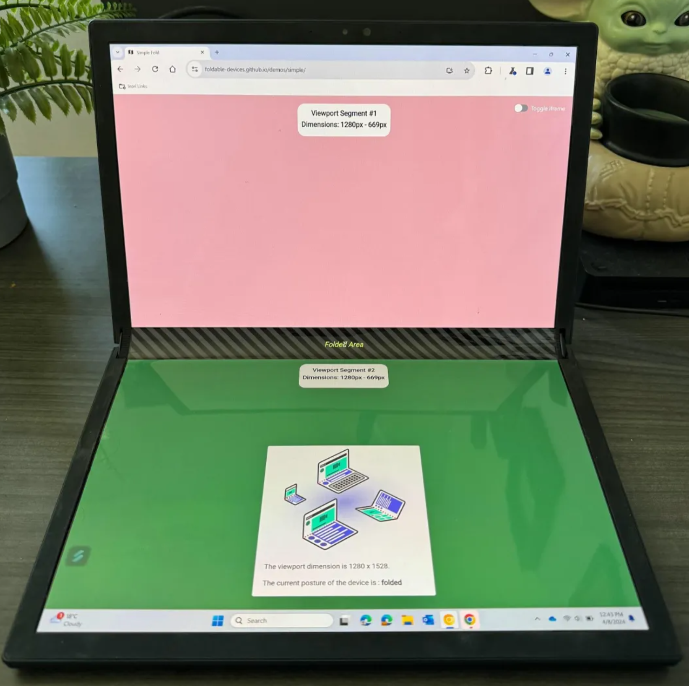

代码请参考上面的链接，注意这些特性具体实装可能还需要很长一段时间，本文暂不赘述。

-----

小程序平台也为开发者提供了一系列设备和传感器 API，例如蓝牙连接、NFC、WiFi、扫二维码等功能；
此外，小程序平台还可以访问手机系统日历，添加日程；也可以访问手机系统通讯录，添加联系人等。

例如，使用小程序的 [`wx.scanCode()`](https://developers.weixin.qq.com/miniprogram/dev/api/device/scan/wx.scanCode.html) API 扫描二维码：

```js
wx.scanCode().then(res => {
  console.log(`二维码内容：${res.result}`)
})
```


# 表单控件与虚拟键盘

移动设备的屏幕小，对于输入框类控件，输入时还需要展示虚拟键盘，对于选择类控件，移动浏览器往往有系统默认样式；因此表单的输入控件往往需要特殊处理。


## 样式适配

对于组件库开发者而言，如果你开发的是专用的移动端组件库，那么只需要按照移动端的方式开发即可；
如果需要兼容双端，那么则需要考虑 PC 和移动端控件的显示逻辑和方式，或是直接为移动端提供一套组件。

最简单的例子，就是默认 `<select>` 控件：
在 PC 上，它显示为一个下拉框：


但是，在手机系统中，往往会显示成一个转轮形式：


一般来说，PC 组件库会将这个控件命名为 `<Select>`，而移动端组件库会命名为 `<Picker>`。

-----

我们以 [Material UI](https://mui.com/) 这个组件库举例，它是一个兼容 PC 和移动端的组件库。
它采用两种兼容方式：

- 主组件库 `@mui/material` 中，在移动端部分组件会有特殊的样式，更符合移动设备的操作逻辑；此外，表单提供组件使用 `<FormControl>`，开启它的 `fullWidth` 属性，可以使组件默认即渲染为移动端的样式； 

- 时间日期选择器位于单独的组件库 `@mui/x-date-pickers`，这个包会单独导出专为移动端设计的组件，这些组件以 `Mobile` 开头。

<br />

例如，`<Select>` 控件如果选项很多，在 PC 上渲染为：

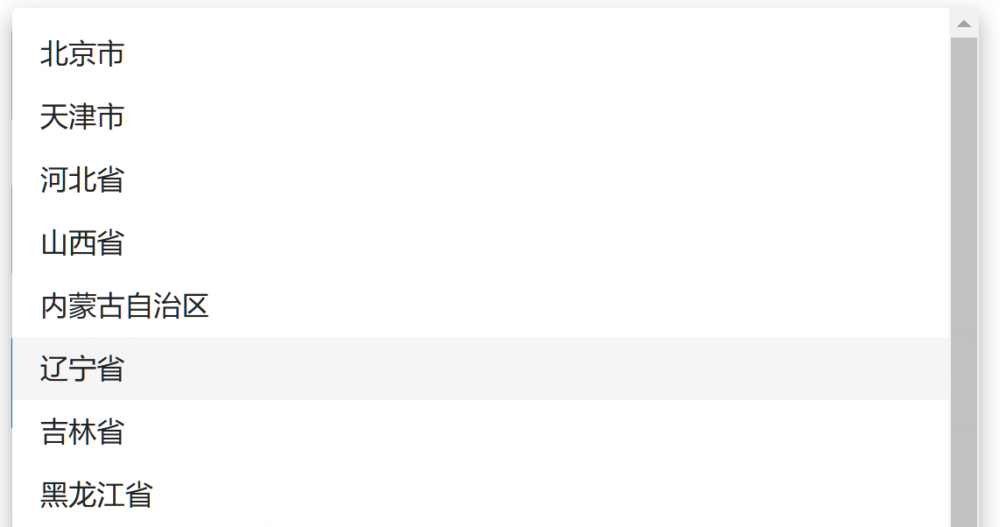

右侧出现了 PC 端的滚动条，且文字大小也是 PC 端的字号。

但如果在移动设备上运行，或者为组件外面套一层 `<FormControl fullWidth>`，会显示为：

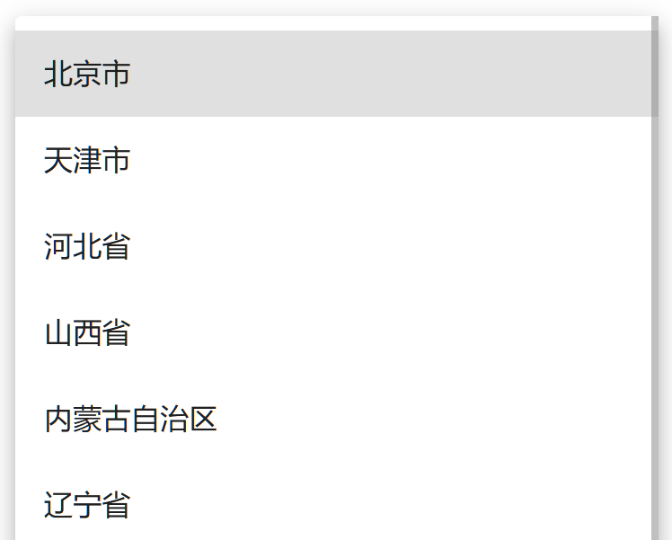

此时，字号变大，文字间距变大，更符合移动端的操作逻辑，滚动条的样式也有所更新。

<br />

再比如，时间日期选择器 [`<DateTimePicker>`](https://mui.com/x/react-date-pickers/date-picker/) 控件，PC 端显示效果：

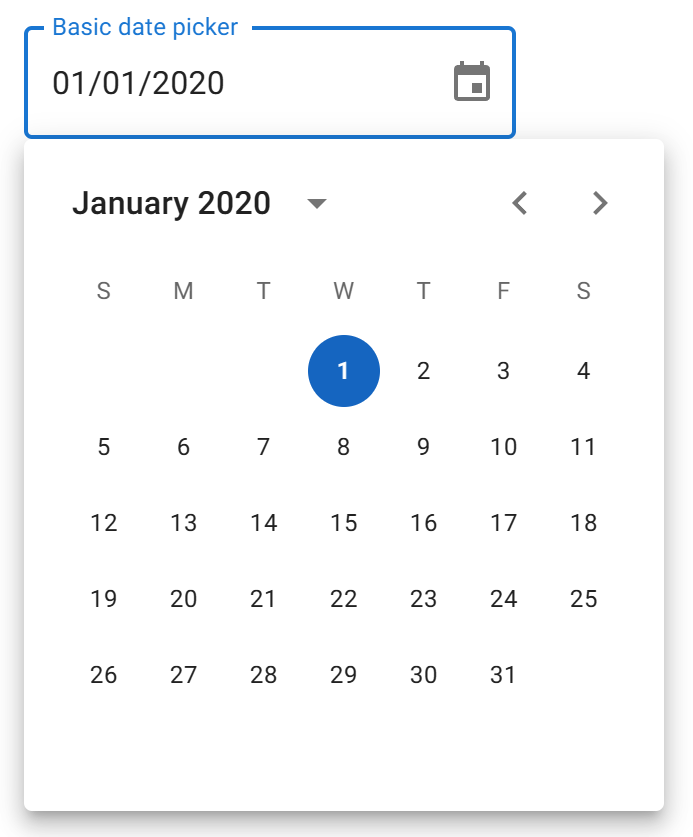

在手机端，需要使用 [`<MobileDatePicker>`](https://mui.com/x/react-date-pickers/date-picker/) 组件，显示效果：

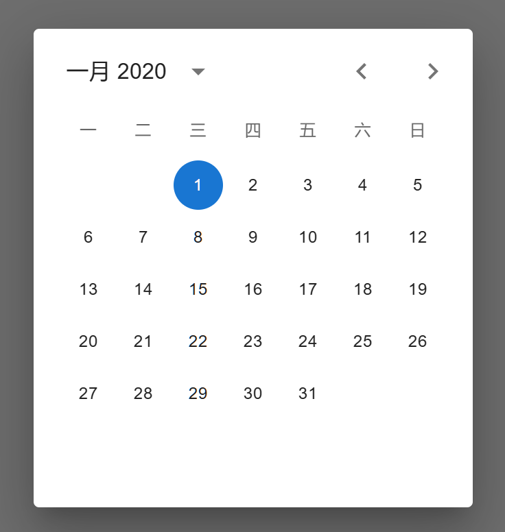

移动端的选择器，会直接显示全屏蒙层弹窗，这样避免了误触，按钮也更大，更符合移动端的操作逻辑。


## 虚拟键盘的确认按钮

观察下面三个网站的虚拟键盘，找出它们的区别：

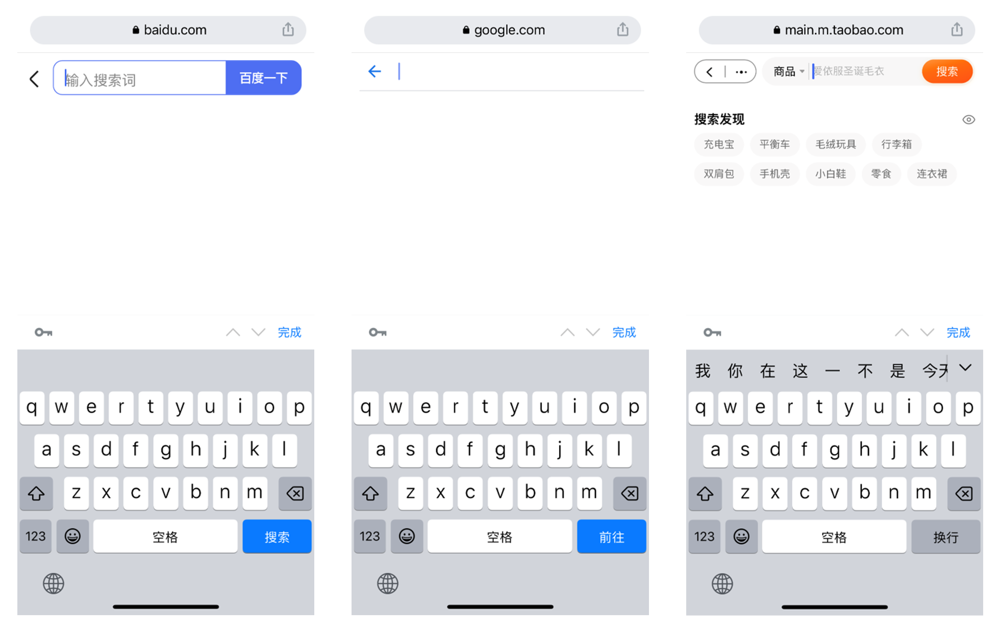

可以发现，它们右下角的确认按钮不同。
一般来说，对于门户类网站，搜索栏输入框被聚焦时，我们期望虚拟键盘右下角的确认按钮显示为 “搜索”；多行文本输入时，右下角应该显示 “换行”；而 Google 搜索框聚焦时，虚拟键盘显示的是 “前往”。

移动端虚拟键盘，右下角的按钮到底有多少种类型？如何设置这个按钮的类型？

实际上，虚拟键盘右下角这个按钮，一共支持 6-7 种显示方式，通过 `<input>` 控件的 `enterKeyHint` 属性来设置：

- 设为 `"done"` 则显示为 “完成”；
- 设为 `"go"` 则显示为 “前往”；
- 设为 `"send"` 则显示为 “发送”；
- 设为 `"enter"` 则显示为非高亮的 “换行”，这也是默认行为；也推荐在 `<textarea>` 中使用；
- 设为 `"next"` 则显示为非高亮的 “下一项”；
- 设为 `"previous"` 则应显示为非高亮的 “上一项”，但此属性支持度不广泛，可能很多手机浏览器还没有支持此项；
- 设为 `"search"` 时，**且当输入框控件位于一个 `<form>` 内时**，右下角按钮显示为 “搜索”；
  此外，可使用 `<input type="search">` 控件来取代 `<input>`。

以上示例以 iOS 的 Chrome 浏览器为例，系统默认中文输入法。不同的操作系统和语言，可能显示的文字有所不同。

实际上，`enterKeyHint` 是一个全局属性，任何标签都可以使用它，不过仅当标签为可输入控件，或者是开启了 `contentEditable` 时，调出虚拟键盘后此属性才起作用。
曾经 Firefox 浏览器使用 `mozactionhint` 属性名代指，现在此名称已废弃。

-----

对于小程序用户而言，可以使用 [`<input>`](https://developers.weixin.qq.com/miniprogram/dev/component/input.html) 组件的参数 `confirm-type` 指定呼出虚拟键盘后右下角按钮的文本，默认为 “完成”，支持上面的 “下一个”、“发送”、“搜索”、“前往” 的选项值。


## 虚拟键盘的类型

你有没有遇到此类问题：

- 表单需要用户输入手机号，但是默认的数字输入键盘没有加号 `+`，导致用户无法输入区号；
- 需要用户输入身份证号，但是默认的数字输入键盘没法输入身份证号最后一位的 `X`。

不同于 PC 端网页开发，在移动端上输入控件会呼出虚拟键盘，虚拟键盘有数个不同的种类，用来满足通常输入、密码输入、纯数字输入等不同场景。

例如，实现一个手机号码输入控件：

使用 `<input>` 控件时，我们可以通过其 `type` 属性来控制呼出的虚拟键盘的样式：
常用的有三种取值，`"text"`（默认）、`"number"`、`"tel"`。
以下是三种属性值的效果：

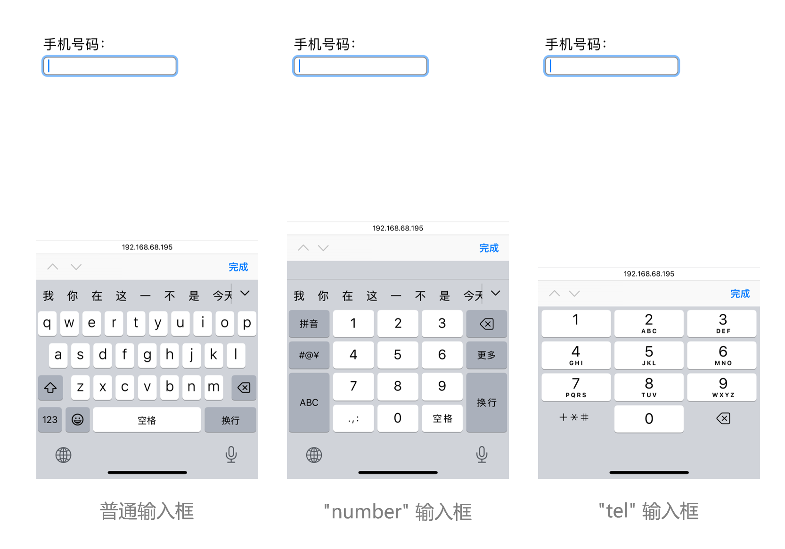

可以看出，普通输入框显然不符合需求；
而 `"number"` 输入框如果是九宫格类布局的键盘，系统会自动帮我们默认切换到数字输入状态，比较方便，但此时如果想输入区号的加号 `+`，还是有点麻烦；
只有 `"tel"` 类型的输入框，其虚拟键盘完美符合需求。

此外，可以利用表单的一些字段（`name` 字段，`title` 字段）来 “暗示” 手机浏览器，这个输入框用于输入电话号码；
例如，以下示例中，为输入控件添加 `name="phone"` 或 `title="phone"` 属性后，显示为：

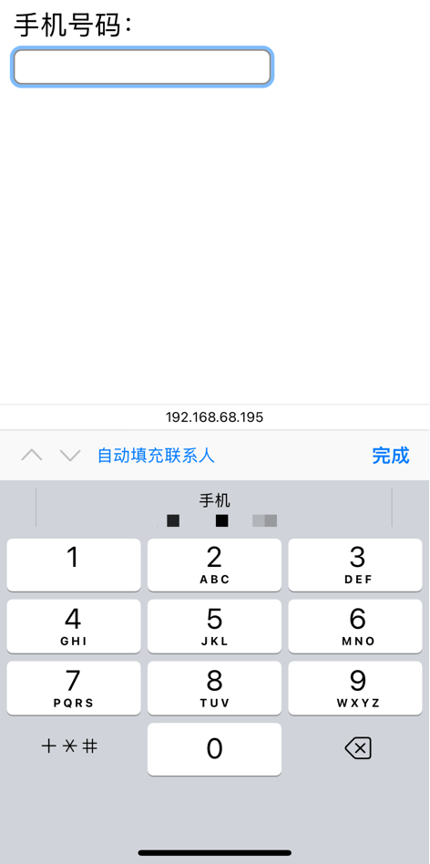

在输入框上方的虚拟键盘工具条上，系统自动显示了联系人快捷选择按键，还把我们当前的手机号码作为快捷输入选项提供了出来。

-----

移动端另一比较麻烦的输入，就是身份证号码输入了，因为身份证号码除了涉及到十个数字以外，还有字母 `X`，标准的浏览器控件不可能为中国用户提供这一种适配。

此时，我们需要使用提供身份证号码输入框的组件库，或是使用提供了虚拟键盘的组件库。

例如，我们可以使用 `antd-mobile` 的 [“虚拟输入框”](https://mobile.ant.design/zh/components/virtual-input) 配合 [“数字键盘”](https://mobile.ant.design/zh/components/number-keyboard)，这样可以自定义一个带有 `X` 键的键盘：

```tsx
import { VirtualInput, NumberKeyboard } from "antd-mobile"

function IDCardInput() {
  return (
    <VirtualInput
      placeholder="输入身份证号码"
      keyboard={<NumberKeyboard customKey="X" />}
    />
  )
}
```

显示效果：

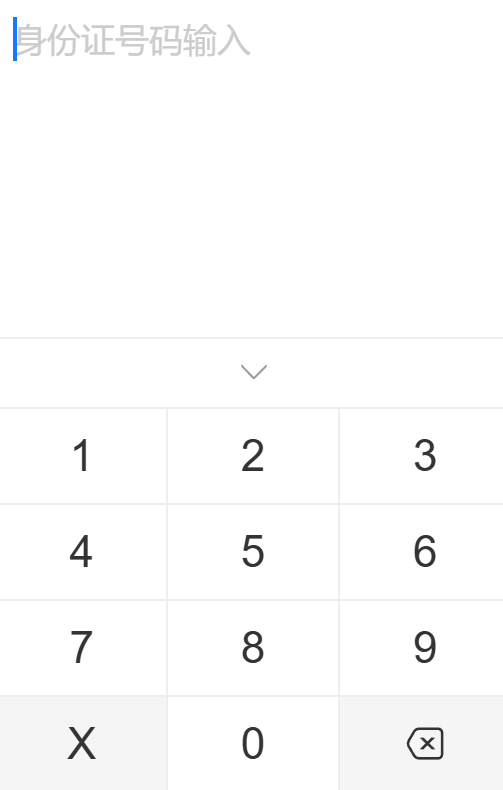

目前，大部分移动端 UI 组件库都提供了身份证号码输入框，或者提供了自定义输入键盘的功能。应用广泛的大厂组件库，可以查看 [PaperPlane Awesome](https://paperplane.cc/p/50388d702488/) 来进一步查看。

------

对于小程序开发者而言，可以利用 [`<input>`](https://developers.weixin.qq.com/miniprogram/dev/component/input.html) 组件的 `type` 属性来控制输入框以及虚拟键盘的类型，除了支持 `"text"`、`"number"` 这两种最基本的输入框以外，还支持：

- `"digit"`，带有小数点的数字键盘，一般用于金额输入；
- `"nickname"` 可向用户申请授权自动填入微信昵称，用户可以拒绝，此时变为普通文本输入框；
- **身份证号专用的输入类型 `"idcard"`，这个输入框的虚拟键盘带有字母 `X` 的按钮。**

小程序的 `<input>` 功能强大，甚至支持专用的加密键盘；但是没有提供专用的手机号码输入功能，可能是期望用户使用其内建的手机号码授权功能。


# iOS 的问题：`100vh` 会超出视口高度

这是 iOS 浏览器 Safari 的老问题，Safari 的 UI 界面有展开状态和收起状态，UI 界面展开时浏览器窗口高度被挤压，**但浏览器认为 `100vh` 的高度等同于 UI 界面收起时窗口高度未被挤压时的高度**，因此只要 UI 界面已展开，那么 `100vh` 会比视口区域要高，会出现滚动条。

如图所示，一个 `100vh` 高度的元素，在 Safari 浏览器的 UI 展开显示时，视口放不下这个元素，页面会出现滚动条。

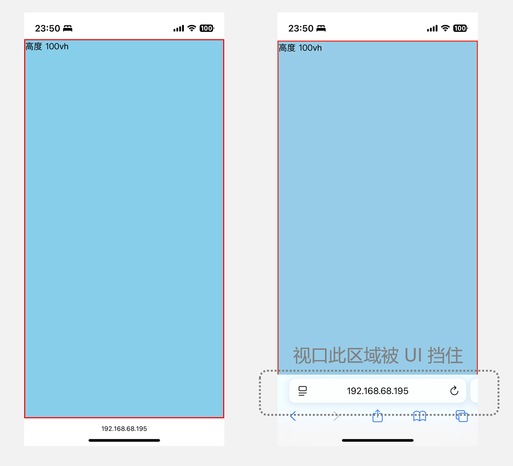

而且，因为 iOS 规定了所有浏览器必须使用 Webkit 内核，这导致了此问题广泛存在于 iOS 的浏览器上，包括 Chrome。

<br />

在过去的数年中，互联网上关于这个问题的解决方案一直讨论的喋喋不休。

这里给出一个以前常用的解决方案：
在文档中加入以下 JS 代码：

```js
function fixIOSVh() {
    document.documentElement.style.setProperty('--vh', `${window.innerHeight * 0.01}px`)
}

fixIOSVh()
window.addEventListener('resize', fixIOSVh);
```

如果你担心 JS 代码加载慢或加载失败，可准备 CSS 作为回退：

```css
:root {
  --vh: 1vh;
}
```

此后，可以使用 `var(--vh)` 来代替 `vh` 单位：

```css
.div {
  /* 例如高度 50vh */
  height: 50vh;
  height: calc(50 * var(--vh));
}
```

这种写法很麻烦，需要使用 `calc()` 和 `var()`，还需要用到乘法算法，但是胜在兼容性比较好。

<br />

接下来的是比较新的解决方式，也可以被认为是最完美的解决方式：

考虑的 iOS 对视口的特殊处理，以及浏览器 UI 的复杂性，浏览器厂商和 Web 标准委员会制定了新的单位，用于在多个平台和设备上提供统一的尺寸计量单位：
**对于原本的 `vh` 单位，新增了 `lvh`、`svh` 和 `dvh`；而 `vw` 单位也一样，新增了 `lvw`、`swv` 和 `dvw`。**

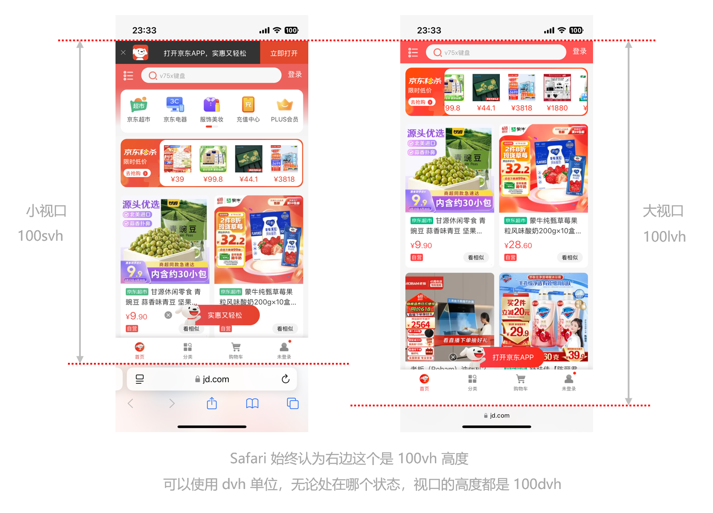

具体而言：

- 以 `svh` 单位举例，其中的字母 `s` 意思为 “small”，单位 `svh` 即表示 “小视口模式下的 `vh`”；例如，浏览器的 UI 展开时，视口变小，此时的状态为 “小视口”，`100svh` 刚好等于小视口的高度；
- 同理，`lvh` 中字母 `l` 意思为 “large”，在浏览器的 UI 收起时，视口变大，此时状态视为 “大视口”，`100lvh` 刚好等于大视口的高度；
- 而 `dvh` 中的字母 `d` 意思为 “dynamic”，它表示动态视口高度，始终匹配当前浏览器真实的视口高度，最准确。

**解决方式就一目了然了，直接使用 `dvh` 取代所有 `vh` 即可，因为它最为精准、最 “合理”。**
如下：

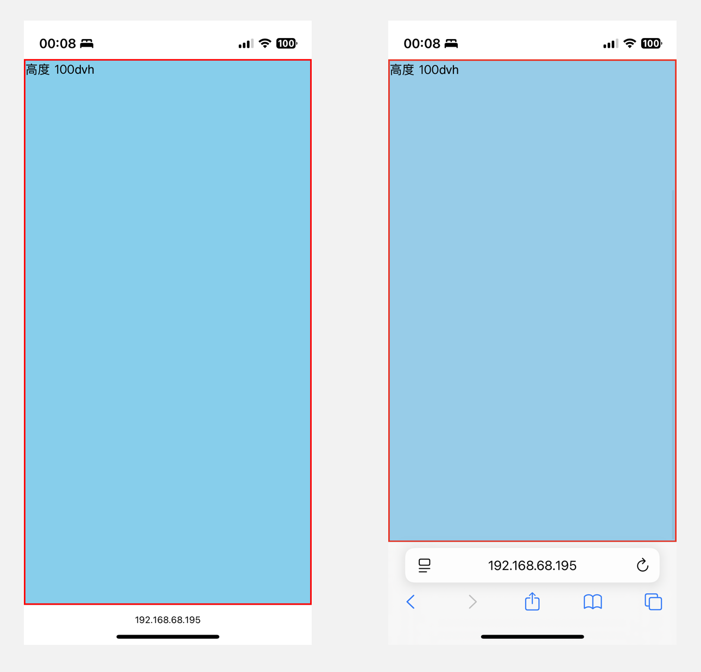

注意，这几个 CSS 单位上线较晚，浏览器需要更新的比较即时才能使用，[查看兼容性](https://caniuse.com/mdn-css_types_length_viewport_percentage_units_dynamic)。

-----

小程序开发者无需担心此问题，因为小程序不存在动态 UI 的部分，视口高度是稳定的。


# iOS 的问题：必须由操作触发的事件

现在手机 App 的开屏广告，经常被设计成了 “摇一摇” 或 “翻转手机” 来触发，非常容易误触发。
你有没有想过，为什么要设计成 “摇一摇” 触发？如果点击广告能给厂商带来收入，那为何不直接跳转触发？


实际上，这涉及到一个用户体验问题，手机 App 框架为了防止厂商的广告跳转行为打扰到用户，规定了跳转 App 操作 **必须由用户真实行为来触发**，你可以理解成必须触发一个真实的事件，所以 App 开屏广告开始监听手机陀螺仪的 “摇一摇” 动作进行跳转。

-----

小程序开发也是这样，为了避免侵犯隐私和打扰用户，请求用户授权手机号、分享等动作，也都必须由用户的真实点击操作触发；

小程序官方甚至直接不提供这些功能的 API，必须使用组件来触发。
例如，请求用户授权手机号码，小程序压根没有这个 API，必须使用 [`<button>`](https://developers.weixin.qq.com/miniprogram/dev/component/button.html) 组件，用户点击组件时才能弹出弹窗；让用户转发小程序页面，也必须使用这个组件。

官方文档如下：

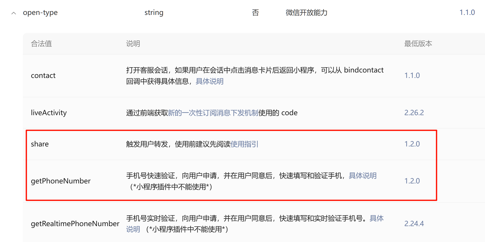

----

实际上，出于同样的考虑，iOS 浏览器也应用了这些做法：
**为了避免打扰用户，iOS 浏览器的部分操作，必须由用户的真实操作来触发，通过 API 来触发是无效的。**


## 打开新页面

为了避免弹出页面骚扰等情况，iOS 浏览器如果想通过 `window.open()` 的方式打开新页面，必须是由用户的真实点击操作触发，且此代码放置于事件监听函数中 **同步触发**，才能生效。

直接使用 `<a>` 标签，并设置 `target="_blank"` 时，用户点击是可以打开新页面的，因为超链接的默认行为就是点击后跳转或打开新页面，这本身就是由用户触发的行为，iOS 肯定不会阻止。

使用以下代码测试：

```html
<!DOCTYPE html>
<html lang="zh-CN">
  <head>
    <title>移动端测试</title>
    <meta name="viewport" content="width=device-width, initial-scale=1.0" />
    <script>
      function jumpPage() {
        window.open('https://www.baidu.com')
      }

      function jumpPageAsync() {
        setTimeout(() => void window.open('https://www.baidu.com'), 1000)
      }
    </script>
  </head>
  <body>
    <button onclick="jumpPage()">打开新页面</button>
    <button onclick="jumpPageAsync()">打开新页面（异步）</button>
  </body>
</html>
```

将此文件命名为 `index.html`，然后运行：

```bash
npx serve -p 5000
```

随后，复制运行结果输出的 IP 地址和端口：

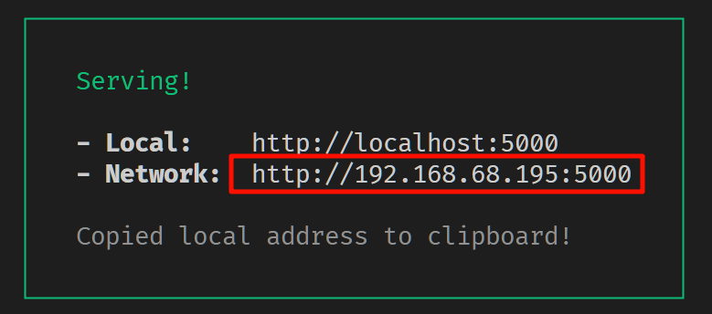

将手机接入同一局域网，在手机浏览器上访问这个地址，即可测试以上页面。
点击页面上的两个按钮测试，可以发现，在 Safari 浏览器中，异步调用 `windows.open()` 的情况无法打开新页面；在 Chrome 浏览器中，会弹出一个提示 “拦截了弹出式窗口”。无论哪种情况，用户体验都会变差。

一种解决方式是，去设置里更改选项：

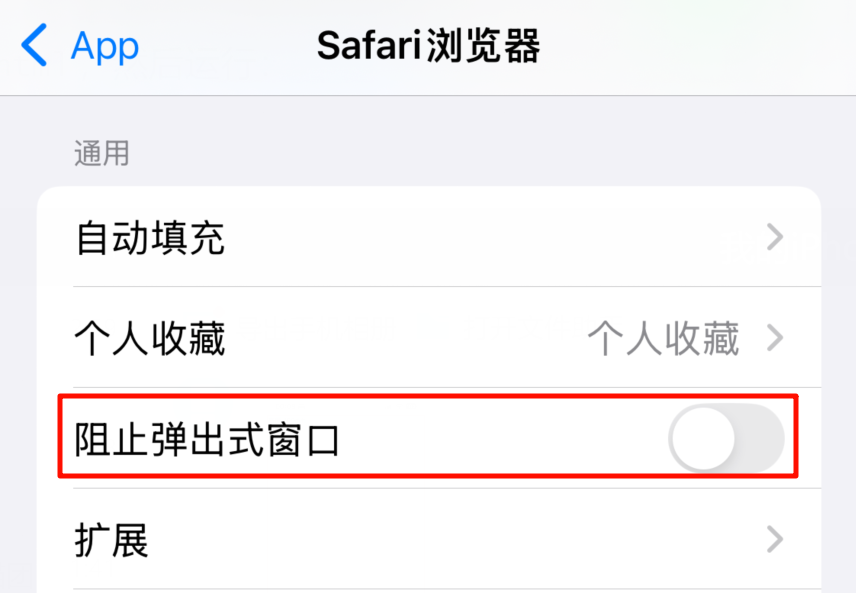

这里 “弹出式窗口” 指的是非用户点击操作触发的窗口，用户点击超链接等是不会被阻止的。
但是，手机浏览器上这个开关默认是开启状态（PC 浏览器一般默认不会开启），作为开发者，我们很难要求用户去菜单里调整这个选项，所以需要找到一个直接可行的解决方案。

**用户无交互的情况下想打开新页面：**无法实现。

**用户点击后异步打开新页面：**

如果是发送 API 请求，那么可以把请求改成同步请求，这样拿到响应后就可以执行 `window.open()` 了，实际上 `fetch()` 等 API 已经不支持同步请求了，这对用户的体验也并不好，不推荐这个方法。

<br />

另一种方案是，开发一个跳转中转页，显示一个 “跳转中” 的动画，用户点击后直接使用 `window.open()` 打开这个页面，等拿到响应结果，再修改这个页面的 `location.href` 即可。

在刚才那个 `index.html` 同目录下创建一个 `jump.html`：

```html
<!DOCTYPE html>
<html lang="zh-CN">
  <head>
    <meta charset="UTF-8" />
    <meta name="viewport" content="width=device-width, initial-scale=1.0" />
    <title>跳转中...</title>
  </head>
  <body>
    跳转中...
  </body>
</html>
```

然后，修改刚才的 `index.html`：

```html
<!DOCTYPE html>
<html lang="zh-CN">
  <head>
    <title>移动端测试</title>
    <meta name="viewport" content="width=device-width, initial-scale=1.0" />
    <script>
      function jumpPageAsync() {
        const jumpPage = window.open('/jump')
        const jumpFn = () => {
          jumpPage.location.href = 'https://www.baidu.com'
        }

        setTimeout(jumpFn, 1000)
      }
    </script>
  </head>
  <body>
    <button onclick="jumpPageAsync()">打开新页面（异步）</button>
  </body>
</html>
```

这样，就可以在 iOS 等移动端浏览器上实现异步打开新窗口了。


## 聚焦输入框

iOS 浏览器中，只有用户的点击操作或者是点击操作触发事件时，以代码同步调用的方式，才能触发输入框的聚焦行为。
具体的原因上面已经讲过了，这里不再赘述。

使用以下代码进行测试：

```html
<!DOCTYPE html>
<html lang="zh-CN">
  <head>
    <title>移动端测试</title>
    <meta name="viewport" content="width=device-width, initial-scale=1.0" />
    <script>
      function focusInput() {
        document.getElementById('input').focus()
      }

      function focusInputAsync() {
        setTimeout(() => void document.getElementById('input').focus(), 1000)
      }
    </script>
  </head>
  <body>
    输入框：<input id="input" />
    <button onclick="focusInput()">聚焦输入框</button>
    <button onclick="focusInputAsync()">聚焦输入框（异步）</button>
  </body>
</html>
```

可以发现，异步同样无法触发输入框的聚焦状态。

但是，考虑到这样一种需求：
在门户页面，有一个搜索框，点击之后要进入搜索页面，聚焦搜索输入框并唤起虚拟键盘。

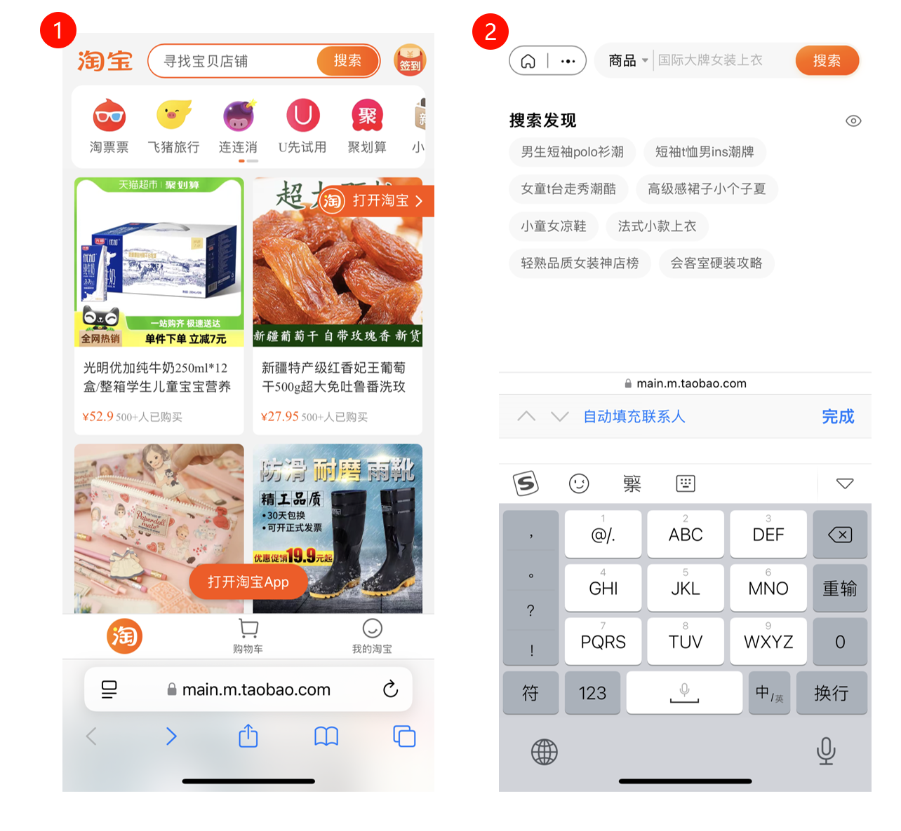

如果不是 SPA 网站，这个操作几乎不可能实现；但现在移动端网站基本上都是 SPA 了，所以我们是有解决方法的。

京东、知乎采取的方式是，不单独做一个搜索页面了，点击搜索输入框后，页面直接覆盖一个 `<div>`，展示搜索界面的 UI；这也是最简单直观的解决方式，不过，目前来说它并不符合我们的需求。
淘宝的移动端不是 SPA，所以它无法解决这个问题，新页面必须用户再点击一次唤起虚拟键盘。

实际上，如果网站是 SPA，那么是有办法既跳转搜索页面、又实现跳转后聚焦输入框的：
浏览器只阻止了非用户行为聚焦输入框，但是，**它没有阻止非用户行为在多个输入框之间切换焦点**，这就给了我们思路。

用户点击页面后，我们可以先创建一个虚拟输入框让用户聚焦，切换页面完成后，此时调用 `focus()` 即可把焦点切换到新页面的输入框上了。Webpack 打包时，需要把搜索页和主页打包在一起，这样它们之间可以瞬间切换，切换焦点看不出来。

代码示例：

```js
// 在首页点击聚焦输入框时调用
function focusInput() {
  window.virtualInput = document.createElement('input')
  window.virtualInput.style.setProperty('opacity', 0)
  document.body.appendChild(window.virtualInput)
  window.virtualInput.focus()
}

// 切换到新搜索页后聚焦新的输入框时调用
function switchInputFocus(newInput) {
  newInput.focus()
  document.body.removeChild(window.virtualInput)
}
```

可以访问这个地址：https://nl5k6c.csb.app/ 体验测试；
或者，使用 iOS 扫描这个二维码：


-----

小程序没有这个问题，任何时候，你都可以使用 `.focus()` 聚焦任何一个输入框。
