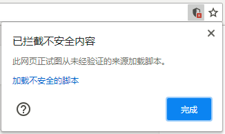

本文的内容部分参考自阮一峰博客的 [一篇博文](http://www.ruanyifeng.com/blog/2016/04/cors.html) 和 [MDN](https://developer.mozilla.org/en-US/docs/Web/HTTP/Access_control_CORS)，关跨域访问的其他解决方案可以参考阮一峰的 [这篇博文](http://www.ruanyifeng.com/blog/2016/04/same-origin-policy.html)，有关 CORS 的兼容性，可以在 [CanIUse](https://caniuse.com/#feat=cors) 上看到。


# 跨域请求的默认行为


## 跨域是什么意思

对于两个 url 而言，只有它们的**协议相同、主机名相同、端口相同**，它们才是同域（或者叫同源、同站）的。
以上三者有任一项不同，则这两个 url 便是跨域（或者叫跨源、跨站）的。

例如：

```
http://paperplane.cc
https://paperplane.cc
file:///example.html
```
这几个 url 的协议不同，互相均不同源。

---

又例如：
```
http://paperplane.cc
http://paperplane.com
http://xxxx.paperplane.cc
http://123.123.123.123
```
这几个 url 也互相均不同源。
只有主机名整个部分完全相同才是同源，前面带子域名或者是用 IP 都不是同源。

---

又例如：

```
http://paperplane.cc
http://paperplane.cc:8080
```
这两个 url 端口不同，分别是 80、8080，因此也不是同源。


## 跨域的限制

出于安全考虑，浏览器会限制跨域资源的访问或权限。
如果讲的更精细一点，可以这样理解：跨域的 “写” 操作一般来说是不太会限制的，浏览器主要限制跨域 “读” 操作，因为读取操作很可能会导致信息泄露。


**请求和资源方面的限制：**

- 普通的 XHR 或 `fetch` 无法获得预期的结果，可以发出请求但是结果会被拦截；
- LocalStorage、IndexDB、WebSQL 跨域无法互通；
- CSS 跨域加载字体，以及 SVG 图片中跨域加载字体；
- Cookie、DOM 在跨域情况下访问受到限制。

**不受跨域访问限制的资源和场景：**

- 加载 JS 和 CSS 文件；但是从 https 源站试图加载 http 地址的 JS 和 CSS 则会被浏览器阻止；
- 加载 `` 标签的图片文件，但是如果返回的类型不匹配或返回错误的状态码，则浏览器会隐藏响应中的大部分数据，这是 CORB 机制，此处不再赘述；
- canvas 的 `drawImage()` 可以跨域加载图片，但不能获取图片的数据以及转为 Base64；
- 使用 `<form>` 向跨域的站点提交表单。


可以发现跨域只能加载 JS、CSS、图片等资源，所以使用 CDN 或 OSS 加速网站时，把这些文件上传到第三方域名是没有问题的。虽然可能存在 CDN 劫持等情况，不过也是有 CSP 内容安全策略方案的，本文暂不赘述。

而常常提到的 JSONP 跨域方案，实际上就是**将 XML、JSON 或者是其他数据转化为 JS，利用 JS 可以跨域加载的原理来进行跨域访问的**。

---

需要注意的是，现代浏览器也会限制在 https 的页面中加载 http 协议的 JS 和 CSS。
最早是不限制的，后来会弹出警告，现在是完全不允许加载了。

可以实测一下，在浏览器中按 F12 打开控制台，输入以下内容运行：

```js
const scriptTag = document.createElement('script')
scriptTag.src = "http://paperplane.cc/js/jquery-3.4.1.min.js?"
document.body.appendChild(scriptTag)
```

马上就会像下图一样报错：


把代码中地址的 `http` 改成 `https` 即可避免报错。
一种解决方法是在 url 中不指定协议，此时协议将自动跟随当前页面，例如将 `src` 属性改为 `//paperplane.cc/js/jquery-3.4.1.min.js?` 这种两个斜杠开头的形式。

如果是几年前的浏览器版本，可能不会报错，但是会弹出如下图所示的确认警告：



---

CSS 的加载，也会被浏览器阻止。可以尝试运行以下代码：

```js
const styleTag = document.createElement('link')
styleTag.href = 'http://paperplane.cc/css/style.css?'
styleTag.rel = 'stylesheet'
document.head.appendChild(styleTag)
```

马上就会看到报错。


# 使用 CORS 来跨域访问资源

前面说到过浏览器的跨域主要是避免信息的 “读” 操作，对于  “写” 操作则是比较放开的。
实际上 HTTP 跨域请求也是这样：**跨域请求可以成功发出，只是浏览通过判断返回的相应的报文头信息来判断是否拦截响应的**，如果返回的响应头不满足特定的条件，那么浏览器就会拦截掉该响应。

因此，如果想实现跨域访问，后端需要配置额外的响应头内容来允许网站做跨域访问，这样一来便保证了信息安全。


## CORS 用法

对于跨域请求，浏览器依据请求的类型和头信息将其分为两种：**简单请求，非简单请求**。

满足以下条件的请求为**简单请求**：

- 类型为 `GET` 或 `HEAD` 或 `POST`；
- 请求头的内容不能超出以下几个：`Accept`、`Accept-Language`、`Content-Language`、`Last-Event-ID`、`Content-Type`；
- 如果有 `Content-Type` 请求头，那么它只能是以下几个值：`application`、`x-www-form-urlencoded`、`multipart/form-data`、`text/plain`。

只要以上任一条件不满足，该请求就是**非简单请求**。


## 简单请求的 CORS 流程

发起简单请求时，浏览器会在请求头中添加一项 `Origin`，该项的值**为发起请求时的域名**，这一项用于告知服务器跨域请求的来源。

如果服务器支持并同意该跨域请求，则浏览器的响应头会额外带有以下内容：
- 必须有 `Access-Control-Allow-Origin` 项，它的值必须为 `*` 或是和请求头中的 `Origin` 相同的值；如果你的跨域请求还需要携带 Cookie 那就必须和请求头中的 `Origin` 相同，不能设为 `*`；
- 可能带有 `Access-Control-Credentials` 项，它的值也只能为 `true`，表示服务器接受客户端的 Cookie；
- 可能带有 `Access-Control-Expose-Headers` 项，它是由多个字符串组成的，表示 http 请求能额外获取的响应头有哪些。如果服务器不给出该项，那么 http 请求默认只能获取以下六项响应头：`Cache-Control`、`Content-Language`、`Content-Type`、`Expires`、`Last-Modified` 以及 `Progma`。

如果服务器不支持或是不同意该次跨域请求，那么返回的响应头不包含 `Access-Control-Allow-Origin` 即可，这次请求会被当做失败，也无法读取到响应的内容。


## 非简单请求的 CORS 流程

只要有任一条不符合上面的简单请求的条件，那么该请求就是非简单请求。
浏览器在进行非简单请求前，会额外发送一条预检请求，预检请求的响应如果不符合规则，则原本的请求也不会正常发出。你可以理解为，先测试一下对方是否支持跨域，避免直接发送请求造成信息泄露。

预检请求的特点：
- 它的请求方法是 `OPTIONS`；
- 这次请求有 `Origin` 请求头，其值为发起请求的页面域名；
- 这次请求有 `Access-Control-Request-Method` 请求头，表示非简单请求的类型，例如 `PUT`；
- 这次请求可能会有 `Access-Control-Request-Headers` 请求头，它表示本次请求会额外携带的请求头，用逗号分隔。

如果服务器同意该次预检请求，将返回一个响应，告知浏览器预检请求的结果。
该响应具有以下特点：

- 必须带有 `Access-Control-Allow-Origin` 响应头，值要么和原请求的 `Origin` 相同，要么是 `*`；
- 必须带有 `Access-Control-Allow-Methods` 响应头，它的值表示支持的请求方法，例如 `PUT`，用逗号分隔；
- 可能带有 `Access-Control-Allow-Headers` 响应头，表示本次响应会额外携带的的响应头，用逗号分隔；
- 可能带有 `Access-Control-Allow-Credentials` 响应头，值只能为 `true`，表示接受浏览器发出的 Cookie 信息；
- 可能带有 `Access-Control-Max-Age` 响应头，表示允许浏览器缓存该预检请求结果的时长。

可以看到只要带有前两个响应头，并且请求类型包含在 `Access-Control-Allow-Methods` 内，那么该次预检请求就是成功的。
浏览器在预检请求成功的时候，才会进一步发出实际的请求。实际的请求流程和简单请求类似，这里不再赘述。


# 改造后端以支持 CORS

此处以 Node.js 的 koa 来举例。


## 只考虑简单请求

如果只考虑简单请求，后端可以进行以下改造：
- 如果不要求浏览器提供 Cookie，那么在响应头上增加 `Access-Control-Allow-Origin` 项，值为 `*` 即可；
- 如果要求浏览器提供 Cookie，那么 `Access-Control-Allow-Origin` 项的值必须和 `Origin` 请求头的值相同，不能是星号，还需要提供一个 `Access-Control-Allow-Credentials` 响应头，值设置为 `true`；
- 如果浏览器需要从响应头中获取额外的信息，后端还需要配置 `Access-Control-Expose-Headers` 项，值为需要对浏览器暴露的响应头的名称，多个的话用逗号 `,` 分隔。


可以做一下 CORS 简单请求的测试，找一个空文件夹打开系统终端，执行以下命令：

```bash
# 初始化 npm 项目，一路回车即可
yarn init

# 安装 koa
yarn add koa @koa/router

# 创建 index.js
echo "" >> index.js
```

在这个 index.js 中输入以下代码：

```js
const Koa = require('koa')
const Router = require('@koa/router')

const app = new Koa()
const router = new Router()

app.use(router.routes()).use(router.allowedMethods())

router.get('/', async (ctx, _next) => {
  ctx.body = { data: 'Hello' }
})

app.listen(6200)
```

然后在终端中运行 `node index.js` 开启服务；
然后在现在这个页面按 F12 打开浏览器的调试菜单，转到控制台栏，输入以下代码运行：

```js
fetch('http://localhost:6200').then(res => res.json()).then(console.log)
```

因为请求的域名和当前页面的域名不同，所以一运行代码就可以看到，控制台中马上打印了跨域的错误：


而我们回去修改 index.js 中的代码，将其中的片段修改为：

```js
router.get('/', async (ctx, _next) => {
  // 注意下面这一行是新增的
  ctx.set('Access-Control-Allow-Origin', '*')
  ctx.body = { data: 'Hello' }
})
```

修改并保存后，按下 Ctrl + C 中断 Node.js 进程，重新运行 `node index.js` 开启服务，此时再在网页控制台中输入上面的请求代码，便可以看到这个请求不再报错了，还能正确打印出响应的内容：`{ data: 'Hello' }`。


## 非简单请求

与简单请求不同的是，非简单请求在发送之前浏览器先会发一个预检请求，它是一个 OPTIONS 请求。
后端需要有逻辑来处理这个预检请求。

修改 index.js 代码，将其中的 `router.get` 改为 `router.put`，保存后按下 Ctrl + C 中断 Node.js 进程，重新运行 `node index.js` 开启服务；
然后构造一个非简单请求来试一试。在浏览器控制台中输入以下内容并回车：

```js
fetch('http://localhost:6200', { method: 'PUT' })
  .then(res => res.json())
  .then(console.log)
```


运行后可以看到控制台马上报错：


因为 PUT 请求是非简单请求，在跨域请求时浏览器会先发一个预检请求；如果我们不处理预检请求，那么这次请求会直接失败。

接下来尝试正确处理预检请求。编辑 index.js，在最后一行的上面添加以下内容：

```js
router.options('/', async (ctx, _next) => {
  ctx.set('Access-Control-Allow-Origin', '*')
  ctx.set('Access-Control-Allow-Methods', 'PUT')
  ctx.body = ''
})
```

此时再次在浏览器控制台中运行上面的请求代码，可以看到请求成功完成并打印了结果。


# 曾经的跨域请求方案 JSONP

JSONP 意思是 JSON with Padding，这个不需要记。在以前不支持 CORS 的时代，通常会使用 JSONP 来处理跨域请求。

前面说到过，浏览器跨域加载 JS 是不受限制的，因此我们可以让后端把跨域请求的结果改为 JS 格式，当做一个 JS 文件返回给前端，这样就可以实现跨域响应了。

尝试使用 Node.js 作为后端来编写一个 JSONP 处理程序。修改 index.js 文件：

```js
router.get('/', async (ctx, _next) => {
  const responseData = { data: 'Hello' }
  const callbackFnName = ctx.query.callbackFnName

  ctx.body = `${callbackFnName}(${JSON.stringify(responseData)})`
})
```

修改并保存后，按下 Ctrl + C 中断 Node.js 进程，重新运行 `node index.js` 开启服务；
然后在浏览器控制台里尝试前端封装一个 JSONP 请求方法：

```js
async function jsonp(url) {
  return new Promise((resolve, reject) => {
    const callbackFnName = 'jsonp_' + new Date().valueOf()
    const scriptTag = document.createElement('script')

    window[callbackFnName] = resolve
    scriptTag.onerror = reject
    scriptTag.src = `${url}?callbackFnName=${callbackFnName}`

    document.body.appendChild(scriptTag)
  })
}
```

这样一个简易版的 JSONP 前后端模型便实现好了。可以测试一下，在浏览器控制台中输入：

```js
jsonp('http://localhost:6200').then(console.log)
```

可以看到正确的打印出了结果。

JSONP 的用法有很多，这里只举例出最常用的一种方式，通过代码也能很容易看出原理：
前端声明一个全局函数，名称可以随便取但是要避免重名，所以用时间戳，这一步会污染全局对象；
用 `<script>` 来尝试加载一个 “JS 文件”，并在 url 中通过 query 传这个全局函数的名称，后端生成一段 “JS 代码”，内容是把要返回的数据作为参数，传给这个全局函数。

---

对比 JSONP 和 CORS，可以发现它们具有以下区别：

- 因为 JSONP 的原理是利用 `<script>` 去加载 JS 文件，这个过程一定是 GET 请求，也很难获取响应的 Header 头等；而 CORS 支持各种类型的请求；
- JSONP 需要使用较为复杂的处理流程，前端需要插入 `<script>` 标签、污染全局对象，后端也需要拼接生成 JS；而 CORS 只需要后端做配置，添加几个响应头即可；
- 兼容性方面，CORS 并不差，除非是特别特别老的浏览器可能只能用 JSONP，不然都是支持 CORS 的，[查看 CORS 的兼容性](https://caniuse.com/#feat=cors)。


# 其他资源的跨域访问


## 跨域访问 Cookie

如果两个 url 的一级域名相同、二级域名不同，比如 `a.paperplane.cc` 和 `b.paperplane.cc`，那么它们之间可以互通 Cookie：
将 Cookie 的 `domain` 属性设置为 `.paperplane.cc`，这样两个站点都可以访问到这个 Cookie。

还有一种情况，用二级域名的页面可以访问没有二级域名的页面的 Cookie，例如 `a.paperplane.cc` 可以访问 `paperplane.cc` 的 Cookie，因为它可以修改自己的 `document.domain` 改为 `paperplane.cc`，但是**反过来是不行的**，修改 `document.domian` 操作会无效且报错。 


## 跨域窗口通讯

在本页按下 F12 打开浏览器控制台，输入以下代码：

```js
// 会打开百度首页，不要关闭网页，切换 Tab 回到本页
const baiduPage1 = window.open('https://www.baidu.com')

// 成功，可以关闭百度页面，关闭操作不受跨域限制
baiduPage1.close()

const baiduPage2 = window.open('https://www.baidu.com')

// 会失败，跨域的情况无法获取页面内容，同域时可以成功执行
console.log(baiduPage2.document)
```


跨域时可以使用 Cross-Document Message 的 API 来通信，它的 [兼容性还不错](https://caniuse.com/#feat=x-doc-messaging)。
在用 `<iframe>` 跨域加载页面或者 `windows.open( )` 跨域打开页面的时候，可以获取新页面的 `window` 对象，跨域情况下这个对象的操作是受限制的，几乎无法获取任何数据；但在该对象上，调用 `.postMessage(data, origin)` 方法可以发出消息：

- `data` 参数是要发出的消息；
- `origin` 注意这个是**必填**的参数，它是一个字符串表示接收窗口的 uri，目标窗口必须协议、主机名、端口号都匹配才会发出该消息；可以设置为 `*` 表示无限制。


作为接收方，想接收来自其他文档发出的跨域消息则是使用 `window.addEventListener('message', callback)` 来接收：

- `callback` 是一个回调，它具备一个事件参数 `e`，其中几个比较重要的属性：
  - `e.data` 是消息的内容；
  - `e.source` 是来源文档的引用，可以用它的 `.postMessage( )` 来发送消息；因为来源文档和本页也是跨域的，所以大部分操作都是受限的，很多属性也访问不了；
  - `e.origin` 是来源文档的 url。


可以试验一下，在本页面按下 F12 打开浏览器控制台，输入以下代码：

```js
// 现在在 paperplane.cc 页面
const baiduPage = window.open('https://www.baidu.com')
```

然后在新打开的百度页面，按下 F12 打开浏览器控制台，输入以下代码：

```js
// 现在在 www.baidu.com 页面
window.addEventListener('message', console.log)
```

此时便可以通过 Message API 在本页面和百度首页之间传递信息。切换到本页面，输入：

```js
// 现在在 paperplane.cc 页面
baiduPage.postMessage({ data: 'Hello' }, '*')
```

便可以看到百度首页那边的控制台打印出了这个消息事件，其 `.data` 属性便是消息内容。
